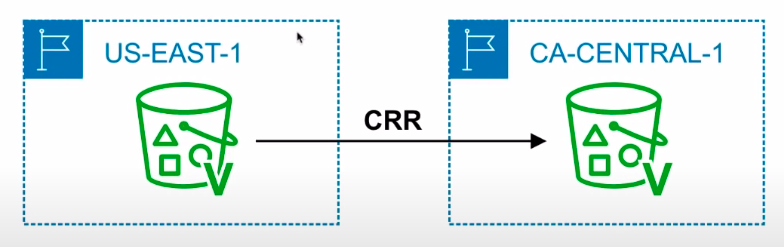
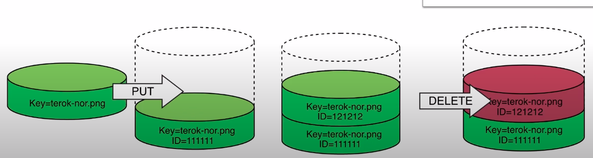
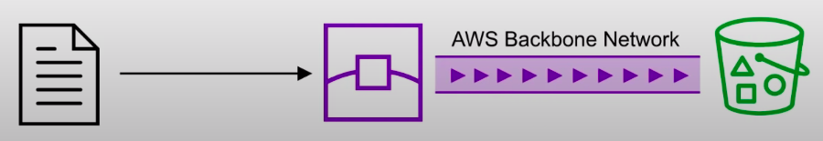
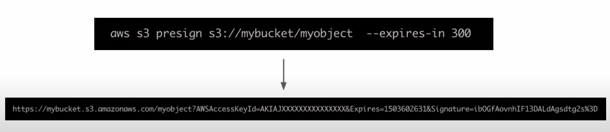
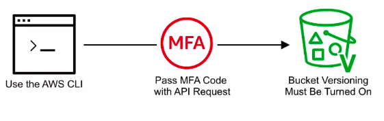

### Intro

* **Object-based** storage service.
* Serverless storage in the cloud.

#### What is object storage(Object-based storage)?**

* **Data storage architecture** that manages data as objects, as opposed to other storage architectures:
* file systems which manages data as a files and fire hierarchy, and 
* block storage which manages data as blocks within sectors and tracks. 

* S3 provides you with **unlimited storage**. You don't need to think about the underlying infrastructure.
* The S3 console provides and interface for you to upload and access your data.

### **S3 Object:**

* Objects contain your data. They are like files. 
* Object may consist of:
  * **Key** this is the name of the object. 
  * **Value** the data itself made up of a sequence of bytes.
  * **Version ID** when versioning enabled, the version of object. 
  * **Metadata** additional information attached to the object. 
* You can store data from **0 bytes to 5 terabytes** in size.

**S3 bucket:**

* Buckets hold objects. Buckets can also have folders which in turn hold objects. 
* S3 is a **universal namespace** so bucket names much be unique(think like having a domain name)

### **S3 Storage Classes:**

* Trade **Retrieval Time, Accessibility and Duration** for Cheaper Storage. 
* 11 9's(Eleven Nines) => 99.99999999999% 
* 9 9's(Nine Nines) => 99.999999999%

#### **Standard(default)**: 

* Fast! 99.99% Availability, 
* 11 9's Durability. 
* Replicated across **at least three AZs**

#### **Intelligent Tiering**: 

* Uses ML to analyze your object usage and determine the appropriate storage class. 
* Data is moved to the most cost-effective access tier, without any performance impact or added overhead.

#### **Standard Infrequently Accessed(IA):** 

* Still Fast, **cheaper if you access the files less than once a month**. 
* Additional retrieval fee is applied. 50% less than Standard(reduced availability)

#### **One Zone IA**: 

* Still Fast, Objects only exists in one AZ. 
* Availability(is 99.5%) but cheaper than Standard IA by 20% less(Reduce durability) Data could get destroyed. 
* A retrieval fee is applied.

#### **Glacier**: 

* **For long term cold storage.**

* Retrieval of data can **take minutes to hours** but the off is very cheap storage.

#### **Glacier Deep Archive**: 

* The lowest cost storage class. 
* Data retrieval **time is 12 hours.** 

#### **S3 - Storage Classes Comparison:**

|                                | Standard | Intelligent Tiering | Standard IA | One-Zone IA | Glacier       | Glacier Deep Archive |
|--------------------------------|----------|---------------------|-------------|-------------|---------------|----------------------|
| Durability                     | 11'9s    | 11'9s               | 11'9s       | 11'9s       | 11'9s         | 11'9s                |
| Availability                   | 99.99%   | 99.9%               | 99.9%       | 99.5%       | N/A           | N/A                  |
| Availability SLA               | 99.99%   | 99%                 | 99%         | 99%         | 99%           | 99%                  |
| AZs                            | > 3      | > 3                 | > 3         | 1           | > 3           | > 3                  |
| Min Capacity charge per object | N/A      | N/A                 | 128kb       | 128kb       | 40kb          | 40kb                 |
| Min Storage duration charge    | N/A      | 30 days             | 30 days     | 30 days     | 90 days       | 180 days             |  
| Retrieval fee                  | N/A      | N/A                 | Per GB      | Per GB      | Per GB        | Per GB               |
| First byte latency             | ms       | ms                  | ms          | ms          | mins to hours | hours                |

### **S3 Security:**

* All new buckets are **PRIVATE** when created by default. 
* Logging per request can be turned on a bucket. 
* Log files are generated and saved in a different bucket(even a bucket in a different AWS account if desired)
* Access control is configured using **Bucket Policies** and **Access Control Lists(ACL)**

#### **Access Control Lists**

* Legacy feature(but not deprecated) of controlling access to buckets and objects. 
* Simple way of granting access.

#### **Bucket Policies**

* Use a policy to define complex rule access.

```json
{
    "Version":"2012-10-19",
    "Statement": [
        {
            "Sid": "PublicReadGetObject",
            "Effect": "Allow",
            "Principal": "*",
            "Action": "s3:GetObject",
            "Resource": "arn:aws:s3:::www.exampro.co/*"
        }
    ]
}
```

### **S3 Encryption:**

#### **Encryption in Transit:**

* Traffic between your local host and S3 is achieved via SSL/TLS

#### **Server Side Encryption(SSE): Encryption at Rest**

* Amazon help you encrypt the object data
* S3 Managed Keys - (Amazon manages all the keys)
* **SSE-AES:** S3 handles the key, uses AES-256 algorithm
* **SSE-KMS:** Envelope encryption, AWS KMS and you manage the keys.
* **SSE-C:** Customer provided key(you manage the keys)

#### **Client-side Encryption:**

* You encrypt your own files before uploading them to S3

#### **S3 - Data consistency:**

| **New Objects(PUTS)**                                                        | **Overwrite(PUTS) or Delete Objects(DELETE)**                                                                            |
|------------------------------------------------------------------------------|--------------------------------------------------------------------------------------------------------------------------|
| **Read After Write** Consistency                                             | **Eventual** Consistency                                                                                                 |
| When you upload a new S3 object you are able read immediately after writing. | When you overwrite or delete an object it takes time for S3 to replicate versions to AZs.                                |
|                                                                              | If you were to read immediately, S3 may return you an old copy. You need to generally wait a few seconds before reading. |


#### **S3 - Cross Region Replication(CRR):**

* When enabled, any object that is uploaded will be automatically replicated to another region(s). 
* Provides higher durability and potential disaster recovery for objects.



* You must have **versioning turned on both the source and destination buckets**. 
* You can have **CRR replicate to another AWS account**. 

### **S3 Versioning:**

* Store all version of an object in S3 
* Once **enabled it cannot be disabled**, only suspended on the bucket.



* Fully integrates with S3 Life cycle rules. 
* MFA Delete feature provides extra protection against deletion of your data.

### **S3 Lifecycle Management:**

* Automate the process of **moving objects to different Storage classes** or deleting objects all together. 
* Can be used together with versioning.
* Can be applied to both current and previous versions.


### **S3 - Transfer Acceleration:**

* Fast and secure transfer of files **over long distances** between your end users and an S3 bucket. 
* Utilizes the **cloudFront's** distributed **Edge Locations**. 
* Instead of uploading to your bucket, users use a distinct URL for an Edge location. 
* As data arrives at the Edge Location it is automatically routed to S3 over a specially optimized network path.



### **S3 - Presigned URLs:**

* Generate a URL which provides you **temporary access to an object either to upload or download object data**. 
* Presigned URLs are commonly used **to provided access to private objects**. 
* You can use **AWS CLI or AWS SDK** to generate Presigned Urls.



You have a web-application which needs to allow users to download files from a password protected part of your web-app. Your web-app generates presigned url which expires after 5 seconds. The user download the file.


### **MFA - Delete:**

* * MFA delete ensures users cannot delete objects from a bucket **unless they provide their MFA code**. 
* * MFA delete can only be enabled under these conditions. 
  * The AWS CLI must be used to turn on MFA. 
  * The bucket must have versioning turned on.



```
aws s3api put-bucket-versioning \
  --bucket bucketname \
  --versioning-configuration Status=Enabled,MFADelete=Enabled
  --mfa "your-mfa-serial-number mfa-code"
  
```

* Only the bucket owner logged in as Root user can DELETE objects from bucket.

### **S3 CheatSheet:**

1. Simple Storage Service(S3): Object based storage. Store unlimited amount of data without worry of underlying storage infra-structure.
2. S3 replicates data across at least 3 AZs to ensure 99.99% Availability and 11's 9s of durability.
3. Objects contains you data.
4. Objects can be size anywhere from 0 bytes upto 5 terabytes.
5. Buckets contain objects. Buckets can also contain folders which can in turn can contain objects.
6. Bucket names are unique across all AWS accounts. Like a domain name.
7. When you upload a file to S3 successfully you'll receive an HTTP 200 code. Lifecycle Management Objects can be moved between storage classes or objects can be deleted automatically based on a schedule.
8. Versioning Objects are giving a Version ID. When new objects are uploaded the old objects are kept. You can access any object version. When you delete an object the previous object is restored. Once Versioning is turned on it cannot be turned off, only suspended.
9. MFA Delete enforce DELETE operations to require MFA token in order to delete an object. Must have versioning turned on to use. Can only turn on MFA Delete from the AWS CLI
10. All new buckets are private by default.
11. Logging can be turned to on a bucket to log a track operations performed on objects.
12. Access control is configured using Bucket Policies and Access Control Lists(ACL)
13. Bucket policies are JSON documents which let you write complex control access.
14. ACLs are the legacy method(not deprecated) where you grant access to objects and buckets with simple actions.
15. Security in Transit Uploading files is done over SSL
16. SSE stands for Server Side Encryption. S3 has 3 options for SSE.
    a. SSE-AES S3 handles the key, uses AES-256 algorithm.
    b. SSE-KMS Envelope encryption via AWS KMS and you manage the keys
    c. SSE-C Customer provided key(you manage the keys)
17. Client-side Encryption You must encrypt you own files before uploading them to S3
18. Cross Region Replication(CRR) allows you to replicate files across regions for greater durability. You have versioning turned on in the source and destination bucket. You can have CRR replicate to bucket in another AWS Account.
19. Transfer Acceleration: provide faster and secure uploads from anywhere in the world. Data is uploaded via distinct url to an Edge location. Data is then transported to you S3 bucket via AWS backbone network.
20. Presigned URLs is a URL generated via the AWS CLI and SDK. It provides temporary access to write or download object data. Presigned Urls are commonly used to access private objects.
	
