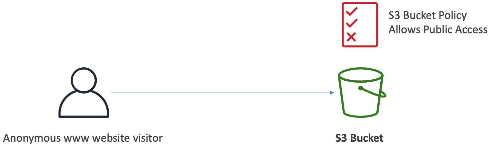
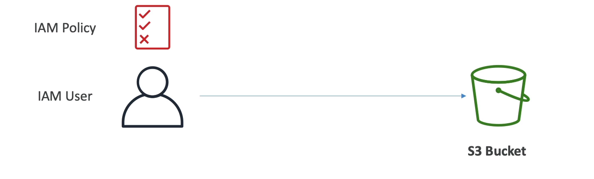
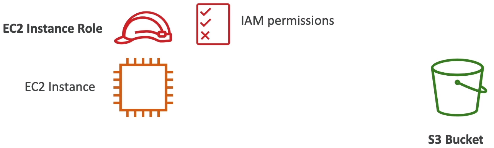
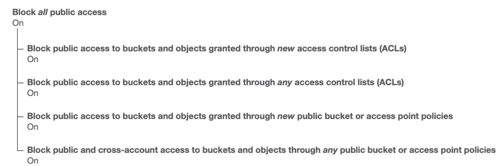
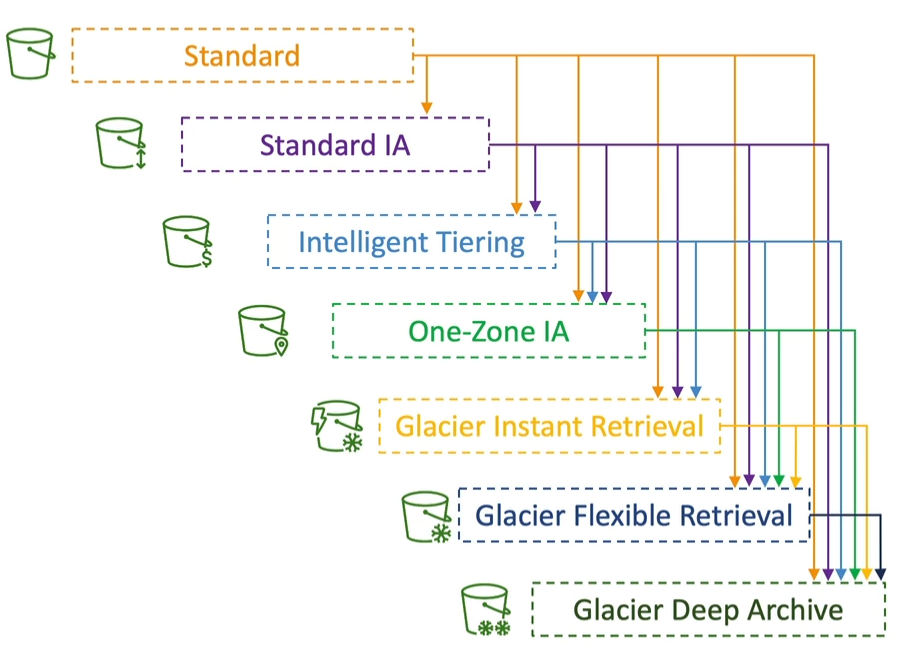
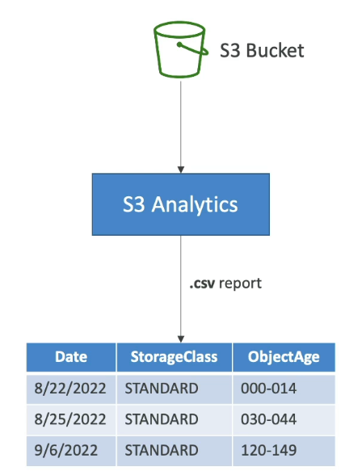

### Amazon S3 Use cases

* Backup and storage
* Disaster recovery
* Archive
* Hybrid Cloud storage
* Application hosting
* Media hosting
* Data lakes & big data analytics
* Software delivery
* Static website

### Amazon S3 - Buckets

* Amazon S3 allows people to store objects(files) in "buckets" (directories)
* Buckets must have a **globally unique name(across all regions all accounts)**
* Buckets are defined at the region level
* S3 looks like a global service but buckets are created in a region
* Naming convention
  * No uppercase, No underscore
  * 3-63 characters long
  * Not an IP
  * Must start with lowercase letter or number
  * Must NOT start with the prefix **xn--**
  * Must NOT end with the suffix **-s3alias**

#### Amazon S3 - Objects

* Objects(files) have a Key
* The key is the **FULL** path:
  * s3://my-bucket/my_file.txt
  * s3://my-bucket/my_folder1/another_folder/my_file.txt
* The key is composed of prefix + object name
  * s3://my-bucket/my_folder1/another_folder/my_file.txt
* There's no concept of "directories" within buckets
  (although the UI will trick you to think otherwise)
* Just keys with very long names that contain slashes("/")

#### Amazon S3 - Objects(cont.)

* Object values are the content of the body:
  * Max. Object Size is 5TB(5000GB)
  * If uploading more than 5GB, must use "multi-part upload"
* Metadata(list of text key / value pairs - system or user metadata)
* Tags (Unicode key / value pair - up to 10) - useful for security / lifecycle
* Version ID (if versioning is enabled)

#### Amazon S3 - Security

* User-Based
  * IAM Policies - which API calls should be allowed for a specific user from IAM
  
* Resource-Based
  * Bucket Policies - bucket wide rules from the S3 console - allows cross account
  * Object Access Control List(ACL) - finer grain(can be disabled)
  * Bucket Access Control List(ACL) - less common(can be disabled)

* Note: an IAM principal can access an S3 object if
  * The user IAM permission ALLOW it OR the resource policy ALLOWS it
  * AND there's no explicit DENY

* Encryption: encrypt objects in Amazon S3 using encryption keys

#### S3 Bucket Policies

* JSON based policies
  * Resources: buckets and objects
  * Effect: Allow/Deny
  * Actions: Set of API to Allow or Deny
  * Principal: The account or user to apply the policy to
  
* Use S3 bucket for policy to
  * Grant public access to the bucket
  * Force objects to be encrypted at upload
  * Grant access to another account(Cross Account)

```json
{
  "Version": "2012-10-17",
  "Statement": [
    {
      "Sid": "PublicRead",
      "Effect": "Allow",
      "Principal": "*",
      "Action": [
        "s3:GetObject"
      ],
      "Resource": [
        "arn:aws:s3:::examplebucket/*"
      ]
    }
  ]
}
```

#### Public Access - Use Bucket Policy

* Use can you bucket policy to allow public access for a bucket or to allow user from different account to access the bucket



#### User Access to S3 - IAM Permissions

* To allow a user to access the bucket use IAM user policy



#### EC2 instance access - Use IAM Roles

* To allow EC2 instance to access the S3 bucket, use IAM roles



#### Bucket settings for Block Public Access



* These settings were created to prevent company data leaks
* If you know your bucket should never be public, leave these on
* Can be set at the account level

### Amazon S3 - Static Website Hosting

* S3 can host static websites and have them accessible on the Internet

* The website URL will be (depending on the region)
  * http://bucket-name.s3-website-aws-region.amazonaws.com
  or 
  * http://bucket-name.s3-website.aws-region.amazonaws.com

* If you get a **403 Forbidden** error, make sure the bucket policy allows public reads!!!

### Amazon S3 - Versioning

* You can version your files in Amazon S3
* It is enabled at the **bucket level**
* Same key overwrite will change the "version": 1,2,3...
* It is best practice to version your buckets
  * Protect against unintended deletes(ability to restore a version)
  * Easy roll back to previous version
* Notes:
  * Any files that is not versioned prior to enabling versioning will have version "null"
  * Suspending versioning does not delete the prevision versions

### Amazon S3 - Replication (CRR & SRR)

* Must enable versioning in source and destination buckets
* **Cross-Region replication** (CRR)
* **Same-Region replication** (SRR)
* Buckets can be in different AWS accounts
* Copying is asynchronous
* Must give proper IAM permissions to S3

* Use cases:
  * CRR - compliance, lower latency access, replication across accounts
  * SRR - log aggregation, live replication between production and test accounts

#### S3 - Replication Notes

* After you enable replication, only new objects are replicated
* Optionally, you can replicate existing objects using **S3 Batch Replication**
  * Replicates existing objects and objects that failed replication

* For DELETE operations
  * **Can replicate delete markers** from source to target(optional setting)
  * Deletions with a version ID are not replicated(to avoid malicious deletes)

* **There is no "chaining" of replication**
  * If bucket 1 has replication into bucket 2, which has replication into bucket 3
  * Then objects created in bucket 1 are not replicated to bucket 3

### S3 Storage Classes

* Amazon S3 Standard - General Purpose
* Amazon S3 Standard-Infrequent Access(IA)
* Amazon S3 One Zone-Infrequent Access
* Amazon S3 Glacier Instant Retrieval
* Amazon S3 Glacier Flexible Retrieval
* Amazon S3 Glacier Deep Archive
* Amazon S3 Intelligent Tiering

* Can move between classes manually or using S3 lifecycle configurations

#### S3 Durability and Availability

* Durability
  * High durability(99.99999999%, 11 9's) of object across multiple AZ
  * If you store 10,000,000 objects with Amazon S3, you can on average expect to incur a loss of a single object once every 10,000 years
  * Same for all storage classes
  
* Availability
  * Measures how readily available a service is
  * Varies depending on storage class
  * Example: S3 standard has 99.99 availability = not available 53 minutes a year

#### S3 Standard - General Purpose

* 99.99% Availability
* Used for frequently accessed data
* Low latency and high throughput
* Sustain 2 concurrent facility failures

* Use cases: Big Data analytics, mobile & gaming applications, content distribution...

#### S3 Storage classes - Infrequenct Access

* For data that is less frequently accessed but required rapid access when needed
* Lower cost than S3 Standard

* **Amazon S3 Standard-Infrequent Access(S3 Standard-1A)**
  * 99.9% Availability
  * Use-case: Disaster Recovery, backup
* **Amazon S3 One Zone-Infrequent Access(S3 One Zone-IA)**
  * High durability(9.999999999%) in a single AZ; data lost when AZ is destroyed
  * 99.5% Availability
  * Use-cases: Storing secondary backup copies of on-premises data, or data you can re-create

#### Amazon S3 Glacier Storage Classes

* Low-cost object storage meant for archiving/backup
* Pricing: price for storage + object retrieval cost

* **Amazon S3 Glacier Instant Retrieval**
  * Millisecond retrieval, great for data accessed once a quarter
  * Minimum storage duration for 90 days
* **Amazon S3 Glacier Flexible Retrieval**(formerly Amazon S3 Glacier)
  * Expedited(1 to 5 minutes), Standard(3 to 5 hours), Bulk(5 to 12 hours) - free
  * Minimum storage duration of 90 days
* **Amazon S3 Glacier Deep Archive - for long term storage**:
  * Standard(12 hours), Bulk(48 hours)
  * Minimum storage duration of 180 days

#### S3 Intelligent Tiering

* Small monthly monitoring and auto-tiering fee
* Moves objects automatically between Access Tiers based on usage
* There are no retrieval charges in S3 Intelligent-Tiering

* Frequent Access Tier(automatic): default tier
* Infrequent Access Tier(automatic): objects not accessed for 30 days
* Archive Instant Access Tier(automatic): objects not accessed for 90 days
* Archive Access tier(optional): configurable from 90 days to 700+ days
* Deep Archive Access tier(optional): config from 180 days to 700+ days

### Amazon S3 - Moving between Storage Classes

* You can transition object between storage classes

* For infrequently accessed object move them to **Standard IA**
* For archive objects that you don't need fast access to, move them to **Glacier or Glacier Deep Archive**
* Moving objects can be automated using a **Lifecycle Rules**



#### Lifecycle Rules

* **Transition Actions** - configure objects to transition to another storage class
  * Move objects to Standard IA class 60 days after creation
  * Move to Glacier for archiving after 6 months

* **Expiration actions** - configure objects to expire(delete) after some time
  * Access log files can be set to delete after 365 days
  * Can be used to delete old versions of files(if versioning is enabled)
  * Can be used to delete incomplete Multi-part uploads

* Rules can be created for a certain prefix(example: s3://mybucket/mp3/*)
* Rules can be created for certain object tags(example: Department finance)

#### Amazon S3 - Lifecycle Rules(Scenario 1)

* Your application on EC2 creates images thumbnails after profile photos are uploaded to Amazon S3. These thumbnails can be easily recreated, and only need to kept for 60 days. The source images should be able to be immediately retrieved for these 60 days, and afterward, the use can wait up to 6 hours. How would you design this?

* S3 source images can be on **Standard**, with a lifecycle configuration to transition them to **Glacier** after 60 days.
* S3 thumbnails can be on **One-Zone IA**, with a lifecycle configuration to expire them(delete them) after 60 days.

#### Amazon S3 - Lifecycle Rules(Scenario 2)

* A rule in your company states that you should be able to recover your deleted S3 objects immediately for 30 days, although this may happen rarely. After this time, and for up to 365 days, deleted objects should be recoverable within 48 hours.

* Enabled **S3 versioning**, in order to have object versions, so that "deleted objects" are in fact hidden by a "delete marker" and can be recovered.
* Transition the "non current versions" of the object to **Standard IA**
* Transition afterward the "non current versions" to **Glacier Deep Archive**

#### Amazon S3 Analytics - Storage Class Analysis

* Help you decide when to transition objects to right class
* Recommendation for **Standard** and **Standard IA**
  * Does NOT work for One-Zone IA or Glacier
* Report is updated daily
* 24 to 48 hours to start seeing data analysis
* Good first step to put together Lifecycle Rules(or improve them)

