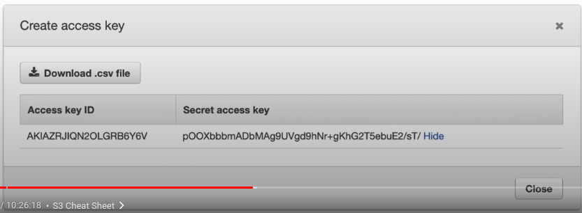

### AWS Command Line Interface

Control multiple AWS services from the command line and automate them through scripts.

**From the CLI you can perform actions such as:**
1. List buckets, upload data s3
2. Launch, stop, start and terminate EC2 instances
3. Update security groups, create subnets

Important AWS CLI flags to know:
1. Easily switch between AWS accounts using **--profile**
2. Change the **--output** between json, table and text.

The CLI is installed using a Python Script.

**Programmatic Access - Access Key and Secret**

When you enable **programmatic access** for AWS users

You'll have the ability to create **Access Key Id** and **Secret Access Key**. They are collectively known as **AWS Credentials**

* You will want to store you credentials in user's home eg. ~/.aws/credentials
* The credentials files allow you to manage multiple credentials

