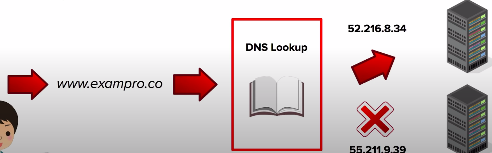

### DNS

* **Domain Name System(DNS)** is the service which handles **converting** a domain name(i.e. exampro.co) into a routable **Internet Protocol(IP)** address (ie 52.216.8.34)
* This is what allows your computer to **find specific servers** on the internet automatically **depending what domain name** you browser to.



**Internet Protocol(IP)**
IP Addresses are what uniquely **identifies each computer** on a network, and **allows communication** between them using the Internet Protocol(IP)

**IPv4** Internet Protocol Version 4

Example: **52.216.8.34**
Address space is **32-bits** with up to **4,294,967,296** available addresses(we are running out)

**IPv6** Internet Protocol Version 6

Example: **2001:0db8:85a3:0000:0000:8a2e:0370:7334**
Address space is **128-bits** with up to **340 undecillion potential addresses(1+36 Zeros)** invented to solve available address limitations of IPv4.

**Domain Registrars:**
* Domain registrars are authorities who **have the ability to assign domain names** under one or more **top-level domains.**
* Domains get registered through **InterNIC,** which is a service provided by the **Internet Corporation for Assigned Names and Numbers(ICANN),** and enforces the uniqueness of domain names all over the internet.
* After registration all domain names can be found publicly in a central **WhoIS database.**

**Top Level Domains:** 
* The **last word** within a domain name represents the **top-level** domain name. example.**com**
* The **second word** within a domain name is know as **second-level** domain name. example.**co**.uk
* Top-level domain names are controller by the **Internet Assigned Numbers Authority(IANA)**
* All available top level domain are stored in a publicly available database at [IANA](http://www.iana.org/domains/root/db)
* AWS has their own top level domain **.aws** because of course they do.

**Start of Authority(SOA):**

Every domain **must have an SOA record.** The SOA is a way for the Domain Admins to provide information about the domain e.g. how often it is updated, what is the admins email address and etc...

A **Zone** file can contain only one SOA Record.

**Format:**
    
[authority-domain][domain-of-zone-admin][zone-serial-number][refresh-time][retry-time][expire-time][negative caching TTL]

**Example:**
    ns.example.net, hostmaster.example.com 1
    7200 900 1209600 86400

**AWS Example:**
    ns-415.awsdns-51.com, awsdns-hostmaster.amazon.com
    1 7200 900 1209600 86400

**Structure of SOA**

|         |                                                                                                                    |
|---------|--------------------------------------------------------------------------------------------------------------------|
| NAME    | name of the zone                                                                                                   |
| IN      | zone class(usually IN for internet)                                                                                |
| SOA     | abbreviation for Start of Authority                                                                                |
| NNAME   | Primary master name server for this zone                                                                           |
| RNAME   | Email of the admin responsible for this zone                                                                       |
| SERIAL  | Serial number for this zone                                                                                        |
| REFRESH | Seconds after which secondary name servers should <br/>query the master for the SOA record, to detect zone changes |
| RETRY   | Seconds after which secondary NS should retry request serial number if unresponsive master                         | 
| EXPIRE  | Seconds after which secondary NS should stop answering request for zone if unresponsive master                     |
| TTL     | Time To Live for purposes of negative caching                                                                      |

**Address Record**
**Address Records(A Records)** are one of the fundamental types of DNS records.

An `A Record` allows you to convert the **name of a domain** directly into **an IP address.** They can also be used on the root(naked domain name) itself.

```json
{
    "ResourceRecordSets":[
        {
            "TTL": 300,
            "Type":"A",
            "Name":"testing-domain.com",
            "ResourceRecords": [
                { "Value" : "52.216.8.34" }
            ]
        }
    ]
}
```

**CNAME Records:** 

* Canonical Name(CName) are another fundamental DNS record used to **resolve one domain name to another - rather than an IP address.**
* The advantage of CNAME is they are unlikely to change where IP addresses can change over time(if it's a dynamic address)

```json
{
    "ResourceRecordSets":[
        {
            "TTL": 300,
            "Type":"A",
            "Name":"testing-domain.com",
            "ResourceRecords": [
                { "Value" : "wwww.testing-domain.com" }
            ]
        }
    ]
}
```

**NS Records(Name Server):** 
* Name Server Records(NS) are used by **top-level domain servers** to direct traffic to the DNS server containing the **authoritative DNS records**. Typically multiple name servers are provided for redundancy.
* If you are managing you DNS records with Route53. The **NS records** for your domain name would be pointing at the AWS servers.

```json
{
    "Type": "NS",
    "ResourceRecordSets":[
        {
            "Name":"testing-domain.com",
            "TTL": 172800,
            "ResourceRecords": [
                { "Value" : "ns-245.awsdns-30.com." },
                { "Value" : "ns-523.awsdns-01.net." },
                { "Value" : "ns-1586.awsdns-06.co.uk." },
                { "Value" : "ns-1373.awsdns-43.org." }
            ]
        }
    ]
}
```

**Time to Live(TTL):** 
* Is the **length of time that a DNS record gets cached** on the resolving server or the users own local machine.
* **The lower the TTL - the faster that changes to DNS records will propagate across the internet.**
* TTL is always measured in **seconds** under IPv4.

**DNS CheatSheet:**

* **Domain Name System(DNS)** - Internet service that converts domain names into routable IP addresses
* **IPv4** - Internet Protocol Version 4 - 32 bit address space (limited number of addresses)
* IPv4 eg. 52.216.8.34
* **IPv6** - Internet Protocol Version 6 - 128 bit address space(unlimited number of addresses)
* IPv6 e.g. **2001:0db8:85a3:0000:0000:8a2e:0370:7334**
* **Top-Level Domain** example.**com** last part of the domain
* **Second-Level Domain** example.**co.**uk **second last part of the domain**
* **Domain Registrar** 3rd party company who you register domains through
* **Name Server** The server(s) which contain the DNS records for a domain
* **Start of Authority(SOA)** Contains information about the DNS zone and associated DNS records.
* **A Record** DNS record which directly converts a domain name into an IP address.
* **CNAME Record** DNS record which lets you convert a domain name into another domain name.
* **Time To Live(TTL)** The time that a DNS record will be cached for(lower time means changes propagate faster)