### Route 53

Route53 Domain Name Service **think** Godaddy or NameCheap but with more synergies with AWS services.

You can:
* register and manage domains
* create various records sets on a domain
* implement complex **traffic flows** eg. Blue/green deploy, fail-overs
* Continuously monitor records via health checks
* resolve VPC's outside of AWS.

**Route53-Use case**

Use Route53 to get your custom domains to point to your AWS Resources.

1. Incoming internet traffic
2. Route traffic to our web-app backend by ELB
3. Route traffic to an instance we use to tweak out AMI
4. Route traffic to API gateway which powers our API
5. Route traffic to CloudFront which servers out S3 static hosted website.
6. Route traffic to an Elastic IP(EIP) which is a static IP that hosts our company Minecraft server.

**Record Sets**

* We create record sets which allows us to point our naked domain(exampro.co) and subdomains via Domain records.
* For example, we can send our www subdomain using an **A record** to point a specific IP address,

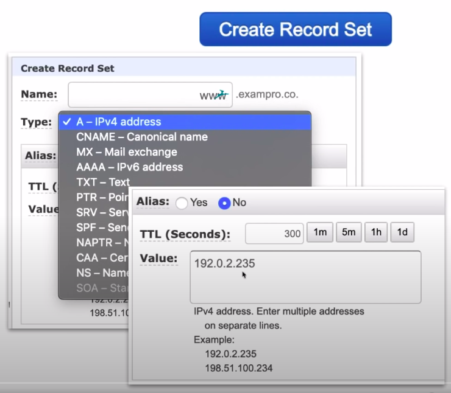

**Route53 - Alias Record**

* AWS has their own special Alias Record which extends DNS functionality. It will route traffic to specific AWS resources.
* Alias records are smart where **they can detect the change of an IP address and continuously keep that endpoint pointed to the correct resource.**
* In most cases you want to be using Alias which routing traffic to AWS resources.

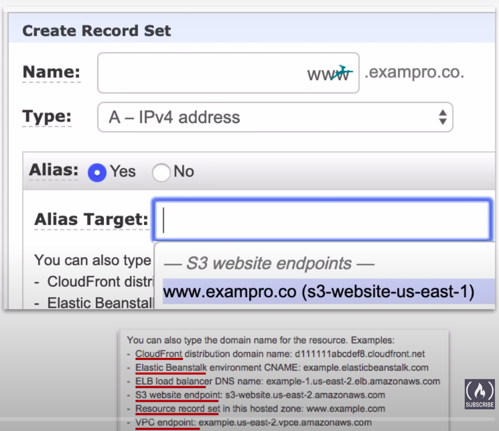

**Routing Policies:**

* **Simple Routing:** default routing policy, multiple addresses result in random selection.
* **Weighted Routing:** route traffic based on weighted values to split traffic.
* **Latency-Based Routing:** route traffic to region resource with lowest latency.
* **Failover Routing:** route traffic if primary endpoint is unhealthy to secondary endpoint.
* **Geolocation Routing** route traffic based on the location of your users.
* **Geo-proximity Routing** route traffic based on the location of your resources and optionally, shift traffic from resources in one location to resources in another.
* **Multi-value Answer Routing** respond to DNS queries with up to eight healthy records selected at random.

**A visual editor** lets you create sophisticated routing configurations for your resources using existing routing types.

Supports **versioning,** so you can roll out or roll back updates.

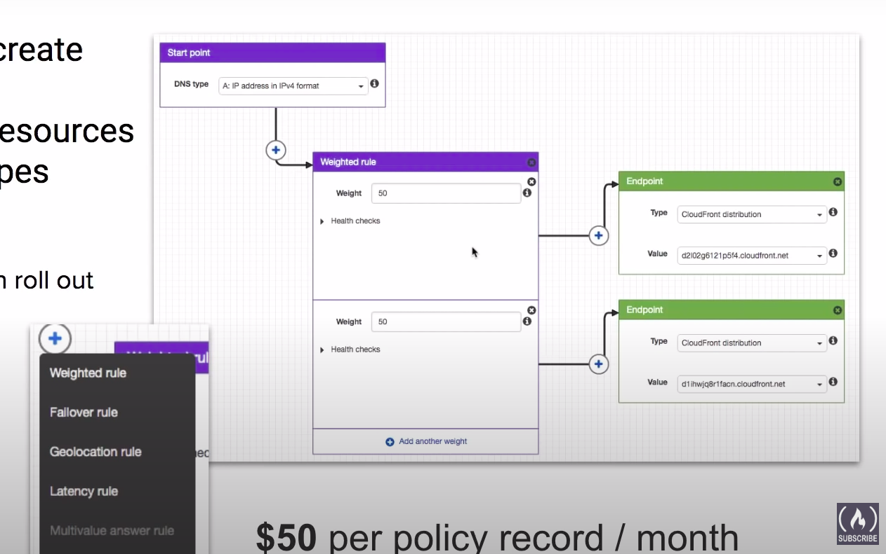

**Simple Routing Policies**

* Simple Routing Policies are the most basic routing policies in Route53 **Default Policy**
* You have 1 record and provide multiple IP addresses.
* When multiple values are specified for a record, Route53 will return all values back to the user in a random order.

For example if you have a record for `www.exampro.co` with 3 different IP address values, users would be directly randomly to 1 of them when visiting the domain.

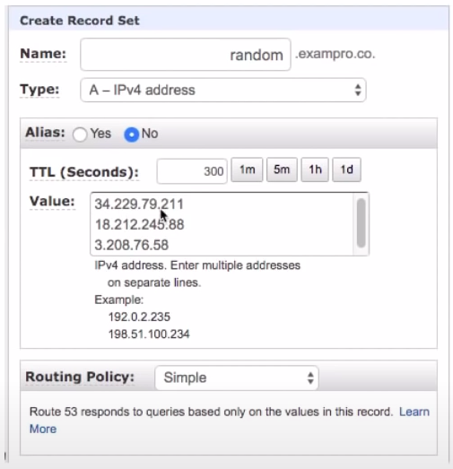

**Weighted Routing Policies**

* Weighted Routing Policies let you split up traffic based on different `weights` assigned.
* This allows you to send a certain percentage of overall traffic to one server, and have any other traffic apart from that directed to a completely different server.

For example if you had an ALB running experimental features you could test against a small amount traffic at random to minimize the impact of affect.

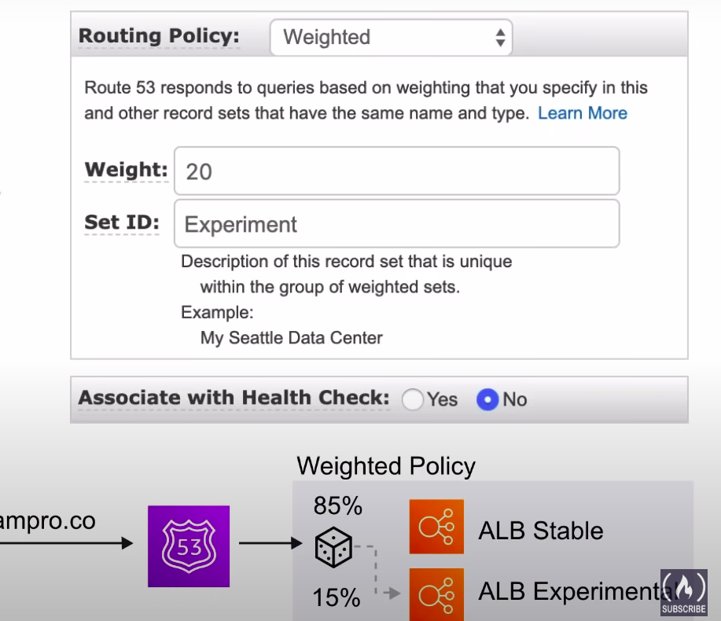

**Latency Based Routing Policies:**

* Latency Based Routing allows you to direct traffic based on the lowest network latency possible for your end-user **based on region.**
* Requires a latency resource record to be set for the EC2 or ELD resource that hosts your application in each region.

For example, You have two copies of your web-app backed by ALB. One in Calif, US and another in Montreal CA. A request comes in from Toronto, it will be routed to Montreal since it will have lower latency.

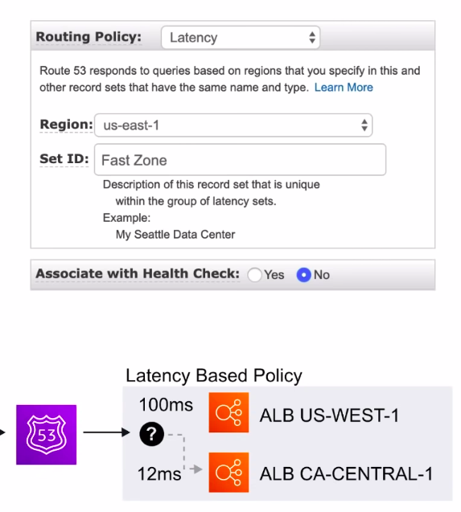

**Failover Routing Policies:**

* Failover Routing Policies allow you to create active/passive setups in situations where you want a primary site in one location and a secondary data recovery site in another.
* Route52 automatically monitors health-checks from your primary site to determine the health of end-points. If an end-point is determined to be in a failed state, all traffic is automatically directed to the secondary location.

For example, we have primary and secondary web-app backed by ALB. Route53 determines our primary is unhealthy and fails over to secondary ALB.

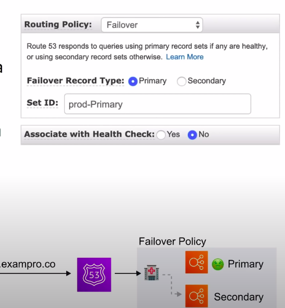

**Geolocation routing policies:**

* Allow you to direct traffic based on the geographic location of where the request originated from.
* For example this would let you route all traffic coming from North America to servers located in North America regions, where queries from other regions could be directed to servers hosted in that region.(potentially with pricing and language specific to that region)

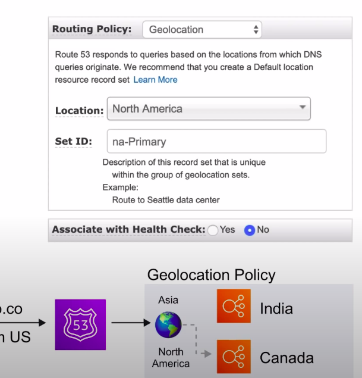

**Geo-proximity Routing Policies:**

* Allow you to direct traffic based on the geographic location of your users, and your AWS resources.
* You can route more or less traffic to a specific resource by specifying a `Bias` value.

`Bias` values expand and shrink the size of the geographic region from which traffic is routed to. **You must use Route53 Traffic flow** in order to use geo-proximity routing policies.

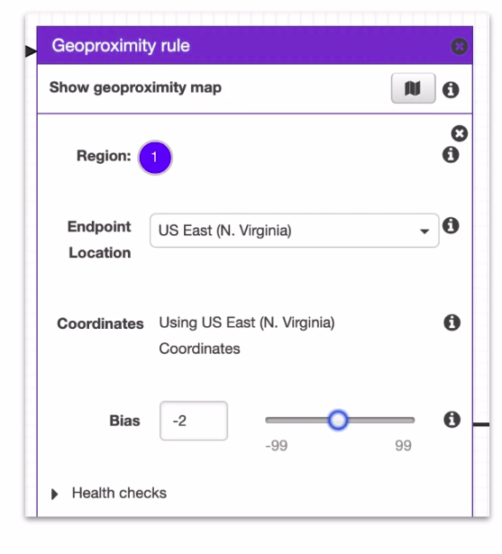
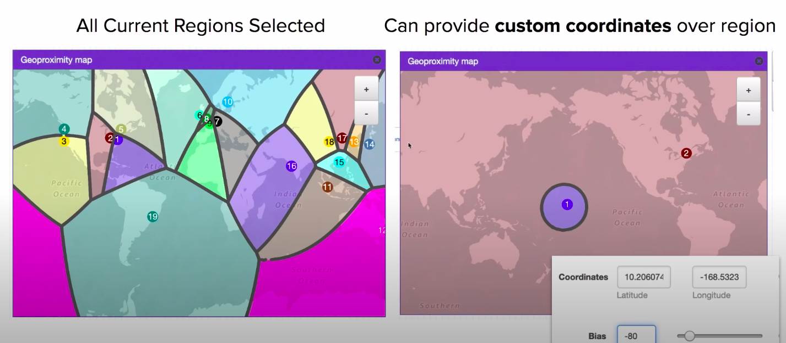

**Multi-value Answer Policies:**

* Let you configure Route53 to return multiple values such as IP addresses for your web-servers, in response to DNS queries.
* Multiple values can be specified for almost any record. Route53 automatically performs health-checks on resources and only returns values of ones deemed healthy.

Similar to Simple Routing, however with an added health check for your record set resources.

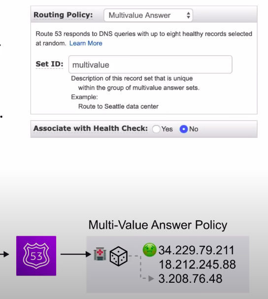

**Route53 - Health Checks**

* Checks health every **30s** by default. Can be reduced to every **10s**.
* A health check can **initial a failover** if status is returned unhealthy.
* A CloudWatch Alarm can be created to alert you of status unhealthy
* A health check can monitor other health check to create a chain of reactions.
* Can create up to 50 health checks for AWS endpoints that are within or linked to the same AWS account.

**Route53 - Resolver**

* Formerly known as **.2 resolver**
* A regional service that lets you route DNS queries between your **VPCs and your network**.
* DNS Resolution for **Hybrid Environments**

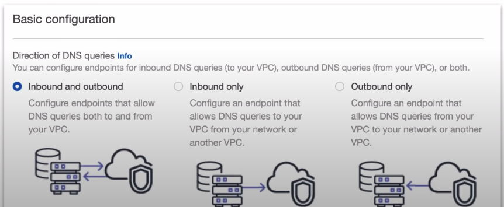

**CheatSheet:**

* Route53 is a DNS provider, register and manage domains, create record sets. This Godaddy or NameCheap.
* Simple Routing - Default routing policy, multiple adresses result in a random endpoint selection.
* Weighted - Split up traffic based on different weights
* Latency - Direct traffic based on region, for lowest possible latency for users.
* Failover - Primary site in one location, secondary data recovery site in another.
* Geolocation - Route traffic based on the geographic location of request origin.
* Geo-proximity - Route traffic based on geographic location using `Bias value`
* Multi-value - Return multiple values in response to DNS queries(using health check)
* Traffic flow - visual editor for chaining routing policies can version policy records for easy rollback
* AWS Alias Record - smart DNS record detects changed IPs for AWS resources and adjust automatically.
* Resolver - Let you regionally route DNS queries between your VPC and your network Hybrid environments
* Health checks can be created to monitor and automatically over endpoints. You can have health checks monitor other health checks.