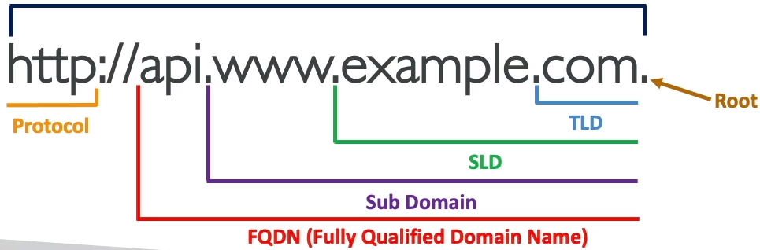

### What is DNS?

* Domain Name System which translates the human friendly hostname into the machine IP addresses
* www.google.com => 171.217.18.36
* DNS is the backbone of the internet
* DNS uses hierarchical naming structure
  * .com
  * example.com
  * www.example.com
  * api.example.com
  
#### DNS Terminologies

* Domain Registrar: Amazon Route 53, GoDaddy,...
* DNS Records: A, AAAA, CNAME, NS,...
* Zone File: contains DNS records
* Name Server: resolves DNS queries(Authoritative or Non-Authoritative)
* Top Level Domain (TLD): .com, .us, .in, .gov, .org, ...
* Second Level Domain (SLD): amazon.com, google.com, ...

#### How DNS Works

### Amazon Route 53 

* A highly available, scalable, fully managed and Authoritative DNS
  * Authoritative = the customer (you) can update the DNS records
* Route 53 is also a Domain Registrar
* Ability to check the health of your resources
* The only AWS service which provides 100% availability SLA
* Why Route 53? 53 is a reference to the traditional DNS port.

#### Route 53 - Records

* How you want to route traffic for a domain
* Each record contains:
  * **Domain/subdomain Name** - e.g., example.com
  * **RecordType** - e.g., A or AAAA
  * **Value** - e.g., 12.34.56.78
  * **Routing Policy** - how Route 53 respond to queries
  * **TTL** - amount of time the record cached at DNS Resolvers
* Route 53 supports the following DNS record types:
  * (must know) A / AAAA / CNAME / NS
  * (advanced) CAA / DS / MX / NAPTR / PTR / SOA / TXT / SPF / SRV

#### Route 53 - Record Types

* **A** - maps a hostname to IPV4
* **AAAA** - maps a hostname to IPV6
* **CNAME** - maps a hostname to another hostname
  * The target is a domain name which must have an A or AAAA record
  * Can't create a CNAME record for the top node of a DNS namespace(Zone Apex)
  * Example: you can't create for example.com, but you can create for www.example.com
* **NS** - Name Servers for the Hosted Zone

#### Route 53 - Hosted Zones

* A container for records that define how to route traffic to a domain and its subdomains
* **Public Hosted Zones** - contains records that specify how to route traffic on the Internet(public domain names) application1.mypublicdomain.com
* **Private Hosted Zones** - contains records that specify how to route traffic within one or more VPCs (private domain names) application1.company.internal

* You pay $0.50 per month per hosted zone

#### Route 53 - Records TTL(Time to Live)

* High TTL - e.g., 24 hr
  * Less traffic on Route 53
  * Possibly outdated record
* Low TTL - e.g, 60 sec
  * More traffic on Route 53($$)
  * Records are outdated for less time
  * Easy to change records
* Except for Alias records, TTL is mandatory for each DNS record

### CNAME vs Alias

* AWS Resources(Load Balancer, CloudFront...) expose an AWS hostname:
  * lb1-1234.us-east-1.elb.amazonaws.com and you want myapp.mydomain.com

* CNAME:
  * Point a hostname to any other hostname(app.mydoamin.com => blabla.anything.com)
  * ONLY FOR NON ROOT DOMAIN(something.mydomain.com)
* Alias:
  * Points a hostname to an AWS Resource(app.mydomain.com => blabla.amazonaws.com)
  * Works for ROOT DOMAIN and NON ROOT DOMAIN(aka mydomain.com)
  * Free of charge

#### Route 53 - Alias Records

* Maps a hostname to an AWS resource
* An extension to DNS functionality
* Automatically recognizes changes in the resource's IP addresses
* Unlike CNAME, it can be used for the top node of a DNS namespace(Zone Apex) e.g: example.com
* Alias Record is always of type A/AAAA for AWS resources(IPv4/IPv6)
* **You can't set the TTL**

### Route 53 - Alias Records Targets

* Elastic Load Balancers
* CloudFront Distributions
* API Gateway
* Elastic Beanstalk environments
* S3 Websites
* VPC Interface Endpoints
* Global Accelerator accelerator
* Route 53 record in the same hosted zone

* **You cannot set an ALIAS record for an EC2 DNS name**

### Route 53 - Routing Policies

* Define how Route 53 responds to DNS queries
* Don't get confused by the word "Routing"
  * It's not the same as Load balancer routing which routes the traffic
  * DNS does not route any traffic, it only responds to the DNS queries
* Route 53 Supports the following Routing Policies
  * Simple
  * Weighted
  * Failover
  * Latency Based
  * Geolocation
  * Multi-Value Answer
  * Geo proximity(using Route 53 Traffic Flow Feature)

#### Routing Policies - Simple

* Typically, route traffic to a single resource
* Can specify multiple values in the same record
* **If multiple values are returned, a random one is chosen by the client**
* When Alias enabled, specify only one AWS resource
* Can't be associated with Health Checks

#### Routing Policies - Weighted

* Control the % of the requests that go to each specific resource
* Assign each record a relative weight
  * traffic(%) = Weight for a specific record / Sum of all the weights for all records
* DNS records must have the same name and type
* Use-cases: load balancing between regions, testing new application versions...
* **Assign a weight of 0 to a record to stop sending traffic to a resource**
* If all records have weight of 0, the all records will be returned equally.

#### Routing Policies - Latency

* Redirected to the resources that has the least latency close to us
* Super helpful when latency for users is a priority
* **Latency is based on traffic between users and AWS regions**
* German users may be directed to the US(if that's the lowest latency)
* Can be associated with Health Checks(has a failover capability)

#### Route 53 - Health Checks

* HTTP Health Checks are only for **public resources**
* Health Check => Automated DNS Failover:
  * Health checks that monitor an  endpoint(application, server, other AWS resource)
  * Health checks that monitor other health checks(Calculated Health Checks)
  * Health checks that monitor CloudWatch Alarms(full control !!!) - e.g., throttles of DynamoDB, alarms on RDS, custom metrics, (helpful for private resources)
* Health Checks are integrated with CW metrics

#### Health Checks - Monitor an Endpoint

* **About 15 global health checkers will check the endpoint health**
  * Healthy/Unhealthy Threshold - 3(default)
  * Interval - 30 sec (can set to 10 sec - higher cost)
  * Supported protocol: HTTP, HTTPS and TCP
  * If > 18% of health report the endpoint is health, Route 53 considers it **Healthy**. Otherwise, it's **Unhealthy**
  * Ability to choose which location you want Route 53 to use
* Health Checks pass only when the endpoint responds with the 2xx and 3xx status codes
* Health Checks can be setup to pass / fail based on the text in the first **5120 bytes** of the response
* Configure you router/firewall to allow incoming requests from Route 53 Health Checkers

#### Route 53 - Calculated Health Checks

* Combine the results of multiple Health Checks into a single Health Check
* You can use **OR**, **AND**, or **NOT**
* Can monitor up to 256 Child Health Checks
* Specify how many of the health checks need to pass to make the parent pass
* Usage: perform maintenance of your website without causing all health checks to fail

#### Health Checks - Private Hosted Zones

* Route 53 health checkers are outside the VPC
* They can't access private endpoints(private VPC or on-premises resources)
* You can create a **CloudWatch Metric** and associate a **Cloudwatch Alarm**, then create a Health Check that checks the alarm itself

### Routing Policies - Failover(Active-Passive)

### Routing Policies - Geolocation

* Different from latency-based
* **This routing is based on user location**
* Specify location by Continent, Country, or by US State(if there's overlapping, more precise location selected)
* Should create a **Default** record(in case there's no match on location)
* Use cases: website localization, restrict content distribution, load balancing,...
* Can be associated with Health Checks

======================================

Route53 Domain Name Service **think** Godaddy or NameCheap but with more synergies with AWS services.

You can:
* register and manage domains
* create various records sets on a domain
* implement complex **traffic flows** eg. Blue/green deploy, fail-overs
* Continuously monitor records via health checks
* resolve VPC's outside of AWS.

**Route53-Use case**

Use Route53 to get your custom domains to point to your AWS Resources.

1. Incoming internet traffic
2. Route traffic to our web-app backend by ELB
3. Route traffic to an instance we use to tweak out AMI
4. Route traffic to API gateway which powers our API
5. Route traffic to CloudFront which servers out S3 static hosted website.
6. Route traffic to an Elastic IP(EIP) which is a static IP that hosts our company Minecraft server.

**Record Sets**

* We create record sets which allows us to point our naked domain(exampro.co) and subdomains via Domain records.
* For example, we can send our www subdomain using an **A record** to point a specific IP address,

**Route53 - Alias Record**

* AWS has their own special Alias Record which extends DNS functionality. It will route traffic to specific AWS resources.
* Alias records are smart where **they can detect the change of an IP address and continuously keep that endpoint pointed to the correct resource.**
* In most cases you want to be using Alias which routing traffic to AWS resources.

**Routing Policies:**

* **Simple Routing:** default routing policy, multiple addresses result in random selection.
* **Weighted Routing:** route traffic based on weighted values to split traffic.
* **Latency-Based Routing:** route traffic to region resource with lowest latency.
* **Failover Routing:** route traffic if primary endpoint is unhealthy to secondary endpoint.
* **Geolocation Routing** route traffic based on the location of your users.
* **Geo-proximity Routing** route traffic based on the location of your resources and optionally, shift traffic from resources in one location to resources in another.
* **Multi-value Answer Routing** respond to DNS queries with up to eight healthy records selected at random.

**A visual editor** lets you create sophisticated routing configurations for your resources using existing routing types.

Supports **versioning,** so you can roll out or roll back updates.

**Simple Routing Policies**

* Simple Routing Policies are the most basic routing policies in Route53 **Default Policy**
* You have 1 record and provide multiple IP addresses.
* When multiple values are specified for a record, Route53 will return all values back to the user in a random order.

For example if you have a record for `www.exampro.co` with 3 different IP address values, users would be directly randomly to 1 of them when visiting the domain.

**Weighted Routing Policies**

* Weighted Routing Policies let you split up traffic based on different `weights` assigned.
* This allows you to send a certain percentage of overall traffic to one server, and have any other traffic apart from that directed to a completely different server.

For example if you had an ALB running experimental features you could test against a small amount traffic at random to minimize the impact of affect.

**Latency Based Routing Policies:**

* Latency Based Routing allows you to direct traffic based on the lowest network latency possible for your end-user **based on region.**
* Requires a latency resource record to be set for the EC2 or ELD resource that hosts your application in each region.

For example, You have two copies of your web-app backed by ALB. One in Calif, US and another in Montreal CA. A request comes in from Toronto, it will be routed to Montreal since it will have lower latency.

**Failover Routing Policies:**

* Failover Routing Policies allow you to create active/passive setups in situations where you want a primary site in one location and a secondary data recovery site in another.
* Route52 automatically monitors health-checks from your primary site to determine the health of end-points. If an end-point is determined to be in a failed state, all traffic is automatically directed to the secondary location.

For example, we have primary and secondary web-app backed by ALB. Route53 determines our primary is unhealthy and fails over to secondary ALB.

**Geolocation routing policies:**

* Allow you to direct traffic based on the geographic location of where the request originated from.
* For example this would let you route all traffic coming from North America to servers located in North America regions, where queries from other regions could be directed to servers hosted in that region.(potentially with pricing and language specific to that region)

**Geo-proximity Routing Policies:**

* Allow you to direct traffic based on the geographic location of your users, and your AWS resources.
* You can route more or less traffic to a specific resource by specifying a `Bias` value.

`Bias` values expand and shrink the size of the geographic region from which traffic is routed to. **You must use Route53 Traffic flow** in order to use geo-proximity routing policies.

**Multi-value Answer Policies:**

* Let you configure Route53 to return multiple values such as IP addresses for your web-servers, in response to DNS queries.
* Multiple values can be specified for almost any record. Route53 automatically performs health-checks on resources and only returns values of ones deemed healthy.

Similar to Simple Routing, however with an added health check for your record set resources.

**Route53 - Health Checks**

* Checks health every **30s** by default. Can be reduced to every **10s**.
* A health check can **initial a failover** if status is returned unhealthy.
* A CloudWatch Alarm can be created to alert you of status unhealthy
* A health check can monitor other health check to create a chain of reactions.
* Can create up to 50 health checks for AWS endpoints that are within or linked to the same AWS account.

**Route53 - Resolver**

* Formerly known as **.2 resolver**
* A regional service that lets you route DNS queries between your **VPCs and your network**.
* DNS Resolution for **Hybrid Environments**

