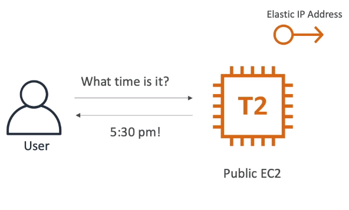
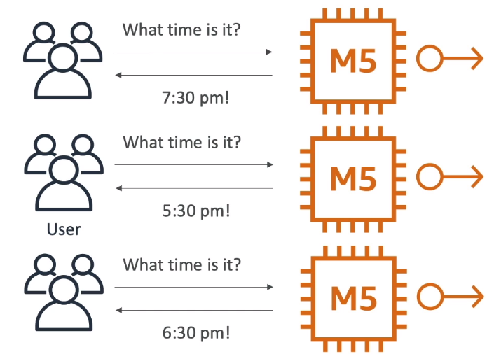
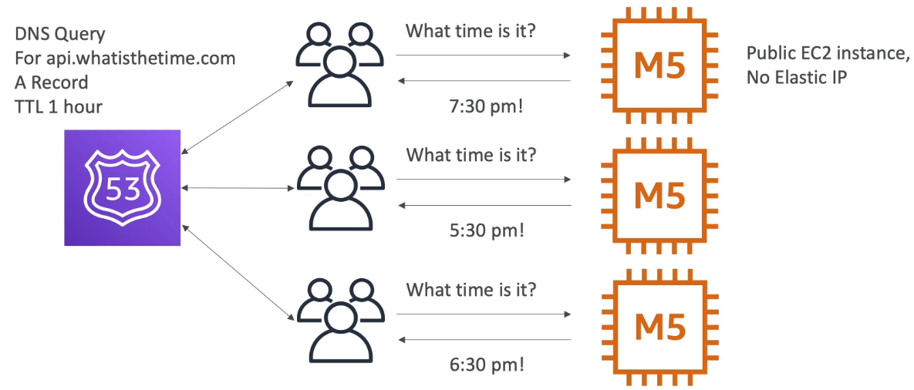
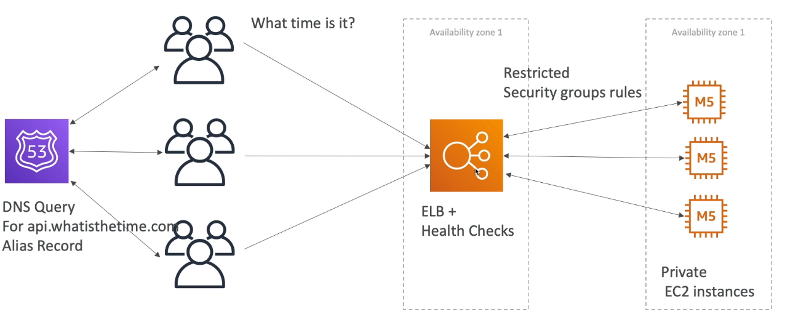
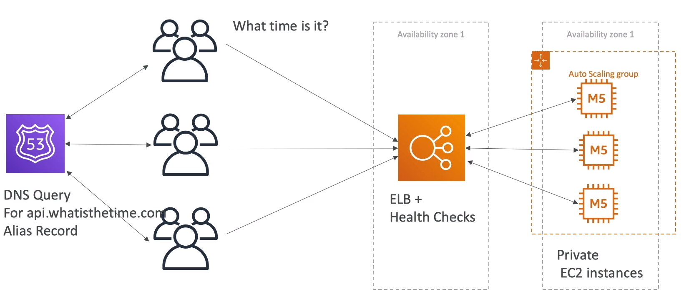
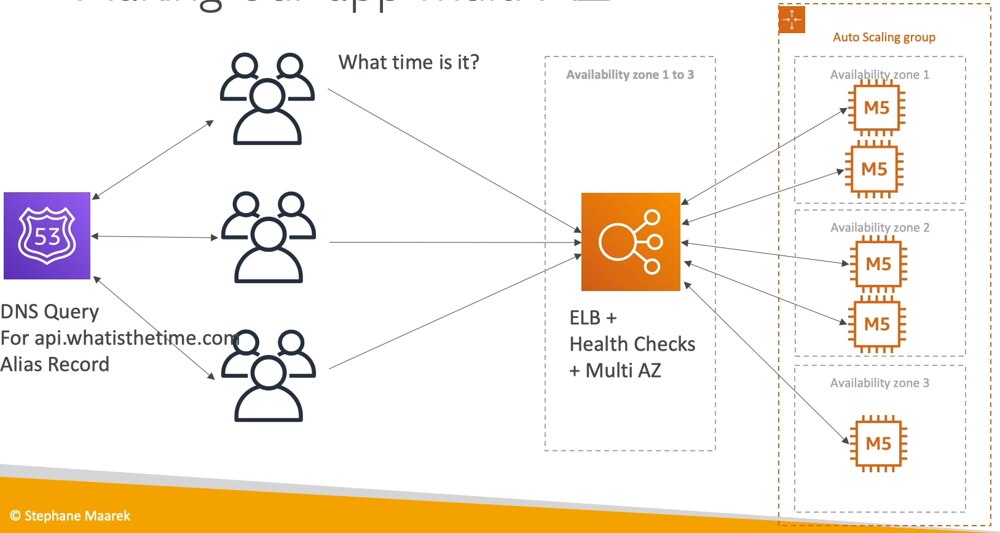

### Stateless Web App: WhatIsTheTime.com

* WhatIsTheTime.com allows people to know what time it is
* We don't need a database
* We want to start small and can accept downtime
* We want to fully scale vertically and horizontally, no downtime
* Let's go thru the Solution Architect journey for this app

#### Starting simple

* We have a public EC2 instance and its has a static IP address in case something happens when we restart it

#### Scaling Vertically

* Now more users started using the app and so more traffic and certainly T2 micro instance isn't enough
* Let's scale vertically and make it an M5 large type of instance

* But during this time user faced downtime during the upgrade time

#### Scaling Horizontally

* Issue: Now adding and removing instance is difficult

#### Scaling horizontally using Load Balancer

* Issue: Adding and removing instance is pretty hard

#### Scaling horizontally with an auto-scaling group

* Issue: Now when there is an earthquake, when the AZ1 goes down, our application is entirely down

#### Making our app multi-AZ

#### Minimum 2 AZ => Let's reserve capacity

* We know that at least one instance will be running on two AZ, so we can reserve capacity and save cost.
* Reserve capacity for minimum instance

#### We discussed

* Public vs Private IP and EC2 instances
* Elastic IP vs Route 53 vs Load Balancers
* Route 53 TTL, A records, and Alias Records
* Maintaining EC2 instaces manually vs Auto Scaling Groups
* Multi AZ to survive disaster
* ELB Health Checks
* Security Group Rules
* Reservation of capacity for costing saving when possible
* We're considering 5 pillars for a well architected application: **costs, performance, reliability, security, operational excellence**