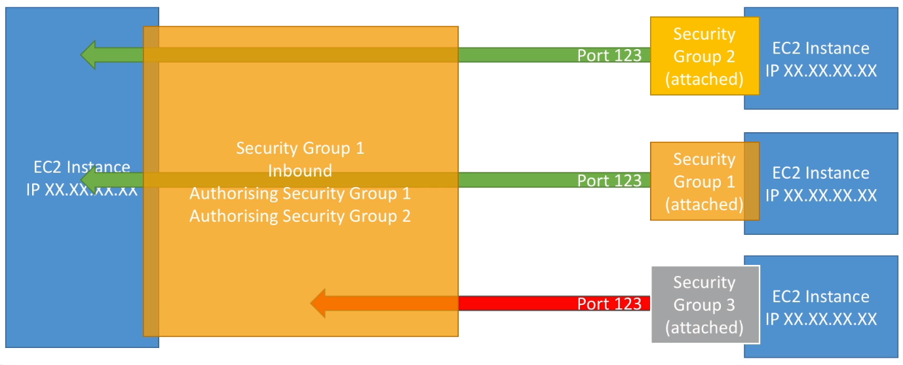
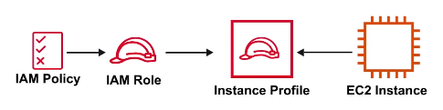

### EC2

* Cloud computing service
* Choose your **OS, storage, Memory, Network Throughput.**
* Launch and SSH into your server within minutes.

### Introduction

EC2 is a **highly configurable server.**
EC2 is resizable **compute capacity.** It takes **minutes** to launch new instances.
Anything and everything on AWS uses EC2 Instance underneath.

**Choose your OS via Amazon Machine Image(AMI)**: Redhat, Ubuntu, windows, amazon linux, suse

**Choose you Instance Type**: 

| t2.nano                   | c4.8xlarge                              |
|---------------------------|-----------------------------------------|
| $0.0065/hour($4.75/month) | $1.591/hour($1161.43/month)             |
| 1 vCPU 0.5GB Mem          | 36 vCPU 60GB Mem 10 Gigabit performance |

Add Storage(EBS, EFS): SSD HDD Virtual Magnetic Tape 

| SSD | HDD | Virtual Magnetic Type | Multiple Volumes |
|-----|-----|-----------------------|------------------|

Configure your Instance:

| Security Group | Key Pairs | UserData | IAM Roles | Placement Groups |
|----------------|-----------|----------|-----------|------------------|

**Instance Types and Usage**

* AWS has the following naming convention:
  * m5.2xlarge
    * m: instance class
    * 5: generation (AWS improves them over time)
    * 2xlarge: size within the instance class
* **General Purpose:**
  * Great for a diversity of workloads such as web servers or code repositories
  * Balance between:
    * Compute
    * Memory
    * Networking
* **Compute Optimized**
  * Great for compute-intensive tasks that require high performance processors:
    * Batch processing workloads
    * Media transcoding
    * High performance web servers
    * High performance computing(HPC)
    * Scientific modeling & machine learning
    * Dedicated gaming server
* **Memory Optimized**
  * Fast performance for workloads that process large data sets in memory
    * Use-cases
      * High performance, relational/non-relational databases
      * Distributed web scale cache stores
      * In-memory database optimized for BI(Business Intelligence)
      * Applications performing real-time processing of big unstructured data.
* **Storage optimized**
  * Great for storage-intensive tasks that requires high, sequential read and write access to large data sets on local storage.
    * Use-cases
      * High frequency online transaction processing(OLTP) system
      * Relational & NoSQL databases
      * Cache for in-memory databases(for example, Redis)
      * Data warehousing applications
      * Distributed file systems

| Instance Type         | Usage                                                                                                                                                                                       |
|-----------------------|---------------------------------------------------------------------------------------------------------------------------------------------------------------------------------------------|
| General Purpose       | **A1 T3 T3a T2 M5 M5a M4.**  Balance of compute, memory and networking resources. **Use-cases** web servers and code repositories                                                           |
| Compute Optimized     | **C5 C5n C4.** Ideal for compute bound applications that benefit from high performance processor. **Use-cases** scientific modeling, dedicated gaming servers and ad server engines         |
| Memory Optimized      | **R5 R5a X1e X1 High Memory z1d.** Fast performance for workloads that process large data sets in memory. **Use-cases** in-memory caches, in-memory databases, real time big data analytics |
| Accelerated Optimized | **P3 P2 G3 F1.** hardware accelerators, or co-processors. **Use-cases** Machine learning, computational finance, seismic analysis, speech recognition                                       |
| Storage Optimized     | **I3 I3en D2 H1** high, sequential read and write access to very large datasets on local storage. **Use-cases** NoSQL, in-memory or transaction databases, data warehousing.                |

**Instance Sizes**

EC2 Instance Sizes **generally double** in price and key attributes

| Name      | vCPU | RAM(GIB) | On-Demand per hour | On-Demand per month |
|-----------|------|----------|--------------------|---------------------|
| t2.small  | 1    | 12       | $.023              | $16.79              |
| t2.medium | 2    | 24       | $.0464             | $33.87              |
| t2.large  | 2    | 36       | $.0928             | $67.74              |
| t2.xlarge | 4    | 54       | $.1856             | $135.48             |

**Introduction to Security Groups**

* Security Groups are the fundamental of network security in AWS.
* They control how traffic is allowed into or out of our EC2 instances.
* Security Groups only contain allow rules
* Security Groups rules can reference by IP or by security group.

**Security Group Deeper Dive**

* Security groups are acting as a firewall on EC2 instances
* They regulate:
  * Access to Ports
  * Authorized IP ranges - IPv4 and IPv6
  * Control of inbound network(from other to the instance)
  * Control of outbound network(from the instance to others)

**SG Good to know**

* Can be attached to multiple instances
* Locked down to a region/VPC combination
* Does live "outside" the EC2 - if traffic is blocked the EC2 instance won't see it.
* **It's good to maintain one separate security group for SSH access.**
* If your application is not accessible (time out), then it's a security group issue.
* If your application gives a "connection refused" error, then it's an application error or it's not launched.
* All inbound traffic is **blocked** by default.
* All outbound traffic is **authorized** by default.

**Referencing other security groups**



**Instance Profile**

* Instead of embedding your AWS credentials(Access Key and Secret) in your code so your Instance has permissions to access certain services you can **Attach a role to an instance** via an **Instance Profile**
**You want to always avoid embedding your AWS credentials when possible**



An **Instance Profile** holds a reference to a role. The EC2 instance is associated with the Instance Profile. When you select an IAM role when Launching an EC2 instance, AWS will automatically create the Instance Profile for you. Instance Profiles are not easily viewed via the AWS Console.


**Placement Groups**

Placement Groups let you choose the **logical placement** of your instances to optimize for **communication, performance or durability**. Placement groups are **free**.

**Cluster**

* Pack instances close together inside an AZ
* low-latency network performance for tightly coupled node-to-node communication
* well suited for High Performance Computing applications.
* Clusters cannot be multi-AZ


**Partition**

* Spread instances across logical partitions
* each partition do not share the underlying hardware with each other(rack per partition)
* well suited for large distributed and replicated workloads(Hadoop, Cassandra, Kafka)


**Spread**

* Each instance is placed on a different rack
* When critical instances should be keep separate from each other.
* You can spread a max of 7 instances. Spreads can be multi-AZ.


**User data**

* You can provide an EC2 with **UserData** which is a script that will be automatically run when launching an EC2 instance. You could install package, apply updates or anything you like.

This example sets up an apache web-server.


From within the EC2 instance, if you were to SSH in and CURL this special URL you can use the UserData script eg. **curl http://169.254.169.254/latest/user-data**

**Metadata**

* From within your EC2 instance you can access information about the EC2 via a special url endpoint at

```
169.254.169.254
```

You would SSH into your EC2 instance and can you the CURL command:

```
curl http://169.254.169.254/latest/meta-data
```

| type           | Desc                                         |
|----------------|----------------------------------------------|
| /public-ipv4   | get the current public IPV4 address          |
| /ami-id        | the AMI ID used to launch this EC2 instance. |
| /instance-type | the Instance Type of this EC2 instance.      |

Combine metadata with userdata scripts to perform all sorts of advanced AWS staging automation.


### Cheat Sheet

* Is a cloud computing service.
* Configure your EC2 by choosing you **OS, Storage, Memory, Network Throughput**
* Launch and SSH into your server within minutes
* EC2 comes with variety Instance Types specialized for different roles:
  * General purpose
  * Compute Optimized
  * Memory Optimized
  * Accelerated Optimized
  * Storage Optimized
* Instance Sizes **general double** in price and key attributes
* **Placement groups** let you choose the logical placement of your instances to optimize for communication, performance or durability. Placement groups are free.
* **UserData** a script that will be automatically run when launching an EC2 instance
* **MetaData** meta data about the current instance.
* **Instance Profiles** a container for an IAM role that you can use to pass role information to an EC2 instance when the instance starts.