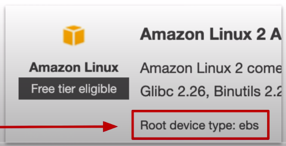

### Amazon Machine Image(AMI): A template to configure new instances.

* Amazon Machine Image(AMI) provides the information required to launch an instance.
* You can turn you **EC2 instances into AMIs,** so you can create copies of your server.

**An AMI holds the following information:**
* A template for the root volume for the instance(**EBS Snapshot or Instance Store template**) e.g. an operating system, an application server and applications.
* Launch permissions that control which AWS accounts can use the AMI to launch instances.
* A block device mapping that specifies the volumes to attach to the instance which it's launched.
* AMIs are **Region Specific!**

**AMI Use cases**

AMIs help you keep incremental changes to your OS, application code and system packages

* web-server-000: Ruby, Node, Postgres Client Installed
* web-server-001: Redis for Sidekiq Installed
* web-server-002: ImageMagick for Image Processing Installed
* web-server-003: CloudWatch Agent Installed

* Using **System Manager Automation** you can routinely patch your AMIs with security updates and bake those AMIs.
* AMIs are used with **LaunchConfigurations.** When you want to roll out updates to multiple instances you make a copy of your LaunchConfiguration with new AMI.

**AMI Marketplace:**

* The AWS Marketplace lets you **purchase subscription** to vendor maintained AMIs.

**Creating an AMI:** 

* You can **create an AMI** from an existing EC2 instance that's either **running** or **stopped**.

**Choosing an AMI**

* AWS has hundreds of AMIs you can search and select from.
* **Community AMI are** free AMIs maintained by the community
* **AWS Marketplace** free and paid AMIs maintained by vendors.

**Amazon Machine Images can be selected based on:**
* Region
* Operating System
* Architecture(32-bit or 64-bit)
* Launch Permissions
* Root Device Volume
  * Instance Store(Ephemeral Storage)
  * EBS Backed Volumes

AMIs are categorized as either backed by Amazon EBS, or backed by Instance Store.

**Copying an AMI**

* AMIs are region specific. If you want to use an AMI from another region. You need to **Copy the AMI** and then select the destination region.

