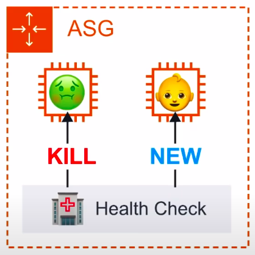

### EC2 Auto Scaling Groups

* Set scaling rules which will automatically **launch additional EC2 instance or shutdown instances to meet current demand**.
* Auto Scaling Groups(ASG) contains a collection of EC2 instances that are treated as a group for the purpose of automatic scaling and management.

Automatic Scaling can occur via:
1. **Capacity Settings**
2. **Health Check Replacements**
3. **Scaling Policies**

**Capacity Setting**

* The size of an Auto Scaling Group is based on **Min, Max and Desired Capacity.**
* Min is how many EC2 instances should at least be running
* Max is number of EC2 instances allowed to be running
* Desired capacity is how many EC2 instances you want to ideally run.
* ASG will always launch instances to meet minimum capacity.

**Health Check Replacements**

**EC2 Health Check Type**

* ASG will perform a health check on EC2 instances to determine if there is a software or hardware issue. This is based on the **EC2 Status Checks**. If an instance is considered unhealthy, ASG will terminate and launch a new instance.

**ELB Health Check Type**

* ASG will perform a health check based on the ELB health check. ELB can perform health checks by pinging and HTTP(S) endpoint with an expected response. If ELB determines a instance is unhealthy to ASG which will terminate the unhealthy instance.

**Scaling Policies**

* **Scaling Out**: Adding more Instances
* **Scaling In**: Removing Instances

**Target Tracking Scaling Policy:**

* Maintains a specific metric at a target value. 
e.g. If **Average CPU Utilization** exceeds 75% then add another server.

**Simple Scaling Policy(Not recommended)**

* Scales when an alarm is breached

**Scaling policies with steps**

* Scales when an alarm is breached, can escalate based on alarm value changing.

**ELB Integration**

* ASG can be associated with Elastic Load Balancers(ELB). When ASG is associated with ELB richer health checks can be set.
* **Classic Load Balancers** are associated directly to the ASG.

* **Application and Network Load Balancers** are associated indirectly via their Target Groups.

**Use-case**

* Burst of traffic from the internet hits our domain
* Route53 points that traffic to our load balancer
* Our load balancer passes the traffic to its target group.
* The target group is associated with our AGS and sends the traffic to instances registered with our ASG.
* The ASG Scaling Policy with check if our instances are near capacity.
* The Scaling Policy determines we need another instance, and it Launches an new EC2 instance with the associated Launch Configuration to our ASG

**Launch Configuration**

* A launch configuration is an instance configuration template that an Auto Scaling Group uses to Launch EC2 instances.
* A Launch Configuration is the same process as Launching an EC2 instance except you are saving that configuration to Launch an Instance for later. 

* Launch Configuration **cannot be edited,** when you need to update your launch configuration you create a new one or clone the existing configuration and then manually associate that new Launch Configuration.