### What is load balancing?

* Load balancers are servers that forward traffic to multiple servers (e.g. EC2 instances) downstream.

#### Why use a load balancer?

* Spread load across multiple downstream instances
* Expose a single point of access(DNS) to your application
* Seamlessly handle failure of downstream instances
* Do regular health check to your instances
* Provide SSL termination (HTTPS) for your websites
* Enforce stickiness with cookies
* High availability across zones
* Separate public traffic from private traffic.

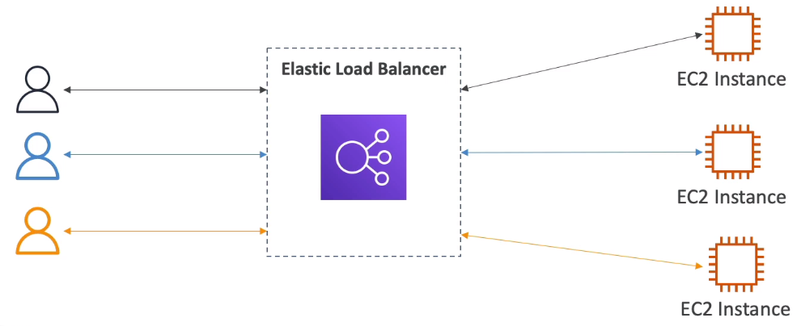

### Elastic Load Balancer

* An Elastic Load Balancer is a **managed load balancer**
  * AWS guarantees that it will be working
  * AWS takes care of upgrades, maintenance, high availability
  * AWS provides only a few configuration knobs

* It costs less to setup your own load balancer, but it will be a lot more effort on your end.

* It is integrated with many AWS offerings/services
  * EC2, EC2 Auto Scaling Group, Amazon ECS
  * AWS Certificate Manager(ACM), CloudWatch
  * Route 53, AWS WAF, AWS Global Accelerator

#### Health Checks

* Health checks are crucial for Load Balancers
* They enable the load balancer to know if instances it forwards traffic to are available to reply to requests
* The health check is done on a port and a route(/health is common)
* If the response is not 200(OKAY), then the instance is unhealthy

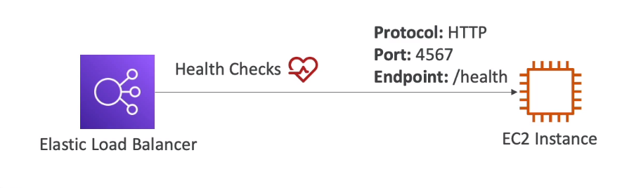

#### Types

* AWS has 4 kinds of managed Load Balancers
* **Classic Load Balancer** (v1 - old generation) - 2009 - CLB
  * HTTP, HTTPS, TCP, SSL (secure TCP)
* **Application Load Balancer** (v2 - new generation) - 2016 - ALB
  * HTTP, HTTPS, WebSocket
* **Network Load Balancer** (v2 - new generation) - 2017 - NLB
  * TCP, TLS (secure TCP), UDP
* **Gateway Load Balancer** - 2020 - GWLB
  * Operates at Layer 3 (Network Layer) - IP Protocol

* Overall, it is recommended to use the newer generation load balancers as they provide more features
* Some load balancers can be set as _internal_(private) or _external_(public) ELBs

### Load Balancer Security Groups

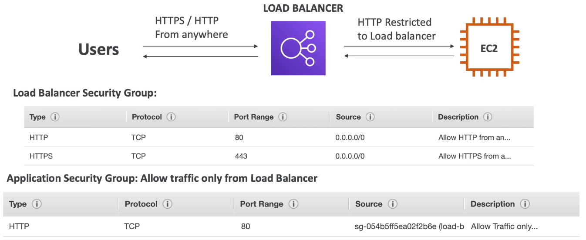

Here if your check closer the source of the ec2 which allows traffic only from Load Balancer.

### Application Load Balancer(v2)

* Application load balancers is Layer 7(HTTP)

* Load balancing to multiple HTTP applications across machines(target groups)
* Load balancing to multiple applications on the same machine(ex: containers)
* Support for HTTP/2 and WebSocket
* Support redirects (from HTTP to HTTPS for example)

* **Routing tables** to different target groups:
  * Routing based on path in URL(example.com/users & example.com/posts)
  * Routing based on hostname in URL(one.example.com & other.example.com)
  * Routing based on Query String, Headers
    * example.com/users?id=123&order=false

* ALB are a great fit for micro-services & container-based application(example: Docker & Amazon ECS)
* Has a port mapping feature to redirect to a dynamic port in ECS
* In comparison, we'd need multiple Classic Load Balancer per application

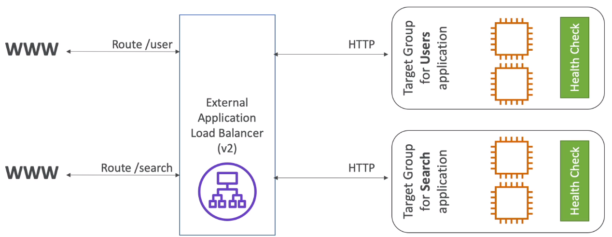

#### Target Groups

* EC2 instances (can be managed by an Auto Scaling Group) - HTTP
* ECS tasks (managed by ECS itself) - HTTP
* Lambda functions - HTTP request is translated into a JSON event
* IP Addresses - must be private IPs

* ALB can route to multiple target groups
* Health checks are at the target group level.

* Query String Routing

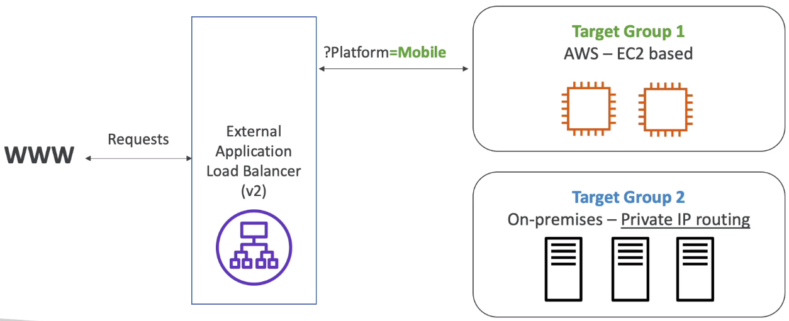

#### Good to know

* Fixed hostname(XXX.region.elb.amazonaws.com)
* The application server don't see the IP of the client directly
  * The true IP of the client is inserted in the header **X-Forwarded-For**
  * We can also get Port(X-Forwarded-Port) and proto(X-Forwarded-Proto)

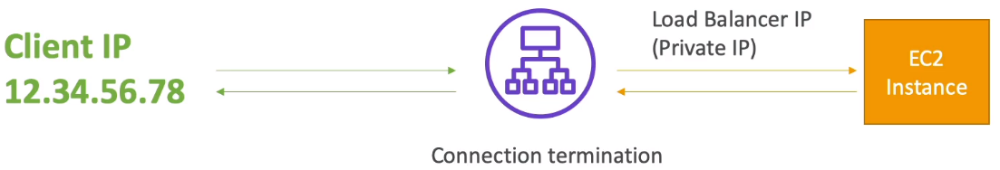

### Network Load Balancer

* It allows:
  * Forward TCP & UDP traffic to your instances
  * Handle millions of request per seconds
  * Less Latency ~100 ms (vs 400 ms for ALB)
* NLB has **one static IP per AZ**, and supports assigning Elastic IP(helpful for whitelisting specific IP)
* NLB are used for extreme performance, TCP or UDP traffic
* Not included in the AWS free tier

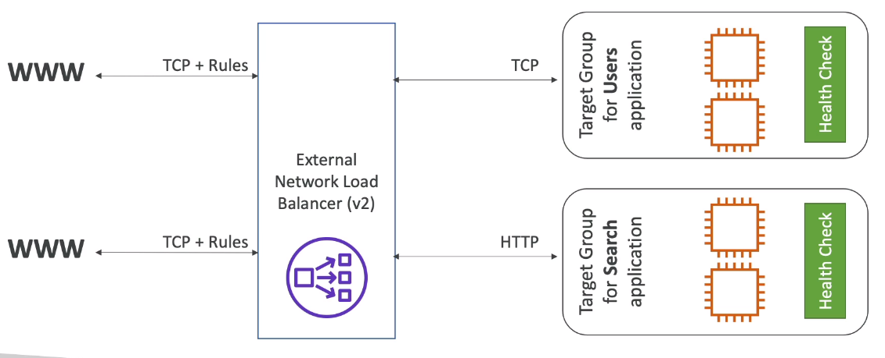

#### Network Load Balancer - Target Groups

* EC2 instances
* IP Addresses - must be a private IPs
* Application Load Balancer
* Health Checks support the **TCP, HTTP and HTTPS Protocols**.

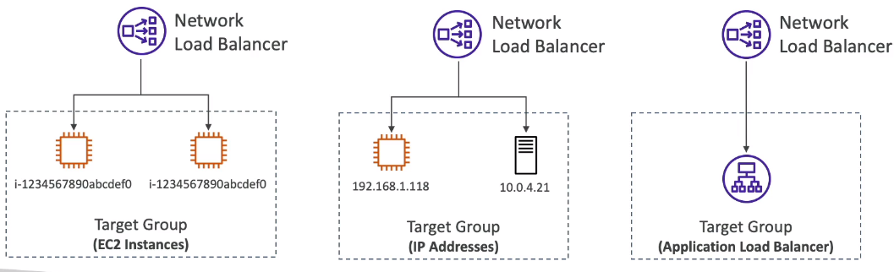

### Gateways Load Balancer

* Deploy, scale and manage fleet of 3rd party network virtual appliances in AWS
* Example: Firewalls, Intrusion Detection and Prevention Systems, Deep Packet Inspection Systems, payload manipulation...

* Operates at Layer 3 (Network Layer) - IP Packets
* Combines the following functions:
  * **Transparent Network Gateway** - single entry/exit for all traffic
  * **Load Balancer** - distributes traffic to your virtual appliances
* Uses the **GENEVE** protocol on port **6081**

### Sticky Sessions(Session Affinity)

* It is possible to implement stickiness so that the same client is always redirected to the same instance behind a load balancer.
* This works for **Classic Load Balancer, Application Load Balancer, and Network Load Balancer**
* The "cookie" used for stickiness has an expiration data you control
* Use case: make sure the user doesn't lose his session data
* Enabling stickiness may bring imbalancer to the load over the backend EC2 instances

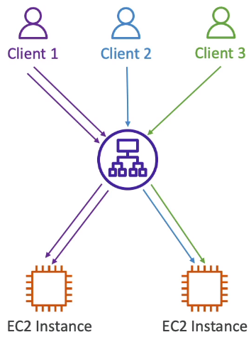

#### Sticky Sessions - Cookie Names

* Application Based Cookies
  * Custom cookie
    * Generated by the target 
    * Can include any custom attributes required by the application
    * Cookie name must be specified individually for each target group
    * Don't use **AWSALB**, **AWSALBAPP**, or **AWSALBBTG**
  * Application cookie
    * Generated by the load balancer
    * Cookie name is **AWSALBAPP**
* Duration-based Cookies
  * Cookie generated by the load balancer
  * Cookie name is **AWSALB** for ALB, **AWSELB** for CLB
 
**The Rules of Traffic**

**Listeners:** 

* **Incoming traffic is evaluated against listeners.** Listeners evaluate any traffic that is matches the Listener's port. For Classic Load Balancer, EC2 instances are directly registered to the Load Balancer.

**Rules:(Not available for Classic Load Balancer)**

* **Listeners will then invoke rules to decide what to do with the traffic.** Generally the next step is to forward traffic to a Target Group.

**Target Groups:(Not available for Class Load Balancer)**
  
* EC2 instances are registered as targets to a Target Group.

* For **Application Load Balancer(ALB) or Network Load Balancer(NLB)** traffic is sent to the Listeners. When the port matches it then checks the rules what to do. The rules will forward the traffic to a Target Group. The target group will evenly distribute the traffic to instances registered to that target group.

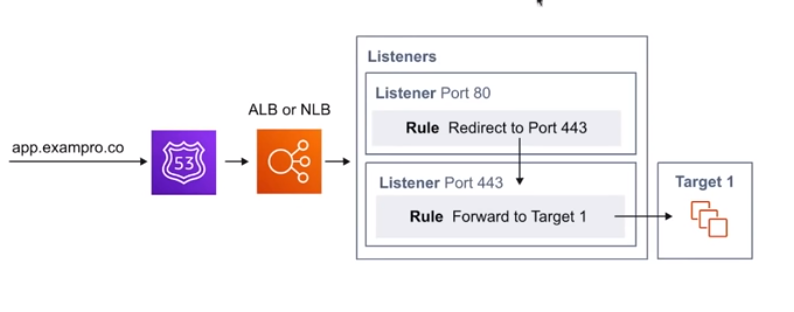

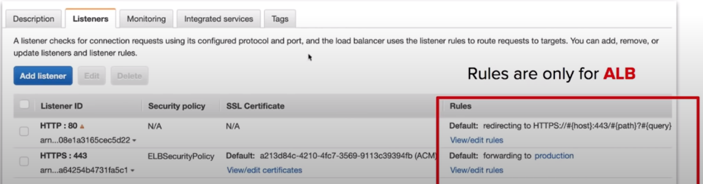

* For **Classic Load Balancer(CLB)** traffic is sent to the listeners. When the **port matches it then forwards the traffic to any EC2 instances** that are registered to the Classic Load Balancer. CLB does not allow you to apply rules to listeners.

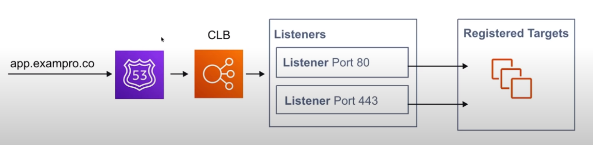

**Application Load Balancer(ALB)**

* This is designed to balance **HTTP and HTTPs** traffic.
* They operate at **Layer 7 of the OSI model**
* ALB has a feature called **Request Routing** which allows you to add routing rules to your listeners based on the HTTP protocol.
* Web Application Firewall can be attached to ALB.
* Great for Web Applications.

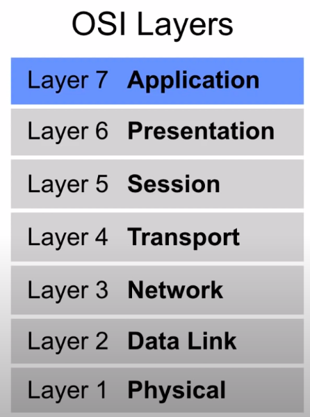

**Network Load Balancers**

* It is designed to balance **TCP/UDP.** 
* They **operate at Layer 4 of the OSI Model**
* Can handler **millions of requests per second** while still maintaining extremely low latency.
* Can perform Cross-Zone Load Balancing
* Great for multiplayer video games or when network performance is critical.

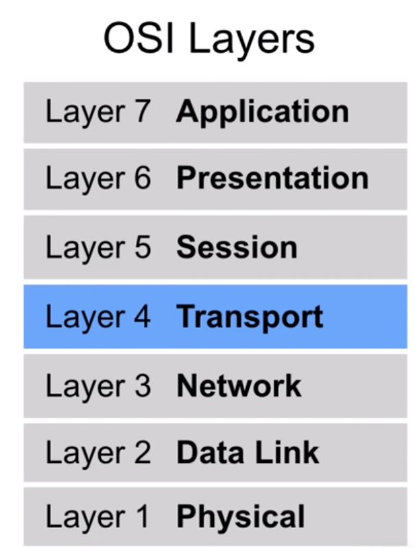

**Classic Load Balancer**

* It was AWS first load balance(legacy)
* Can balance **HTTP, HTTPS or TCP** traffic(but not at the same time)
* It can use **Layer 7-specific features** such as sticky sessions.
* It can also use **strict Layer 4** balancing for purely TCP applications.
* Can perform Cross-Zone Load Balancing
* It will respond with a 504 error(timeout) of the underlying application is not responding(at the web server or database level)
* Not recommended for use, instead use NLB or ALB 

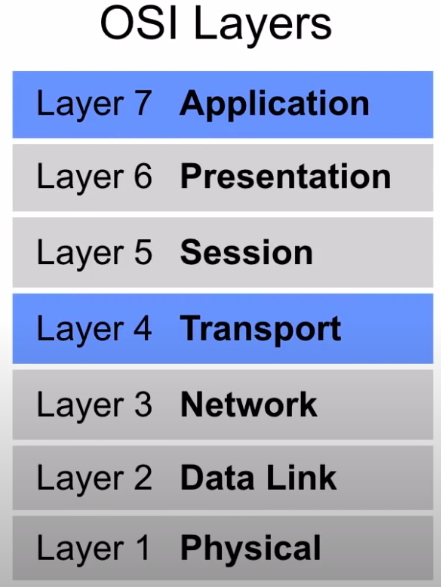

**Sticky Session**

* Is an advanced load balancing method that allows you to bind a user's session to a specific EC2 instance.
* Ensures all requests from that session are **sent to the same instance**
* Typically utilized with a **Classic Load Balancer**
* **Can be enabled for ALB** though can only be set on a **Target Group not individual EC2 instances**.
* Useful when specific **information is only stored locally on a single instance**

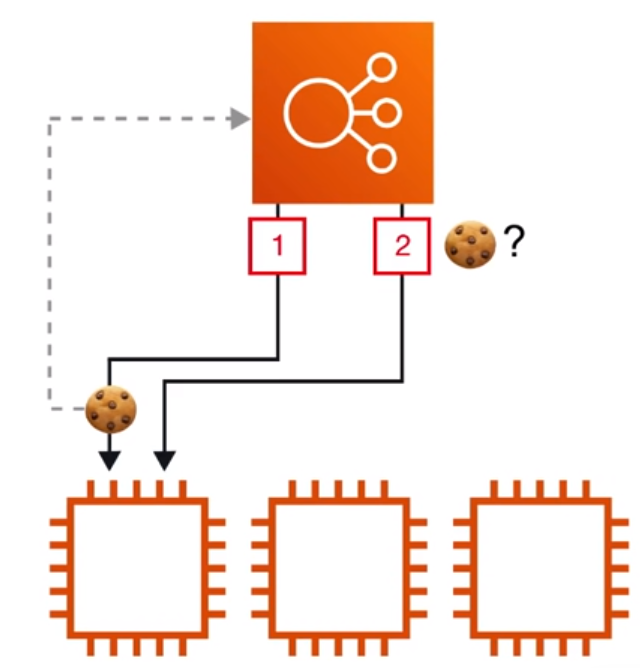

**X-Forwarded-For(XFF) Header**

* If you **need the IPv4 address** of a user, check the **X-Forwarded-For** header.
* The **X-Forwarded-For(XFF)** header is a command method for identifying the **originating IP address** of a client connecting to a web server thought an HTTP proxy or a load balancer.

**Health Checks**

* Instances that are monitored by the Elastic Load Balancer(ELB) report back Health Checks as **InService, or OutOfService**
* Health Checks communicate directly with the instance to determine its state.
* ELB **does not terminate unhealthy instance.** It will just redirect traffic to health instances.
  
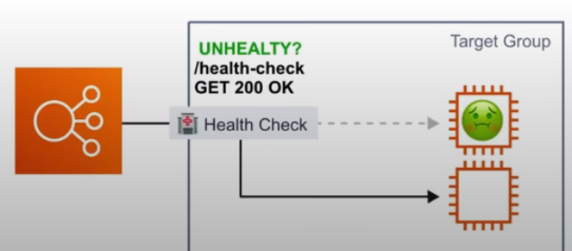

* For ALB and NLB the Health checks are found on the **Target Group**

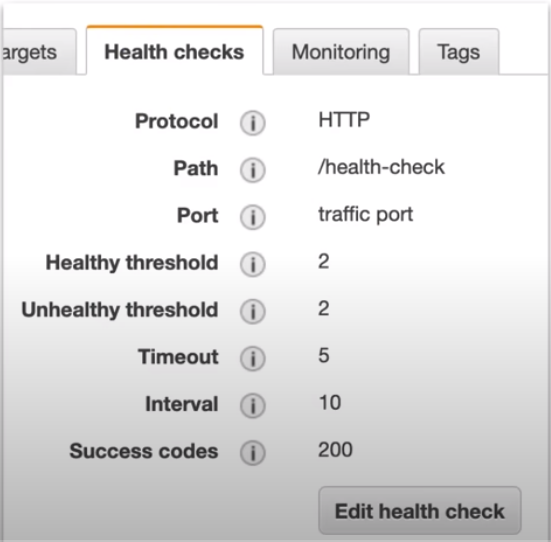

**Cross-Zone Load Balancing**

* Only for **Classic** and **Network** Load Balancer

**Cross-Zone Load Balancing _Enabled_** requests are distributed evenly across the instances in all enabled Availability Zones.

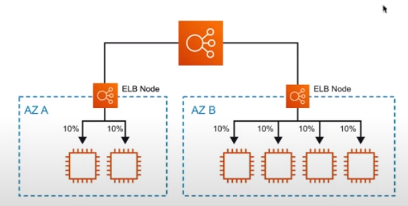

**Cross-Zone Load Balancing _Disabled_** requests are distributed evenly across the instances **in only** it Availability Zone.

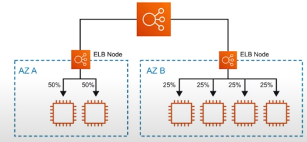

**Request Routing**

* Apply rules to incoming request and the **forward** or **redirect** traffic.
  * Host Header
  * Source IP
  * Path
  * Http Header
  * Http Header method
  * Query String

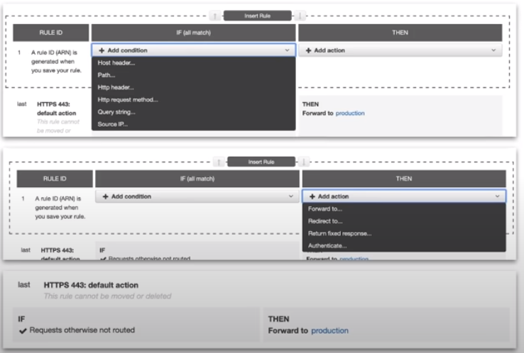

**CheatSheet**

* There are three ELBs: **Network, Application, and Classic** Load Balancer
* A Elastic Load Balancer must have **at least two** Availability Zones.
* Elastic Load Balancers **cannot go cross-region.** You must create one per region.
* ALB has **Listeners, Rules and Target Groups** to route traffic.
* NLB use **Listeners and Target Groups to route traffic**
* CLB use **Listeners and EC2 instances are directly registered** as targets to CLB
* Application Load Balancer is for HTTP(S) traffic and the name implies it is good for Web Applications.
* Network Load Balancer is for TCP/UDP is good for network throughput eg. Video Games
* Classic Load Balancer is legacy and It's recommended to use ALB or NLB
* Use X-Forwarded-For to get original IP of incoming traffic passing through ELB
* You can attach Web Application Firewall to ALB but to NLB or CLB
* You can attach Amazon Certification Manager SSL to any of the Elastic Load Balancers for SSL
* **ALB has advanced Request Routing riles where you can route based on subdomain header, path and other HTTP(S) information**
* Sticky Sessions can be enabled for CLB or ALB and sessions are remembered via Cookie.