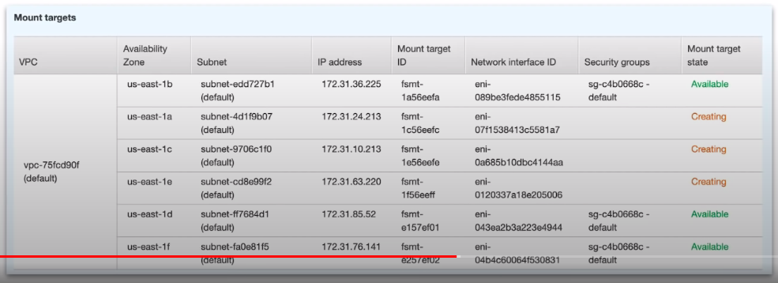

### Elastic File System(EFS)

* **Scalable, elastic**, cloud-native **NFS file system.** 
* **Attach a single file system to multiple EC2 instances.**
* Don't worry about running out or managing disk space.

* EFS is a file storage service for EC2 instances
* Storage capacity grows(upto petabytes) and shrinks automatically based on data stored(elastic). 
* **Multiple EC2 instances** in same VPC **can mount a single EFS volume(volume must be in same VPC)**
* EC2 instances install the **NFSv4.1 client** and can then mount the EFS volume because EFS is using Network File system version 4(NFSv4) protocol
* EFS creates multiple **mount targets** in all you VPC subnets.
* Your billing is based per space used starting at $0.30GB/month

**Check the follow along**

**Cheatsheet**

* **EFS** supports the Network File System version 4(NFSv4) protocol
* You pay GB of storage per month
* Volume can scale to petabyte size storage
* Volume will shrink and grow to meet current data stored(elastic)
* Can support thousands of concurrent connections over NFS
* Your data is stored across multiple AZs within a region
* Can mount multiple EC2 instance to a single EFS(as long as they are in same VPC)
* Create Mount Points in all your VPC subnets, so you can mount from anywhere within your VPC
* Provides Read After Write consistency
 