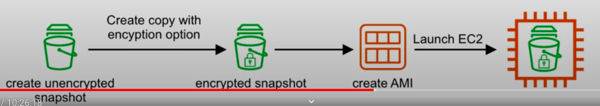

### Elastic Block Store(EBS)

* An EBS(Elastic Block Store) volume is a network drive you can attach to your instances while they run.
* It allows your instances to persist data, even after their termination
* **They can only be mounted to one instance at a time**(at the CCP level).
* **They are bound to a specific availability zone.**
* Analogy: Think of them as a "network USB stick"
* Free tier: 30 GB of free EBS storage of type General Purpose (SSD) or Magnetic per month.

#### EBS Volume

* It is network drive(i.e. not physical drive)
  * It uses the network to communicate the instance, which means there might be a bit of latency
  * It can be detached from an EC2 instance and attached to another one quickly
* It's locked to an Availability Zone(AZ)
  * An EBS volume in us-east-1a cannot be attached to us-east-1b
  * To move a volume across, you first need to snapshot it.
* Have a provisioned capacity(size in GBs, and IOPS)
  * You get billed for all the provisioned capacity.
  * You can increase the capacity of the drive over time.

#### EBS Example:

#### EBS - Delete on Termination attribute

* Controls the EBS behavior when an EC2 instance terminates
  * By default, the root EBS volume is deleted(attribute enabled)
  * By default, any other attached EBS volume is not deleted(attribute disabled)
* This can be controlled by the AWS console / AWS CLI
* Use case: preserve root volume when instance is terminated

#### What is IOPS? 
IOPS stands for Input/Output Per Second. It is the speed at which **non-contiguous reads and writes** can be performed on a storage medium. high I/O = lots of small fast reads and writes

#### What is Throughput?
The **data transfer rate to and from the storage medium**  in megabytes per second.

#### What is Bandwidth?

Bandwidth is **the measurement of the total possible speed of data movement along the network**

**Note:** Think of **Bandwidth** as the **Pipe** and **Throughput** as the **Water**

* **Elastic Block Store** is a highly available and durable solution for attaching persistent block storage volumes to an EC2 instance. Volumes are automatically replicated within their Availability Zone(AZ) to protect from component failure.

* **General Purpose(SSD)**  (gp2) for general usage without specific requirements
* **Provisioned IOPS(SSD)** (io1) when you require really fast input & output
* **Throughput Optimized HDD** (st1) magnetic drive optimized for quick throughput
* **Cold HDD** (sc1) The Lowest cost HDD volume for infrequently access workloads
* **EBS Magnetic** (standard) previous generation HDD

|                 | Solid State Drives(SSD)        | ---                                                                              | Hard Disk Drives(HDD)                                                      | ---                                              |                      |
|-----------------|--------------------------------|----------------------------------------------------------------------------------|----------------------------------------------------------------------------|--------------------------------------------------|----------------------|
| **Volume Type** | General Type                   | Provisioned IOPS SSD                                                             | Throughput Optimized HDD                                                   | Cold HDD                                         | EBS Magnetic         |
| **API Names**   | gp2                            | io1                                                                              | st1                                                                        | sc1                                              | standard             |
| **Description** | Balances price and performance | Highest SSD performance for Mission-Critical low latency or high throughput      | Low-cost. Designed for frequently accessed, throughput intensive workloads | Lowest HDD cost. Less frequently used workloads. |                      |
| **Use cases**   | **Most workloads**             | **Large Databases. IOPS greater than 16,000 or Throughput greater than 250 MiB** | **Data Warehouses, Big Data, Log Processing**                              | **File Storage**                                 | **Archival storage** |
| **Volume Size** | 1GiB-16TiB                     | 4GB-16TiB                                                                        | 500GiB-15TiB                                                               | 500GiB-15TiB                                     | 500GiB-15TiB         |
| **Max IOPS**    | 16,000                         | 64,000                                                                           | 500                                                                        | 250                                              | 40-200               |

**Storage Volumes**

**Hard Disk Drive(HDD):**

* Is magnetic storage that uses rotating platters an actuator arm and a magnetic head(similar to record player).
* HDD is very good at writing a continuous amount of data.
* HDD not great for writing many small reads and write(think of the arm of record player having to lift up and down and move around.)
  * **Better for throughput**
  * **Physical Moving Part**

**Solid State Drive(SSD)**

* Uses integrated circuit assemblies as memory to store data persistently, typically using flash memory. SSDs are typically more resistant to physical shock, run silently and have **quicker access time and lower latency**.
  * **Very good frequently reads and writes(I/O)**
  * **No physical moving parts**

**Magnetic Tape**
* A large reel of magnetic tape. A tage drive is used to write data to the tapel. Medium and large sized data centers deployed both tape and disk formats. They normally come in the form of a cassettes. Magnetic is very cheap to produce and can store considerable amount of data.
  * **Durable for decades**
  * **cheap to produce**

**Moving Volumes**

* **From one AZ to another**
  * Take a snapshot of the volume
  * create an AMI from the Spanshot
  * launch new EC2 instance in desired AZ

* **From one region to another**
  * take a snapshot of the volume
  * create an AMI from the snapshot
  * copy the AMI to another region
  * launch a new EC2 instance from the copied AMI

**Encrypted Root volumes**

When you are through the wizard launching an EC2 instance you can encrypt the volume on creation.

If you want to encrypt an existing volume you'll have to do the following:
* Take a Spanshot of the unencrypted volume
* Create a copy of that Snapshot and select the Encryption option.
* Create a new AMI from the encrypted Snapshot
* Launch a new EC2 instance from the created AMI

### EBS vs Instance Store Volumes

An EC2 instance can be backed (root device) by an **EBS volume or Instance Store Volume**

| EBS Volume                                                                                | Instance Store Volume                                                                      |
|-------------------------------------------------------------------------------------------|--------------------------------------------------------------------------------------------|
| A durable, block-level storage device that you can attach to a single EC2 instance        | A temporary storage type located on disks that are physically attached to a host machine   |
| EBS volume created from a EBS Snapshot                                                    | An Instance Store volume is create from a template stored in S3                            |
| Can start and stop instances.                                                             | Cannot stop instances can only terminate.                                                  |
| Data will **persist** if you reboot you system                                            | Data **will be loss** in case of health host fails or instance is terminated               |
| Ideal for when you want data to persist. In most you cases you'll want EBS backed volume. | Ideal for temporary backup, and storing an application's cache, logs or other random data. |

### EBS CheatSheet
* Is a virtual hard disk. Snapshots are a point-in-time copy of that disk
* Volumes exist on EBS. Spanshots exist on S3.
* Snapshots are incremental, only changes made since the last snapshot are moved to S3.
* Initial Snapshots of an EC2 instance will take longer to create than subsequent snapshots
* If taking Snapshots of a root volume, the EC2 instance should be stopped before Snapshotting
* You can take Snapshots while the instance is still running
* You can create AMIs from Volumes, or from Snapshots
* EBS Volumes, A durable, block level storage device that you can attach to a single EC2 instance.
* EBS Volumes can be modified on the fly
* Volumes always exist in the same AZ as the EC2 instance.
* Instance Store Volumes. A temporary storage type located on disks that are physically attached to a host machine.
* Instance store volumes cannot be stopped. If the host fails then you lost data
* EBS backed instances can be stopped and you will not lost any data.
* By default root volumes are deleted termination.
* EBS volumes can have termination protection(don't delete the volume on termination)
* Snapshot or restored encrypted volumes will also be encrypted.
* You cannot share a snapshot if it has been encrypted.
* Unencrypted snapshots can be shared with other AWS accounts or made public.

