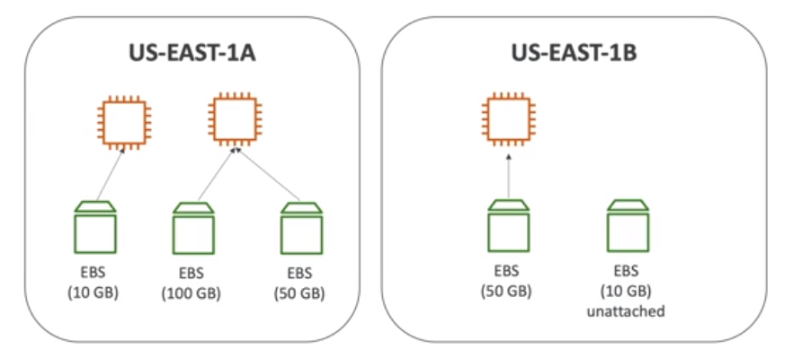
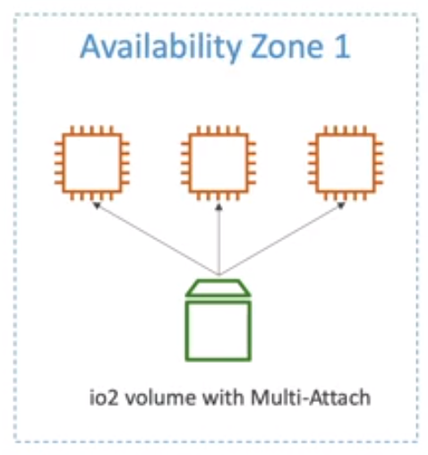
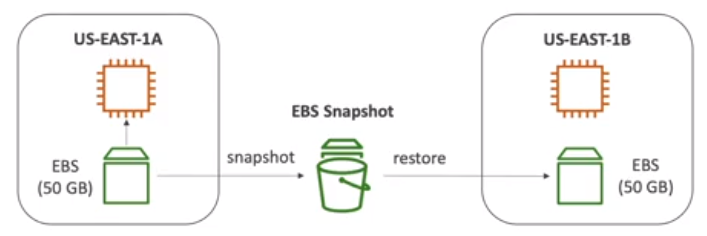
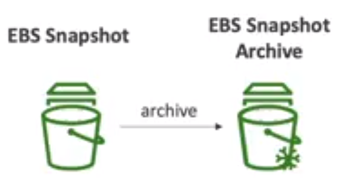
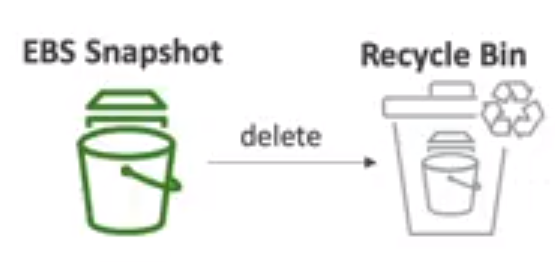
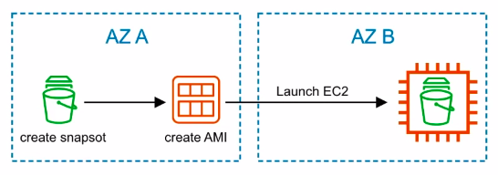
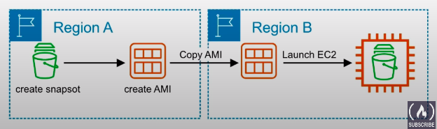
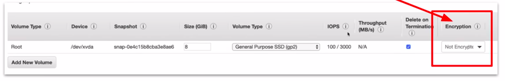

### Elastic Block Store(EBS)

* An EBS(Elastic Block Store) volume is a network drive you can attach to your instances while they run.
* It allows your instances to persist data, even after their termination
* **They can only be mounted to one instance at a time**(at the CCP level).
* **They are bound to a specific availability zone.**
* Analogy: Think of them as a "network USB stick"
* Free tier: 30 GB of free EBS storage of type General Purpose (SSD) or Magnetic per month.

#### EBS Volume

* It is network drive(i.e. not physical drive)
  * It uses the network to communicate the instance, which means there might be a bit of latency
  * It can be detached from an EC2 instance and attached to another one quickly
* It's locked to an Availability Zone(AZ)
  * An EBS volume in us-east-1a cannot be attached to us-east-1b
  * To move a volume across, you first need to snapshot it.
* Have a provisioned capacity(size in GBs, and IOPS)
  * You get billed for all the provisioned capacity.
  * You can increase the capacity of the drive over time.

#### What is IOPS?

IOPS stands for Input/Output Per Second. It is the speed at which **non-contiguous reads and writes** can be performed on a storage medium. high I/O = lots of small fast reads and writes

#### What is Throughput?

The **data transfer rate to and from the storage medium**  in megabytes per second.

#### What is Bandwidth?

Bandwidth is **the measurement of the total possible speed of data movement along the network**

**Note:** Think of **Bandwidth** as the **Pipe** and **Throughput** as the **Water**

#### EBS Example:

#### EBS - Delete on Termination attribute

* Controls the EBS behavior when an EC2 instance terminates
  * By default, the root EBS volume is deleted(attribute enabled)
  * By default, any other attached EBS volume is not deleted(attribute disabled)
* This can be controlled by the AWS console / AWS CLI
* Use case: preserve root volume when instance is terminated

### Elastic Block Store

* Is a highly available and durable solution for attaching persistent block storage volumes to an EC2 instance. Volumes are automatically replicated within their Availability Zone(AZ) to protect from component failure.

* EBS Volumes come in 6 types
  * **gp2/gp3(SSD):** General purpose SSD volume that balances price and performance for a wide variety of workloads.
  * **io1/io2 Block Express (SSD):** Highest-performance SSD volume for mission-critical low-latency or high-throughput workloads.
  * **st 1 (HDD):** Low cost HDD volume designed for frequently accessed, throughput-intensive workloads.
  * **sc 1 (HDD):** Lowest cost HDD volume designed for less frequently accessed workloads.
* EBS Volumes are characterized in Size | Throughput | IOPS (I/O Ops Per Sec)
* Only gp2 / gp3 and io1/io2 Block Express can be used as boot volumes.

#### General Purpose SSD

* Cost-effective storage, low-latency
* System bool volumes, Virtual desktops, Development and test environments
* 1 GiB - 16 TiB
* gp3:
  * Baseline of 3000 IOPS and throughtput of 125 MiB/s
  * Can increase IOPS up to 16,000 and throughput up to 1000 MiB/s independently.
* gp2: 
  * Small gp2 volumes can burst IOPS to 3,000
  * Size of the volume and IOPS are linked, max IOPS is 16,000
  * 3 IOPS per GB, means at 5,334 GB we are the max IOPS.

#### Provisioned IOPS(PIOPS) SSD

* Critical business application with sustained IOPS performance
* Or application that need more than 16,000 IOPS
* Great for database workload(sensitive to storage perf and consistency)
* io1 (4 GiB - 16 TiB)
  * Max PIOPS: 64,000 for Nitro EC2 instances & 32,000 for other
  * Can increase PIOPS independently from storage size
* io2 Block Express(4 GiB - 64 TiB)
  * Sub-millisecond latency
  * Max PIOPS: 256,000 with an IOPS:GiB ratio of 1000:1
* Supports EBS Multi-attach

#### EBS Multi-Attach - io1 / io2 family

* Attach the same EBS volume to multiple EC2 instances in the same AZ
* Each instance has full read & write permissions to the high performance volume.
* Use cases:
  * Achieve higher application availability in clustered Linux application(ex: Teradata)
  * Application must manage concurrent write operations
* Upto 16 EC2 instances at a time.
* Must use a file system that's cluster-aware(not XFS, EXT4, etc...)

#### Hard Disk Drives(HDD)

* Cannot be a boot volume
* 125 GiB to 16 TiB
* Throughput Optimized HDD (st 1)
  * Big Data, Data Warehouses, Log Processing
  * Max throughput 500 MiB/s - max IOPS 500
* Cold HDD(sc 1)
  * For data that is infrequently accessed
  * Scenarios where the lowest cost is important
  * Max throughput 250 MiB/s - max IOPS 250

|                 | Solid State Drives(SSD)        | ---                                                                              | Hard Disk Drives(HDD)                                                      | ---                                              |                      |
|-----------------|--------------------------------|----------------------------------------------------------------------------------|----------------------------------------------------------------------------|--------------------------------------------------|----------------------|
| **Volume Type** | General Type                   | Provisioned IOPS SSD                                                             | Throughput Optimized HDD                                                   | Cold HDD                                         | EBS Magnetic         |
| **API Names**   | gp2                            | io1                                                                              | st1                                                                        | sc1                                              | standard             |
| **Description** | Balances price and performance | Highest SSD performance for Mission-Critical low latency or high throughput      | Low-cost. Designed for frequently accessed, throughput intensive workloads | Lowest HDD cost. Less frequently used workloads. |                      |
| **Use cases**   | **Most workloads**             | **Large Databases. IOPS greater than 16,000 or Throughput greater than 250 MiB** | **Data Warehouses, Big Data, Log Processing**                              | **File Storage**                                 | **Archival storage** |
| **Volume Size** | 1GiB-16TiB                     | 4GB-16TiB                                                                        | 500GiB-15TiB                                                               | 500GiB-15TiB                                     | 500GiB-15TiB         |
| **Max IOPS**    | 16,000                         | 64,000                                                                           | 500                                                                        | 250                                              | 40-200               |

#### Storage Volumes

##### Hard Disk Drive(HDD)

* Is magnetic storage that uses rotating platters an actuator arm and a magnetic head(similar to record player).
* HDD is very good at writing a continuous amount of data.
* HDD not great for writing many small reads and write(think of the arm of record player having to lift up and down and move around.)
  * **Better for throughput**
  * **Physical Moving Part**

##### Solid State Drive(SSD)

* Uses integrated circuit assemblies as memory to store data persistently, typically using flash memory. SSDs are typically more resistant to physical shock, run silently and have **quicker access time and lower latency**.
  * **Very good frequently reads and writes(I/O)**
  * **No physical moving parts**

##### Magnetic Tape

* A large reel of magnetic tape. A tage drive is used to write data to the tapel. Medium and large sized data centers deployed both tape and disk formats. They normally come in the form of a cassettes. Magnetic is very cheap to produce and can store considerable amount of data.
  * **Durable for decades**
  * **cheap to produce**

### EBS Snapshots

* Make a backup(snapshot) of your EBS volume at a point in time.
* Not necessary to detach volume to do snapshot, but recommended
* Can copy snapshots across AZ or Region.

### EBS Snapshots Features

#### EBS Snapshot Archive

* Move a Snapshot to an "archive tier" that is 75% cheaper.
* Takes with 24 to 72 hours for restoring the archive.

#### Recycle Bin for EBS Snapshots

* Setup rules for retain deleted snapshots so you can recover them after an accidental deletion
* Specify retention(from 1 day to 1 year)

#### Fast Snapshot Restore(FSR)

* Force full initialization of snapshot to have no latency on the first use($$$)

#### Moving Volumes

##### From one AZ to another

* Take a snapshot of the volume
* create an AMI from the Spanshot
* launch new EC2 instance in desired AZ

##### From one region to another

* take a snapshot of the volume
* create an AMI from the snapshot
* copy the AMI to another region
* launch a new EC2 instance from the copied AMI

### EBS Encryption

* When you create and encrpted EBS volume, you get the following:
  * Data at rest is encrypted inside the volume.
  * All the data in flight moving between the instance and the volume is encrypted
  * All snapshots are encrypted
  * All volumes created from the snapshot.
* Encryption and decryption are handled transparently(you have nothing to do)
* Encryption has a minimal impact on latency
* EBS Encryption leverages keys from KMS(AES-256)
* Copying an unencrypted snapshot allows encryption
* Snapshots of encrypted volumes are encrypted

#### Encryption: encrypt an unencrypted EBS volume

* Create an EBS snapshot of the volume
* Encrypt the EBS snapshot(using copy)
* Create new EBS volume from the snapshot (the volume will also be encrypted)
* Now you can attach the encrypted volume to the original instance

### EBS vs Instance Store Volumes

An EC2 instance can be backed (root device) by an **EBS volume or Instance Store Volume**

| EBS Volume                                                                                | Instance Store Volume                                                                      |
|-------------------------------------------------------------------------------------------|--------------------------------------------------------------------------------------------|
| A durable, block-level storage device that you can attach to a single EC2 instance        | A temporary storage type located on disks that are physically attached to a host machine   |
| EBS volume created from a EBS Snapshot                                                    | An Instance Store volume is create from a template stored in S3                            |
| Can start and stop instances.                                                             | Cannot stop instances can only terminate.                                                  |
| Data will **persist** if you reboot you system                                            | Data **will be loss** in case of health host fails or instance is terminated               |
| Ideal for when you want data to persist. In most you cases you'll want EBS backed volume. | Ideal for temporary backup, and storing an application's cache, logs or other random data. |

### EBS CheatSheet
* Is a virtual hard disk. Snapshots are a point-in-time copy of that disk
* Volumes exist on EBS. Spanshots exist on S3.
* Snapshots are incremental, only changes made since the last snapshot are moved to S3.
* Initial Snapshots of an EC2 instance will take longer to create than subsequent snapshots
* If taking Snapshots of a root volume, the EC2 instance should be stopped before Snapshotting
* You can take Snapshots while the instance is still running
* You can create AMIs from Volumes, or from Snapshots
* EBS Volumes, A durable, block level storage device that you can attach to a single EC2 instance.
* EBS Volumes can be modified on the fly
* Volumes always exist in the same AZ as the EC2 instance.
* Instance Store Volumes. A temporary storage type located on disks that are physically attached to a host machine.
* Instance store volumes cannot be stopped. If the host fails then you lost data
* EBS backed instances can be stopped and you will not lost any data.
* By default root volumes are deleted termination.
* EBS volumes can have termination protection(don't delete the volume on termination)
* Snapshot or restored encrypted volumes will also be encrypted.
* You cannot share a snapshot if it has been encrypted.
* Unencrypted snapshots can be shared with other AWS accounts or made public.

