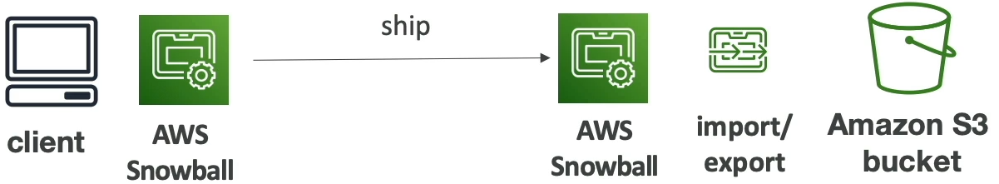

### AWS Snow Family

* Highly secure, portable device to **collect and process data at the edge, and migrate data into and out of AWS**
* **Data migration:**
  * Snowcone
  * Snowball Edge
  * Snowmobile
* **Edge Computing**
  * Snowcone
  * Snowball Edge

#### Data Migrations with AWS Snow Family

|          | Time to transfer |           |           |
|----------|------------------|-----------|-----------|
|          | 100 Mbps         | 1Gbps     | 10Gbps    |
| -------- | ---------------- | --------- | --------- |
| 10 TB    | 12 days          | 30 hours  | 3 hours   |
| 100 TB   | 124 days         | 12 days   | 30 hours  |
| 1 PB     | 3 years          | 124 days  | 12 days   |

Challenges:
* Limited connectivity
* Limited bandwidth
* High network cost
* Shared bandwidth(can't maximize the line)
* Connection stability

**AWS Snow Family: offline devices to perform data migrations**
If it takes more than a week to transfer over the network, use Snowball devices!!!

#### Diagrams

* Clients sends the data to S3

* Client request Snowball device and we receive it via post
* Client load the data directly onto the device locally
* Client ship back the device to AWS
* AWS will take and will plug the device into their own infrastructure and data will be imported or export

#### Snowball Edge(for data transfers)

* Physical data transport solution: move TBs or PBs of data in or out of AWS
* Alternative to moving data over the network(and paying network fees)
* Pay per data transfer job
* Provide block storage and Amazon S3-compatible object storage
* **Snowball Edge Storage optimized**
  * 80 TB of HDD or 210 TB NVMe capacity for block volume and S3 compatible object storage
* **Snowball Edge Compute optimized**
  * 42 TB of HDD or 28TB NVMe capacity for block volume and S3 compatible object storage

* Use-cases: large data cloud migrations, DC decommission, disaster recovery.

#### AWS Snowcone & Snowcone SSD

* Small, portable computing, anywhere, rugged & secure withstands harsh environments
* Light(4.5 pounds, 2.1 kg)
* Device used for edge computing, storage, and data transfer
* **Snowcone** - 8TB or HDD storage
* **Snowcone SSD** - 14TB of SSD storage
* Use Snowcone where Snowball does not fit(space-constrained environment)
* Must provide your own battery/cables

* Can be sent back to AWS offline, or connect it to internet and use **AWS DataSync** to send data.

#### Snowmobile

* Transfer exabyte of data(1 Exabyte = 1,000 PB = 1,000,000 TBs)
* Each Snowmobile has 100PB of capacity(use multiple in parallel)
* High security: temperature controlled, GPS, 24/7 video surveillance
* Better than Snowball if you transfer more than 10PB.

#### AWS Snow Family for Data migrations

|                  | Snowcone & Snowcone SSD        | Snowball Edge(storage optimized) | Snowmobile            |
|------------------|--------------------------------|----------------------------------|-----------------------|
| Storage Capacity | 8 TB HDD & 14 TB SSD           | 80 TB - 210 TB                   | < 100 PB              |
| Migration Size   | Upto 24 TB, online and offline | Upto  petabytes, offline         | Upto exabyte, offline |
| Datasync agent   | Pre-installed                  |                                  |                       |

=============================================================================================================

#### Snow Family - Usage Process

1. Request Snowball devices from the AWS console for delivery
2. Install the **snowball client/AWS OpsHub** on your servers
3. Connect the snowball to your servers and copy files using the client
4. Ship back the device when you're done(goes to the right AWS facility)
5. Data will be loaded into an S3 bucket
6. Snowball is completely wiped

#### What is Edge Computing?

* Process data while it's being created on an **edge location**
  * A truck on the road, a ship on the sea, a mining station underground...
* These location may have 
  * Limited/no internet access
  * Limited/no easy access to computing power
* We setup a Snowball Edge/Snowcone device to the edge computing
* Use cases of Edge computing:
  * Preprocess data
  * Machine learning at the edge
  * Transcoding media streams
* Eventually(if need be) we can ship back the device to AWS(for transferring data for example)

#### Snow Family - Edge computing

* **Snowcone & Snowcone SSD(smaller)**
  * 2 CPUs, 4GB of memory, wired or wireless access
  * USB-C power using a cord or the optional battery
* **Snowball Edge - Compute optimized**
  * 104 vCPU, 416 GiB of RAM
  * Optional GPU(useful for video processing or machine learning)
  * 28 TB NVMe or 42 TB HDD usable storage
  * Storage Clustering available(up to 16 nodes)
* **Snowball Edge - Storage optimized**
  * Up to 40 vCPUs, 80GiB of RAM, 80 TB storage
  * Up to 104 vCPUs, 416 GiB of RAM, 210 TB NVMs storage
* All: Can run EC2 Instances & AWS Lambda functions(using AWS IoT Green grass)
* Long-term deployment options: 1 and 3 years discounted pricing

#### AWS OpsHub

* Historically, to use Snow family devices, you needed a CLI
* Today you can use AWS OpsHub(a software you install on your computer/laptop) to manage your Snow Family Device
  * Unlocking and configuring single or clustered devices
  * Transferring files
  * Launching and managing instances running on Snow Family Devices
  * Monitor device metrics(storage capacity, active instances on your device)
  * Launch compatible AWS services on your device(ex: EC2 instances, DataSync, Network File System)

#### Solution Architecture: Snowball into Glacier

* Snowball cannot import to Glacier directly
* You must use Amazon S3 first, in combination with an S3 lifecycle policy

#### Amazon FSx - Overview

* Launch 3rd party high-performance file system on AWS
* Fully Managed Service

##### File Systems

* **FSx for Lustre**
* **FSx for Windows File Server**
* **FSx for NetApp ONTAP**
* **FSx for OpenZFS**

##### Amazon FSx for Windows(File Server)

* **FSx for Windows** is a fully managed Windows file system share drive
* Support SMB protocol & Windows NTFS
* Microsoft Active Directory integration, ACLs, user quotas
* **Can be mounted on Linux EC2 instances**
* Supports **Microsoft Distributed File System(DFS) Namespaces** (group files across multiple FS)
* Scale upto 10s of GigaBytes/s, millions of IOPS, 100s PetaByte of data
* Storage Options:
  * **SSD**: latency sensitive workloads(database, media processing, data analytics,...)
  * **HDD**: broad spectrum of workloads(home directory, CMS, ...)
* Can be accessed from your on-premises infrastructure(VPN or Direct Connect)
* Can be configured to be Multi-AZ(high availability)
* Data is backed-up daily to S3

##### Amazon FSx for Lustre

* Lustre is a type of parallel distributed file system, for large-scale computing
* The name Lustre is derived from "Linux" and "cluster"

* Machine Learning, "**High Performance Computing(HPC)**"
* Video Processing, Financial Modeling, Electronic Design Automation
* Scales up to 100s GB/s, millions of IOPS, sub-ms latencies
* Storage Options:
  * SSD: low-latency, IOPS intensive workloads, small & random file operations
  * HDD - throughput-intensive workloads, large & sequential file operations.
* Seamless integration with S3
  * Can read S3 as a file system(through FSx)
  * Can write the output of the computations back to S3(through FSx)
* Can be used on-premises servers(VPN or Direct Connect)

###### FSx File System Deployment Options

* **Scratch File System**
  * Temporary storage
  * Data is not replicated(doesn't persist if file server fails)
  * High burst(6x faster, 200MBps per TiB)
  * Usage: short term processing, optimize costs

* **Persistent File System**
  * Long term storage
  * Data is replicated within the same AZ
  * Replace failed files within minutes
  * Usage: long-term processing, sensitive data

#### Amazon FSx for NetApp ONTAP

* Managed NetApp ONTAP on AWS
* **File System compatible with NFS, SMB, iSCSI protocol**
* Move workload running on ONTAP or NAS to AWS
* Works with:
  * Linux 
  * Windows
  * MaxOS
  * VMWare Cloud on AWS
  * Amazon Workspaces * ApprStream 2,0
  * Amazon EC2, EC2 and EKS
* Storage shrinks or grow automatically
* Snapshots, replication, low-cost, compression and data de-duplication
* **Point-int-time instantaneous cloning(helpful for testing new workloads)**

#### Amazon FSx for OpenZFS

* Managed OpenZFS file system on AWS 
* File System compatible with NFS(v3, v4, v4.1, v4.2)
* Move workloads running on ZFS to AWS
* Works with:
  * Linux
  * Windows
  * MacOS
  * VMware Cloud on AWS
  * Amazon Workspace & AppStream 2.0
  * Amazon EC2, ECS and EKS
* Upto 1,000,000 IOPS with 0.5ms latency
* Snapshots, compression and low-cost
* Point-in-time instantaneous cloning(helpful for testing new workloads)

====================================================================================================================

* **Petabyte-scale** data transfer service. 
* Move data onto AWS via physical briefcase computer.

* **Low Cost:** It cost a **thousand of dollars** to transfer 100TB over high speed internet. Snowball can reduce that cost by **1/5th**.
* **Speed:** It can take 100TB over 100 days to transfer over high speed internet. Snowball can reduce that transfer time by less than a week.

#### **Snowball features and limitations:**

* E-Ink display(shipping information) 
* Tamper and weatherproof.
* Data is encrypted end-to-end(256-bit encryption)
* Uses **Trusted Platform Module(TPM).** (A specialized chip on an endpoint device that stores RSA encryption keys specific to the host system for hardware authentication)
* For security purposes, data transfer must be completed **within 90 days** of the Snowball being prepared.
* Snowball can Import and Export from S3.

#### **Snowball come in two sizes:**

* 50TB(42 TB of usable spaces)
* 80TB(72 TB of usable spaces)

### **AWS Snowball Edge:**

* Petabyte-scale data transfer service. 
* Move data onto AWS via physical briefcase computer. 
* More storage and on-site compute capabilities. 
* Similar to Snowball but with more storage and with local processing.

#### **Snowball Edge features and limitations:**

* **LCD display**(shipping information and other functionality)
* Can undertake **local processing and edge computing** workloads.
* **Can use in a cluster in groups of 5 to 10 devices**.
* three options for device configurations:
  * storage optimized(24 vCPUs)
  * compute optimized(54 vCPUs)
  * GPU optimized (54 vCPUs)

#### **Snowball Edge come in two sizes:**

* 100 TB(83 TB of usable space)
* 100 TB clustered(45 TB per node)

### **Snowmobile**

* a 45 foot long ruggedized shipping container, pulled by a semi-trailer truck.
* transfer up to 100PB per Snowmobile. 
* AWS personal will help you connect your network to the snowmobile and when data transfer is complete they'll drive it back to AWS to import into S3 or Glacier.

#### **Security Features:**

* GPS tracking
* Alarm monitoring
* 24/7 video surveillance
* an escort security vehicle while in transit(optional)
* It comes in one size: 100PB
