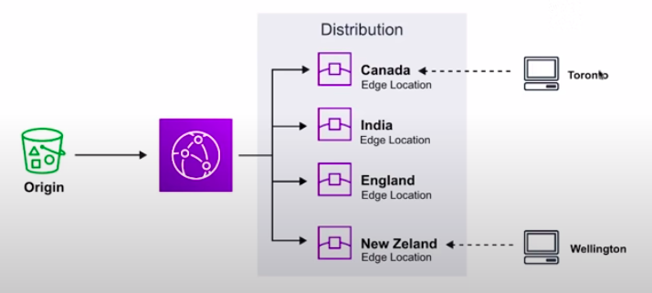
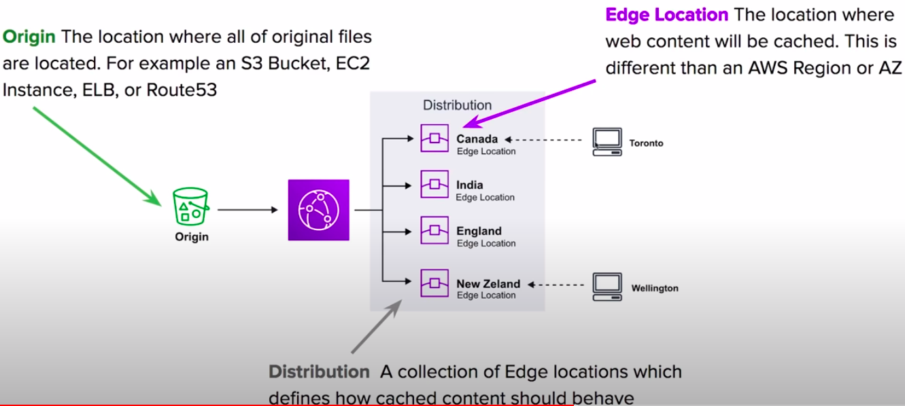
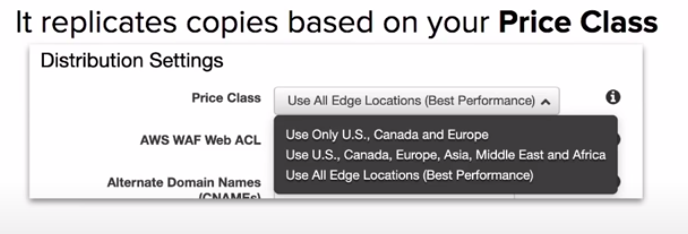
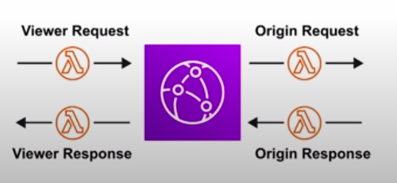
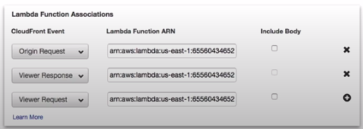
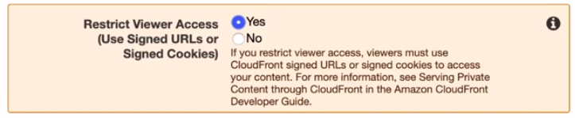

### Cloud Front

* **Content Distribution Network(CDN)** creates cached copies of your website at various Edge Locations around the world.
* A CDN is a **distributed network of servers** which delivers web pages and content to users based on their **geographical location**, the **origin of the webpage** and a **content delivery server**.

* Can be used to **deliver a entire website** including static, dynamic and streaming.
* Requests for content are served from the nearest Edge Location for the best possible performance.

**Core Components**

**Origin:** The location where all of original files are located. For example an S3 Bucket, EC2 Instance, ELB or Route53.
**Edge Location:** The location where web content will be cached. This is different from an AWS Region or AZ.
**Distribution:** A **collection of Edge locations** which defines how cached content should behave.

**Distributions**

A Distribution is a collection of Edge Locations. You specific the Origin eg. S3, EC2, ELB, Route53

**Behaviours:** Redirect to HTTPs, Restrict HTTP Methods, Restrict Viewer Access, Set TTLs.
**Invalidations:** You can manually invalidate cache on specific files via Invalidations.
**Error Pages:** You can serve up custom error pages e.g. 404
**Restrictions:** You can use Geo Restriction to blacklist or whitelist specific countries

**Types:**
1. Web(for websites)
2. RTMP(**for streaming media**)

**Lambda@Edge**

We use Lamdda@Edge functions to **override the behavior** of request and responses.

**The 4 Available Lambda@Edge Functions**
1. **Viewer request** => When CloudFront receives a request from a viewer
2. **Origin request** => Before CloudFront forwards a request to the origin
3. **Origin response** => When CloudFront receives a response from the origin
4. **Viewer response** => Before CloudFront returns the response to the viewer.

**CloudFront Protection**

By default, a Distribution **allows everyone to have access.**

**Original Identity Access(OAI)**

A virtual user identity that will be used to give your CloudFront Distribution permission to fetch a private object.

In order to use Signed URLs or Signed Cookies you need to have an OAI

**Singed URLs**(Not the same thing as S3 presigned URL)
A url with provides temporary access to cached objects.

**Singed Cookies**
A cookie which is passed along with the request to CloudFront. The advantage of using a Cookie is you want to provide access to multiple restricted files. e.g. **Video Streaming**.

### Creating a Distribution

### CheatSheet
* CloudFront is a CDN. It makes website load fast by serving cached content that is nearby
* CloudFront distributes cached copy at Edge Locations
* Edge Locations aren't just not read-only, you can write to them.
* TTL defines how long until the cache expires.
* When you invalidate you cache, you are forcing it to immediately expire
* Refreshing the cache cost money because of transfer costs to update Edge Locations.
* Origin is the address of the where the original copies of your files reside
* Distribution has 2 Types: Web and RTMP
* Origin Identity Access(OAI) is used access private S3 buckets.
* Access to cached content can be protected via Singed URL or Signed Cookies
* Lambda@Edge allows you to pass each request through a Lambda to change the behavior of the response.