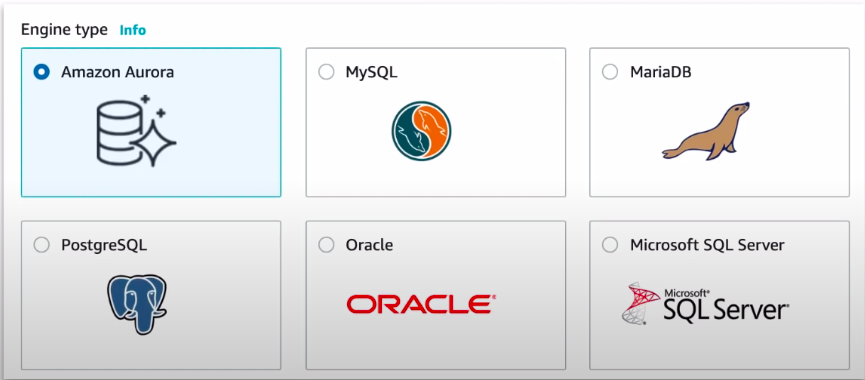
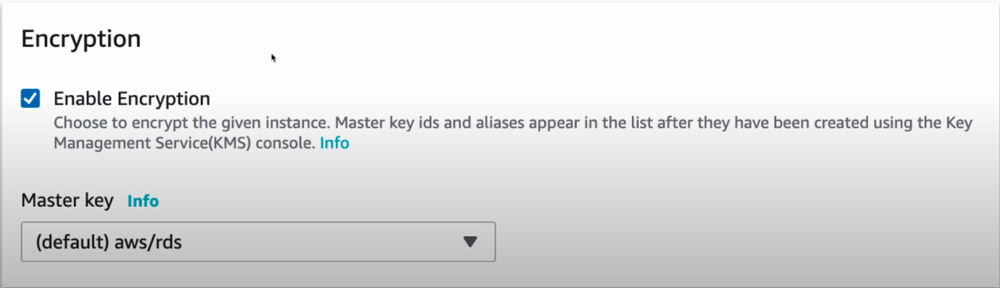
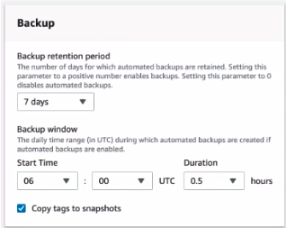
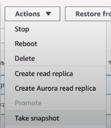
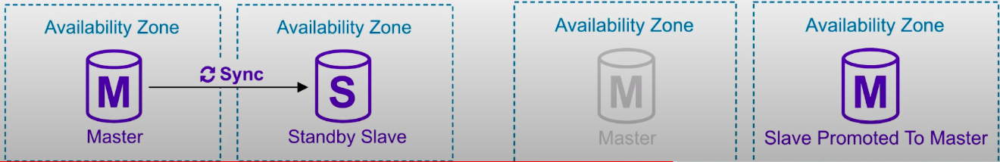
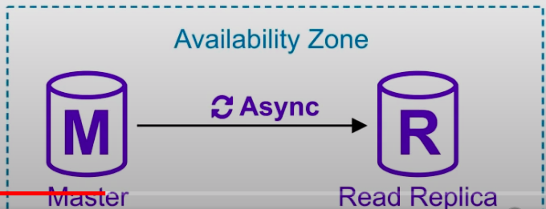
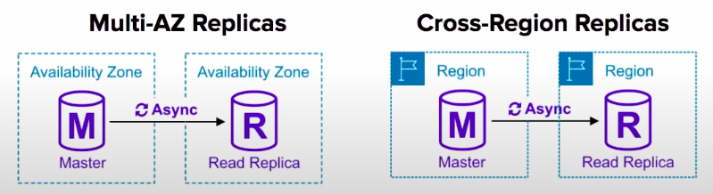

### Relational Database service(RDS)

* A managed **relational database** service. Support multiple **SQL** engines, easy to scale, backup and secure.
* RDS is the AWS solution for relational databases. There are 6 relational database options currently available on AWS

### RDS - Encryption

* You can turn on encryption at-rest for all RDS engines.
* You may not be able to turn encryption on for older versions of some engines.
* It will also encrypt the automated backups, snapshots and read replicas.

Encryption is handled using the AWS Key Management Service(KMS)

### RDS Backup

There are 2 backup solutions available for RDS

**Automated Backups:**

* Choose a **retention period** between 1 and 35 days
* Store transaction logs throughout the day
* **Automated backups are enabled by default**
* All data is stored inside **S3**
* There is no additional change for backup storage
* You define your backup window
* Storage I/O may be suspended during backup

**Manual Backups**
Taken manually by the user
Backup persists even if you delete the original RDS instance

### Restoring Backup

* When recovering AWS will take a most recent daily backup, and apply transaction log data relevant to tha day. This allows **point-in-time** recovery down to a second inside the retention period.

* Backup data is **never restored overtop** of an existing instance.
* When you restore an RDS instance from Automated Backup or a Manual Snapshot a new instance is created for the restored database.
* Restored RDS instances will have a new **DNS endpoint**.

### MultiAZ

* Ensures database remains available if another AZ becomes unavailable
* Makes an exact copy of your database in another AZ. AWS automatically synchronizes changes in the database over to the standby copy.
* Automatic Failover protection if one AZ goes down failover will occur and the standby slave will be promoted to master.

### Read Replicas

Read-Replicas allow you to run multiple copies of your database, these copies only allows reads(no writes) and is intended to alleviate the workload of your primary database to improve performance.

**You must have automatic backups enabled to use Read replicas**
**Asynchronous** replication happens between the primary RDS instance and the replicas.

You can have up to **5 replicas** of a database. Each Read Replica will have its own DNS Endpoint.
You can have Multi-AZ replicas, replicas in another region, or even replicas of other read replicas.

Replicas can be promoted to their own database, but this breaks replication. No automatic failover, if primary copy fails you must manually update urls to point at copy.

### Multi-AZ vs Read Replicas

| Multi-AZ Deployments                                      | Read Replicas                                                       |
|-----------------------------------------------------------|---------------------------------------------------------------------|
| Synchronous replication - highly durable                  | Asynchronous replication - highly scalable                          |
| Only database engine on primary instance is active        | All read replicas are accessible and can be used for read scaling   |
| Automated backups are taken from standby                  | No backups configured by default                                    |
| Always span two Availability Zones within a Single Region | Can be within an AZ, Cross-AZ, or Cross-Region                      |
| Database engine version upgrades happen on primary        | Database engine version upgrade is independent from source instance |
| Automatic failover to standby when a problem is detected  | Can be manually promoted to a standalone database instance          |

### Creating an RDS

1. Under templates choose the right option **production or Dev/Team or Free Tier**
2. You can generate the password or set it manually
3. Choose the right DB instance size(Can choose burstable for the testing purpose)
4. In the storage, choose **Provisioned IOPS** or **General Purpose**
5. VPC security group choose the default
6. Enable backups automatically, choose the right **Backup window**
7. Can enable **deletion protection**

Follow Along
**Need to come back to this**

### Cheatsheet

* Relational Database Service(RDS) is the AWS solution for relational databases.
* RDS instances are managed by AWS, you can't SSH into the VM running the database.
* There are 6 relational database options currently available on AWS, Aurora, MySQL, MariaDB, Postgres, Oracle, Microsoft SQL Server.
* Multi-AZ is an option you can turn on which makes an exact copy of you database in another AZ that is only standup.
* For Multi-AZ AWS automatically synchronizes changes in the database over to the standby copy.
* Multi-AS has Automatic Failover protection of one AZ goes down failover will occur and the standby slave will be promoted to master.
* Read-replicas allow you to run multiple copies of your database, these copies only allows reads(no writes) and is intended to alleviate the workload of your primary database to improve performance
* Read-replicas use Asynchronous replication
* You must have automatic backups enabled to use Read Replicas
* You can have upto 5 read replicas
* You can combine Read replicas with Multi-AZ
* You can have Read Replicas in another Region(Cross Region Read replicas)
* Replicas can be promoted to their own database, but this breaks replication
* You can have Replicas of read replicas
* RDS has 2 backup solutions: Automated and Database Snapshots
* Automated: you choose a retention period between 1 and 35 days. There is no additional cost for backup storage, you define your backup window.
* Manual: you manually create backups, if you delete your primary the manual snapshots will still exist and can restored
* When you restore an instance it will create a new database. You just need to delete your old database and point traffic to new re-stored database.
* You can turn on encryption at-rest for RDS via KMS.