### Relational Database service(RDS)

* RDS stands for Relational Database Service
* It's a managed DB service for DB use SQL as a query language.
* It allows you to create database in the cloud that are managed by AWS
  * Postgres
  * MySQL
  * MariaDB
  * Oracle
  * Microsoft SQL Server
  * IBM DB2
  * Aurora

#### Advantage over using RDS versus deploying DB on EC2

* RDS is a managed service:
  * Automated provisioning, OS patching
  * Continuous backups and restore to specific timestamp(Point in time Restore)
  * Monitoring dashboards
  * Read replicas for improve read performance
  * Multi AZ setup for **Disaster Recovery**(DR)
  * Maintenance windows for upgrades
  * Scaling Capability(vertical and horizontal)
  * Storage backed by **EBS**(gp2 or io 1)
* But you can't SSH into your instances.

#### RDS - Storage Auto Scaling

* Helps you increase storage on your RDS DB instance dynamically.
* When RDS detects you are running out of free database storage, it scales automatically.
* Avoid manually scaling your database storage.
* You have to set **Maximum Storage Threshold** (maximum limit for DB storage)
* Automatically modify storage if:
  * Free storage is less than 10% of allocated storage
  * Low storage lasts at least 5 minutes
  * 6 hours have passed since last modification
* Useful for application with unpredictable workloads
* Supports all RDS database engines

#### RDS Read Replicas for read scalability

* Up to 15 read replicas
* Within AZ, Cross AZ or Cross Region
* Replication is **ASYNC** so reads are eventually consistent
* Replicas can be promoted to their own DB
* Applications must update the connection string to leverage read replicas

##### RDS Read replicas - Use Cases

* You have a production database that is taking on normal load
* You want to run a reporting application to run some analytics
* You create a Read Replica to run the new workload there
* The production application is unaffected
* Read replicas are ise for SELECT(=read) only kind of statement(not INSERT, UPDATE, DELETE)

##### RDS Read Replicas - Network Cost

* In AWS there's a network cost when data goes from one AZ to another
* For RDS Read replicas within the same region you don't pay that fee

##### RDS Multi AZ(Disaster Recovery)

* SYNC replication
* One DNS name - automatic app failover to standby
* Increase **availability**
* Failover in case of loss of AZ, loss of network, instance or storage failure
* No manual intervention in apps
* Not used for scaling
* Note: The Read Replicas be setup as Multi-AZ for Disaster Recovery(DR)

##### RDS - From Single-AZ to Multi-AZ

* Zero downtime operation(no need to stop the DB)
* Just click on "modify" for the database
* The following happens internally:
  * A snapshot is taken
  * A new DB is restored from the snapshot in a new AZ
  * Synchronization is established between the two databases.

### RDS Custom

* Managed Oracle & Microsoft SQL Server Database with OS and database customization
* RDS: Automates setup, operation, and scaling of database in AWS
* Custom: access to the underlying database and OS so you can
  * Configure settings
  * Install patches
  * Enable native features
  * Access the underlying EC2 instance using **SSH** or **SSM Session Manager**
* De-activate Automation Mode to perform your customization, better to take a DB snapshot before
* RDS vs RDS Custom
  * RDS: entire database and the OS to be managed AWS
  * RDS: Custom: full admin access to the underlying OS and the database

### Amazon Aurora

* Aurora is a proprietary technology from AWS(not open sourced)
* Postgres and MySQL are both supported as Aurora DB(that means your drivers will work as if Aurora was a Postgres or MySQL database)
* Aurora is "AWS Cloud optimized" and claims 5x performance improvement over MySQL on RDS, over 3x the performance of Postgres on RDS
* Aurora storage automatically grows in increments of 10GB, up to 128 TB.
* Aurora can have up to 15 replicas and the replication process is faster than MySQL(sub 10ms replica tag)
* Failover in Aurora is instantaneous. It's HA native
* Aurora cost more than RDS(20% more) - but is more efficient

#### Aurora High Availability and Read Scaling

* 6 copies of your data across 3 AZ:
  * 4 copies out of 6 needed for writes
  * 3 copies out of 6 need for reads
  * Self-healing with peer-to-peer replication
  * Storage is striped across 100s of volumes
* One Aurora Instance takes writes(master)
* Automated failover for master is less than 30 seconds
* Master + up to 15 Aurora Read Replicas serve reads
* Support for Cross Region replication

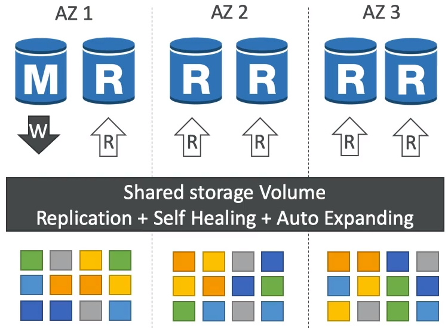

#### Aurora DB Cluster

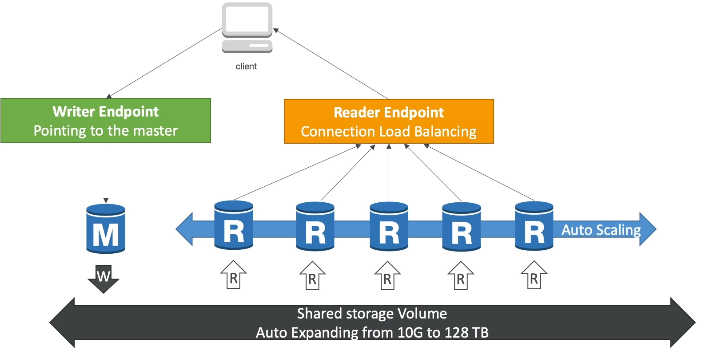

#### Features of Aurora

* Automatic fail-over
* Backup and Recovery
* Isolation and security
* Industry compliance
* Push-button scaling
* Automated Patching with Zero Downtime
* Advanced Monitoring
* Routine Maintenance
* Backtrack: restore data at any point of time with using backups

### Aurora Replicas - Auto Scaling

Auto-scaling due to high CPU usage.

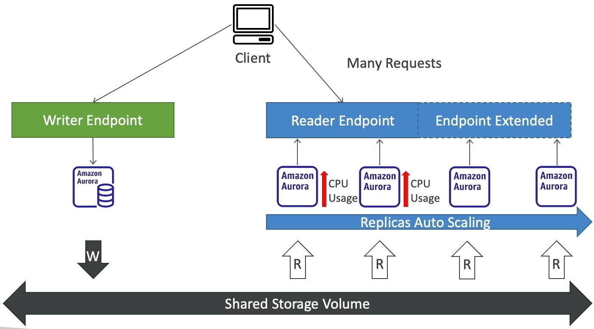

#### Aurora - Custom Endpoints

* Define a subset of Aurora Instance as a Custom Endpoint
* Example: Run analytical queries on specific replicas
* The Reader Endpoint is generally not used after defining Custom Endpoints

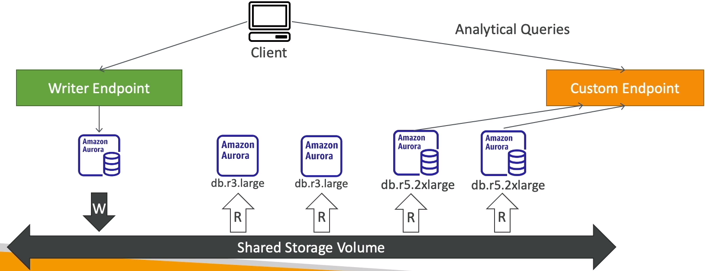

#### Aurora Serverless

* Automated database instantiation and auto-scaling based on actual usage
* Good for infrequent, intermittent or unpredictable workloads.
* No capacity planning needed
* Pay per second, can be more cost-effective

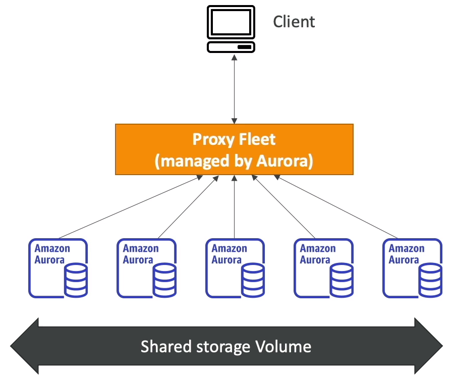

#### Global Aurora

* Aurora Cross Region Read Replicas
  * Useful for disaster recovery
  * Simple to put in place
* Aurora Global Database(recommended)
  * 1 Primary Region(read/write)
  * Up to 5 secondary (read-only) regions, replication lag is less than 1 second
  * Up to 16 Read Replicas per secondary region
  * Helps for decreasing latency
  * Promoting another region(for disaster recovery) has an RTO of less than one minute
  * Typical cross-region replication takes less than 1 second

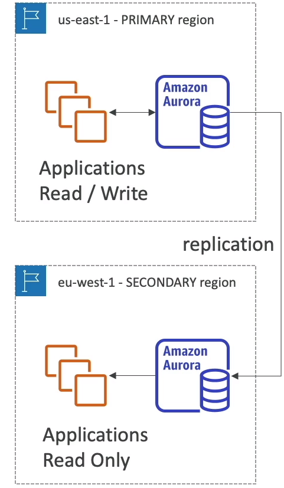

#### Aurora Machine Learning

* Enables you to add ML-based predictions to your application via SQL
* Simple, optimized and secure integration between Aurora and AWS ML services
* Supported services
  * Amazon SageMaker(use with any ML model)
  * Amazon Comprehend(for sentiment analysis)
* You don't need to have ML experience
* Use cases: fraud detection, ads targeting, sentiment analysis, product recommendations

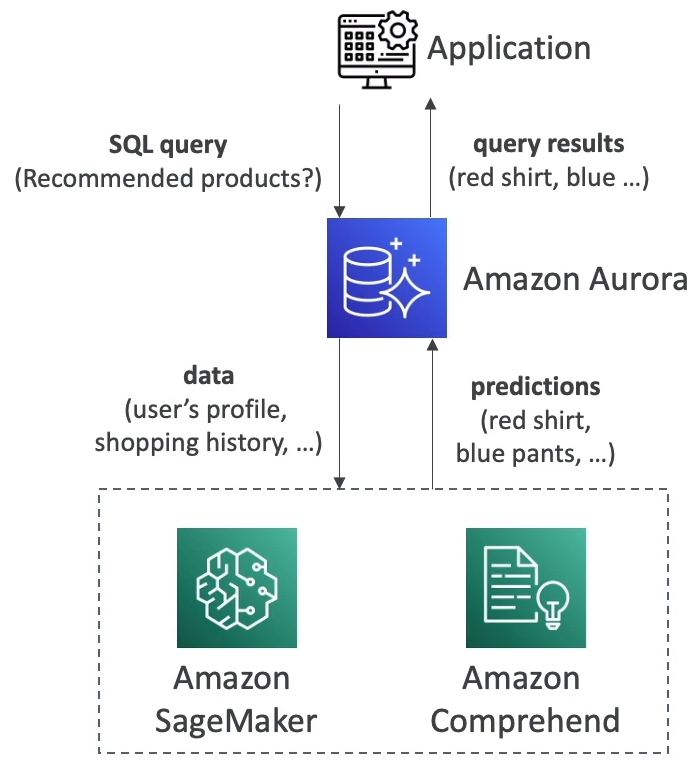

### RDS Backups

* Automated Backups:
  * Daily full backup of the database(during the backup window)
  * Transaction logs are backed-up by RDS every 5 minutes
  * ability to restore to any point in time(from oldest backup to minutes ago)
  * 1 to 35 days of retention, set 0 to disable automated backups
* Manual DB snapshots
  * Manually triggered by the user
  * Retention of backup for as long as you want
* Trick: in a stopped RDS database, you will still pay for storage. If you plan on stopping it for a long time, you should snapshot & restore instead.

#### Aurora Backups

* Aurora backups
  * 1 to 35 days(cannot be disabled)
  * point-in-time recovery in that timeframe

* Manual DB Snapshots
  * Manually triggered by the user
  * Retention of backup for as long as you want

#### RDS & Aurora Restore options

* Restoring an RDS/Aurora backup or a snapshot creates a new database
* Restoring MySQL RDS database from S3
  * Create a back of your on-premises database
  * Store it in Amazon S3
  * Restore the backup file onto a new RDS instance running MySQL
* Restoring MySQL Aurora cluster from S3
  * Create a backup of your on-premises database using Precona XtraBackup
  * Store the backup file on Amazon S3
  * Restore the backup file onto a new Aurora cluster running MySQL

#### Aurora Database Cloning

* Create a new Aurora DB cluster from an existing one
* Faster than snapshot & restore
* Uses copy-on-write protocol
  * Initially, the new DB cluster uses the same data volume as the orignal DB cluster(fast and efficient - no copying is needed)
  * When updates are made to the new DB cluster data, then additional storage is allocated and data is copied to be separated.
* Very fast & cost-effective
* Useful to create a "staging" database from a production database without impacting the production database.

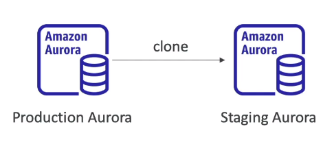

### RDS & Aurora Security

* At-rest encryption:
  * Database master & replicas encryption using AWS KMS - must be defined as launch time
  * If the master is not encrypted, the read replicas cannot be encrypted
  * To encrypt an un-encrypted database, go through a DB snapshot & restore as encrypted
* In-flight encryption: TLS-ready by default, use the AWSTLS root certificates client-side
* IAM Authentication: IAM roles to connect to your database(instead of username/pw)
* Security Groups: Control Network access to your RDS/Aurora DB
* No SSH available except on RDS Custom
* Audit Logs can be enabled and sent to CloudWatch Logs for longer retention

### RDS  Proxy

* Fully managed database proxy for RDS
* Allows apps to pool and share DB connections established with the database
* Improving database efficiency by reducing the stress on database resources(e.g: CPU, RAM) and minimize open connections(and timeouts)
* Serverless, autoscaling, highly available(multi-AZ)
* Reduced RDS & Aurora failover time by up 66%
* Supports RDS(MySQL, PostgreSQL, MariaDB, MS SQL Server) and Aurora(MySQL, PostgreSQL)
* No code changes required for most apps
* Enforce IAM Authentication for DB and securely store credentials in AWS Secret Manager
* RDS Proxy is never publicly accessible(must be accessed from VPC)

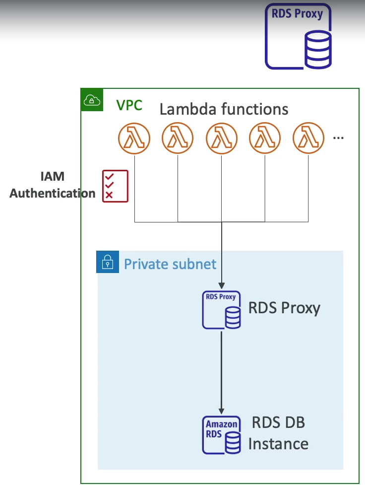

### Amazon ElasicCache Overview

* The same way RDS is to get managed Relational Databases
* ElasticCache is to get managed Redis or Mamcached
* Caches are in-memory databases with really high performance, low latency
* Helps reduce load off of database for read intensive workloads
* Helps make your application stateless
* AWS takes care of OS maintenance / patching, optimizations, setup, configuration, monitoring, failure recovery and backups
* Using ElasticCache involves heave application code changes

#### ElastiCache Solution Architecture - DB Cache

* Application queries ElastiCache, if not available, get from RDS and store in ElasticCache
* Helps relive load in RDS
* Cache must have an invalidation strategy to make sure only the most current data is used in there.

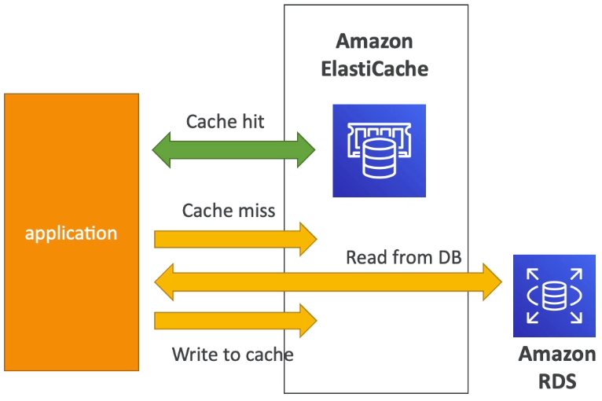

#### ElastiCache Solution Architecture - User Session Store

* User logs into any of the application 
* The application writes the session data into ElastiCache
* The user hits another instance of our application
* The instance retrieves the data and the user is already logged in

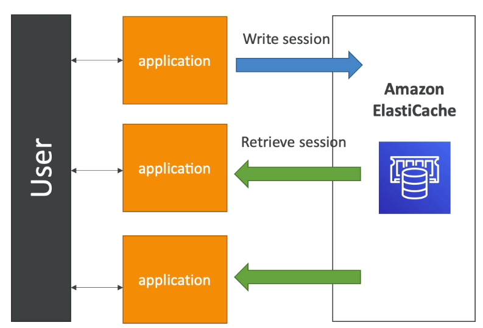

#### ElastiCache - Redis vs Memcached

##### Redis

* Multi-AZ with auto failover
* Read replicas to scale reads and have high availability
* Data Durability using AOF persistence
* Backup and restore features
* Supports Sets and Sorted Sets

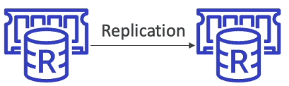

##### MemCached

* Multi-node for partitioning of data(sharding)
* No high availability(replication)
* Non persistent
* No backup and restore
* Multi-threaded architecture

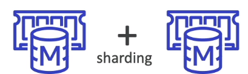

### ElastiCache - Cache Security

* ElastiCache supports **IAM Authentication for Redis**
* IAM policies on ElastiCache are only used for AWS API-Level security
* **Redis AUTH**
  * You can set a "password/token" when you create a Redis cluster
  * This is an extra level of security for your cache(on top of security group)
  * Support SSL in flight encryption
* **MemCached**
  * Support SASL-based authentication(advanced)

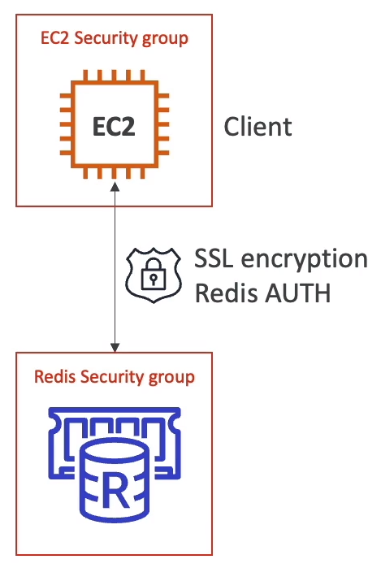

#### Patterns for ElastiCache

* **Lazy Loading**: all the read data is cached, data can become stale in cache
* **Write through**: Adds or update data in the cache when written to a DB(no stale data)
* **Session Store**: Store temporary session data in a cache(using TTL feature)

#### ElastiCache - Redis use cache

* Gaming Leaderboards are computationally complex
* **Redis Sorted Sets** guarantee both uniqueness and element ordering
* Each time a new element added, it's ranked in real time, then added in correct order

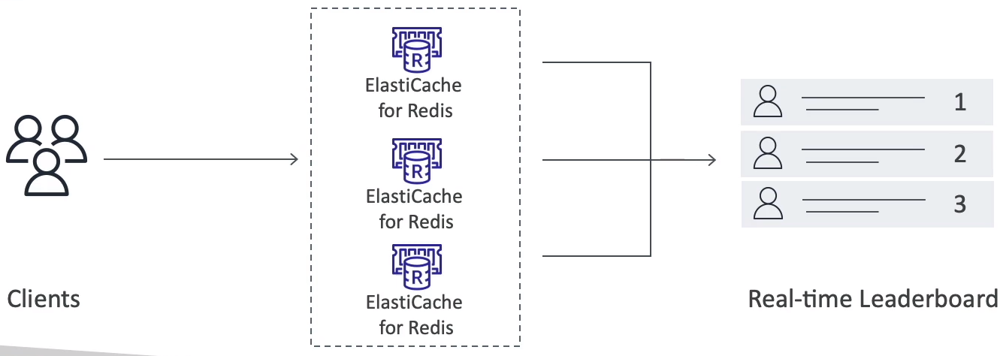