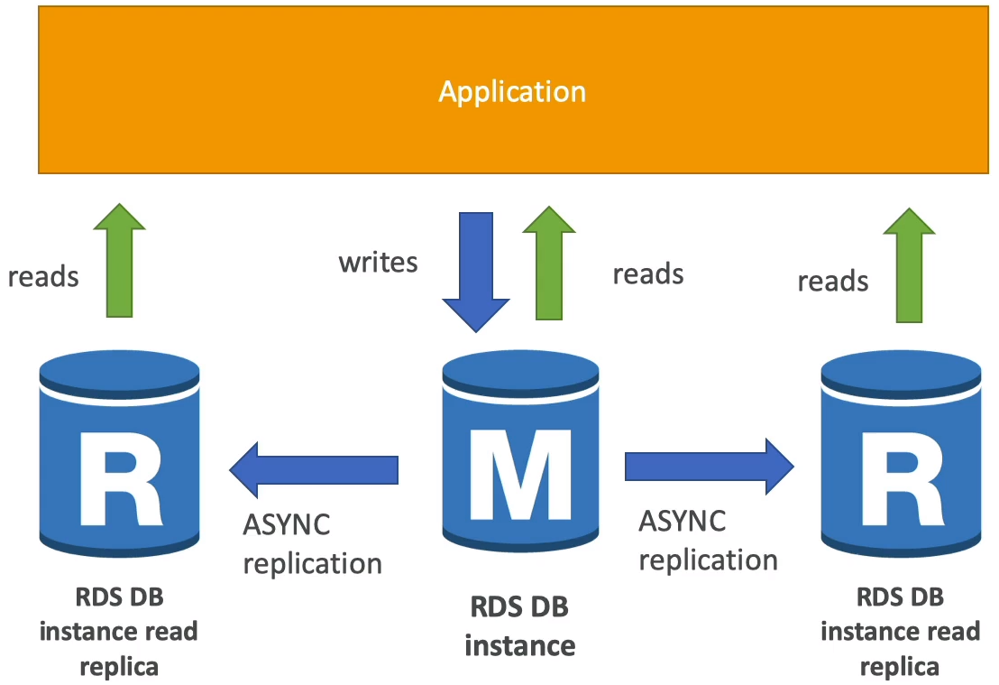
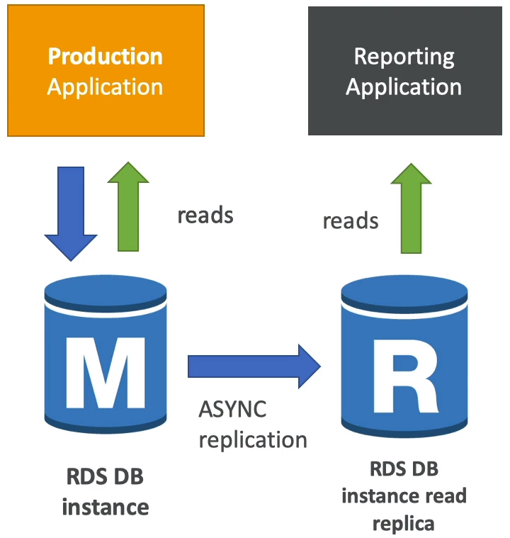
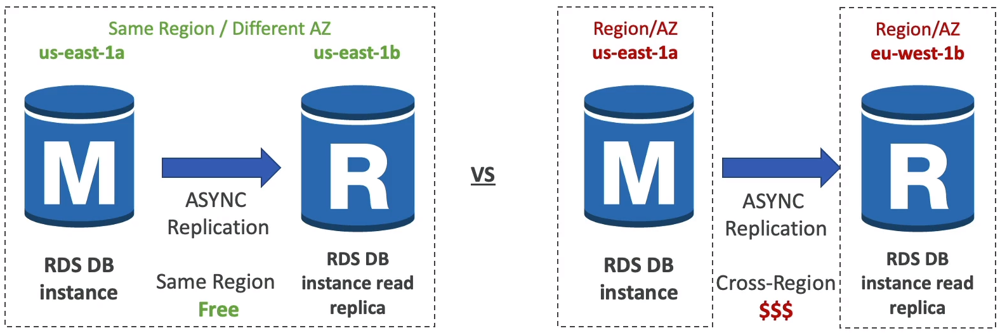
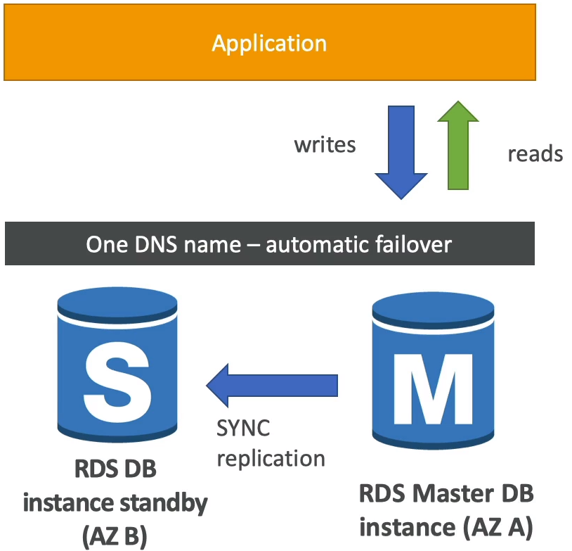
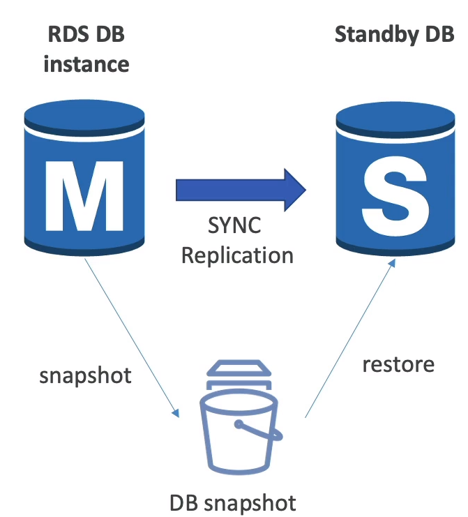

### Relational Database service(RDS)

* RDS stands for Relational Database Service
* It's a managed DB service for DB use SQL as a query language.
* It allows you to create database in the cloud that are managed by AWS
  * Postgres
  * MySQL
  * MariaDB
  * Oracle
  * Microsoft SQL Server
  * IBM DB2
  * Aurora

#### Advantage over using RDS versus deploying DB on EC2

* RDS is a managed service:
  * Automated provisioning, OS patching
  * Continuous backups and restore to specific timestamp(Point in time Restore)
  * Monitoring dashboards
  * Read replicas for improve read performance
  * Multi AZ setup for **Disaster Recovery**(DR)
  * Maintenance windows for upgrades
  * Scaling Capability(vertical and horizontal)
  * Storage backed by **EBS**(gp2 or io 1)
* But you can't SSH into your instances.

#### RDS - Storage Auto Scaling

* Helps you increase storage on your RDS DB instance dynamically.
* When RDS detects you are running out of free database storage, it scales automatically.
* Avoid manually scaling your database storage.
* You have to set **Maximum Storage Threshold** (maximum limit for DB storage)
* Automatically modify storage if:
  * Free storage is less than 10% of allocated storage
  * Low storage lasts at least 5 minutes
  * 6 hours have passed since last modification
* Useful for application with unpredictable workloads
* Supports all RDS database engines

#### RDS Read Replicas for read scalability

* Up to 15 read replicas
* Within AZ, Cross AZ or Cross Region
* Replication is **ASYNC** so reads are eventually consistent
* Replicas can be promoted to their own DB
* Applications must update the connection string to leverage read replicas

##### RDS Read replicas - Use Cases

* You have a production database that is taking on normal load
* You want to run a reporting application to run some analytics
* You create a Read Replica to run the new workload there
* The production application is unaffected
* Read replicas are ise for SELECT(=read) only kind of statement(not INSERT, UPDATE, DELETE)

##### RDS Read Replicas - Network Cost

* In AWS there's a network cost when data goes from one AZ to another
* For RDS Read replicas within the same region you don't pay that fee

##### RDS Multi AZ(Disaster Recovery)

* SYNC replication
* One DNS name - automatic app failover to standby
* Increase **availability**
* Failover in case of loss of AZ, loss of network, instance or storage failure
* No manual intervention in apps
* Not used for scaling
* Note: The Read Replicas be setup as Multi-AZ for Disaster Recovery(DR)

##### RDS - From Single-AZ to Multi-AZ

* Zero downtime operation(no need to stop the DB)
* Just click on "modify" for the database
* The following happens internally:
  * A snapshot is taken
  * A new DB is restored from the snapshot in a new AZ
  * Synchronization is established between the two databases.

