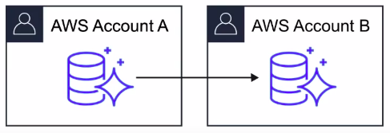
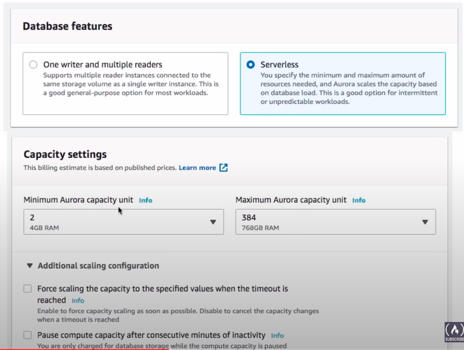

### Aurora

* Fully managed Postgres or MySQL compatible database **designed by default to scale** and **fine-tuned to be really fast**.
* Combines the **speed** and **availability** of **high-end databases** with the **simplicity** and **cost-effectiveness** of open source databases.
* Aurora can run either MySQL or Postgres compatible engines
* Aurora MySQL is **5x better performance** than traditional MySQL 
* Aurora Postgres is **3x better performance** then traditional Postgres
* 1/10th the costs of other solutions offering similar performance and availability.

### Aurora Scaling

* Start with 10GB of storage, and scale in **10GB** increments up to 64TB.

* Storage is autoscaling 
* Computing resources can scale all the way up to **32vCPUs** and **244GB** of memory.

### Availability

* A minimum of 3 availability zones each contain 2 copies of your data at all times. That means there are **6 copies**
* Lose up to 2 copies of your data without affecting **write** availability.
* Lost up to 3 copies of your data without affecting **read** availability.

### Fault Tolerance and Durability

* Aurora Backup and Failover is handled **automatically**
* Snapshots of data can be shared with other AWS accounts.

* Storage is **self-healing**, in that data blocks and disks are continuously scanned for errors and re-paired **automatically**.

### Aurora Replicas

There are 2 types of replicas available

|                                                 | Amazon Aurora     | MySQL Read Replicas                  |
|-------------------------------------------------|-------------------|--------------------------------------|
| Number of replicas                              | Upto 15           | Upto 5                               |
| Replication Type                                | Asynchronous(ms)  | Asynchronous(s)                      |
| Performance impact on primary                   | Low               | High                                 |
| Act as failover target                          | Yes(no data loss) | Yes(potentially minutes of data loss |
| Automated failover                              | Yes               | No                                   |
| Support for user-defined replication delay      | No                | Yes                                  |
| Support for different data or schema vs primary | No                | Yes                                  |

### Aurora Serverless

* Aurora except the database will automatically start up, shutdown and scale capacity up or down based on the application's needs.
* Apps used a few minutes several times per day or week, e.g. low-volume blog site.
* Pay for database storage and the database capacity and I/O your database consumes while it is active.

### Cheatsheet

* When you need a fully-managed Postgres or MySQL database that needs to scale, automatic backups, high availability and fault tolerance think Aurora
* Aurora can run MySQL or Postgres database engines
* Aurora MySQL is 5x faster over regular MySQL
* Aurora Postgres is 3x faster over regular Postgres
* Aurora is 1/10 the cost over its competitors with similar performance and availability options
* Aurora replicates 6 copies of your database across 3 availability zones.
* Aurora is allowed up to **15 Aurora Replices**
* Aurora database can span multiple regions via **Aurora Globla Database**
* **Aurora Serverless** allows you to stop and start Aurora and scale automatically while keeping costs low
* Aurora Serverless is ideal for new projects or project with infrequent database usage.