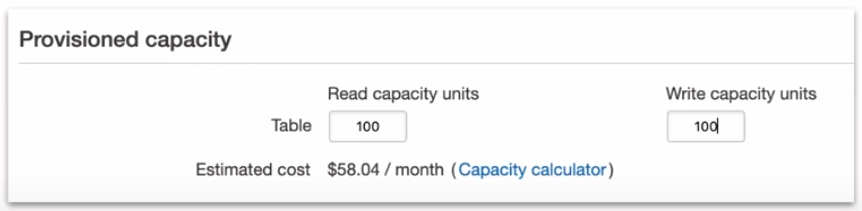
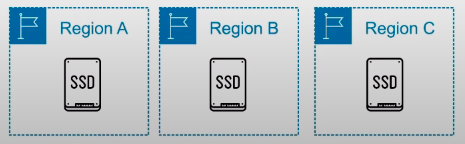
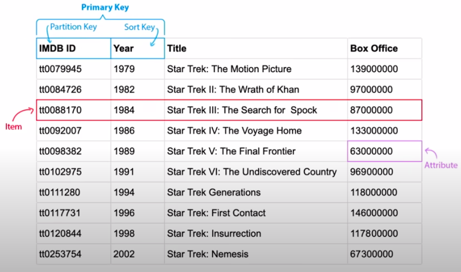

### Dynamo-DB

A **key-value** and **document database(NoSQL)** which can guarantees **consistent reads and writes** at any scale.

**NoSQL:** Is database which is neither relational and does not use SQL to query the data for results.

**What is a Key/Value Store?** A form of data storage which has a key which references a value and nothing more

**What is a Document Store?** A form of data storage which is nested data structure

**DynamoDB** is a NoSQL **key/value** and **document** database for internet-scale applications.

**Features:**
* Fully managed
* Multi region
* Multi master
* Durable database
* Built-in Security
* Backup and restore
* In-memory Caching

**Provides**
* Eventual Consistent Reads(default)
* Strongly Consistent Reads

* Specify your read and write capacity per second, it just works at **whatever capacity you need** without you tweaking anything.

All data is stored in **SSD storage** and is spread across **3 different regions.**

### Table Structure

### Reads

When data needs to updated it has to write updates to all copies. **It is possible for data to be inconsistent** if you are reading from a copy which has yet to be updated. You have the ability to choose the read consistency in DynamoDB to meet your needs.

| Eventual Consistent Read(Default)                                                                 | Strongly Consistent Reads                                                                                 |
|---------------------------------------------------------------------------------------------------|-----------------------------------------------------------------------------------------------------------|
| When copies are being updated it is possible for you to read and be returned an inconsistent copy | When copies are being updated and you attempt to read, it will not return until all copies are consistent |
| Reads are fast but there is no guarantee of consistent                                            | You have a guarantee of consistency but the trade off is higher latency(slower reads)                     |
| All copies of data eventually become generally consistent within a second                         | All copies of data will be consistent within a second                                                     |
