### Simple Queue Service(SQS)

#### What is queue?

* Fully managed service, used to **decouple application**
* Attributes:
  * Unlimited throughput, unlimited number of message in queue
  * Default retention of messages: 4 days maximum of 14 days
  * Low Latency(< 10 ms on publish and receive)
  * Limitation of 256KB per message sent

* Can have duplicate messages(at least once delivery, occasionally)
* Can have out of order messages(best effort ordering)

#### Producing Message

* Produced to SQS using the SDK(SendMessage API)
* The message is **persisted** in SQS until a consumer deletes it
* Message retention: default 4 days, up to 14 days

* Example: send an order to be processed
  * Order id
  * Customer id
  * Any attributes you want

* SQS standard: unlimited throughput

#### Consuming Messages

* Consumers(running on EC2 instances, servers, or AWS Lambda)...
* Poll SQS for messages(receive up to 10 messages at a time)
* Process the message(example: insert the message into an RDS database)
* Delete the message using the DeleteMessage API

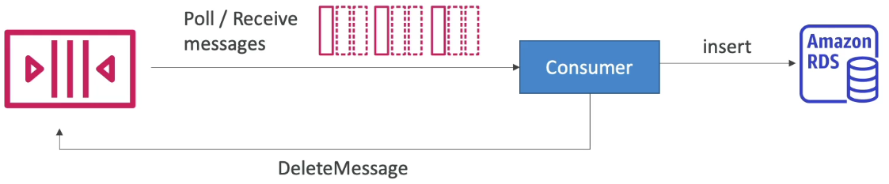

#### Multiple EC2 Instances Consumers

* Consumer receive and process messages in parallel
* Atl east once delivery
* Best effort message ordering
* Consumers delete messages after processing them
* We can scale consumers horizontally to improve throughput of processing.

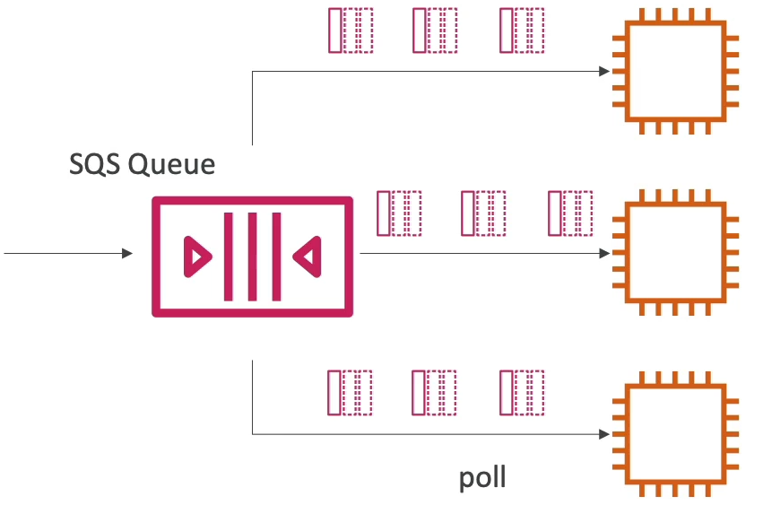

#### SQS with Auto Scaling Group(ASG)

* Consumers will be running EC2 instances inside an Auto Scaling Group and they will be polling for messages from the SQS queue
* This Auto-scaling group has to scaling based on the metric that is available on Cloud Watch(i.e: ApproximateNumberOfMessages)

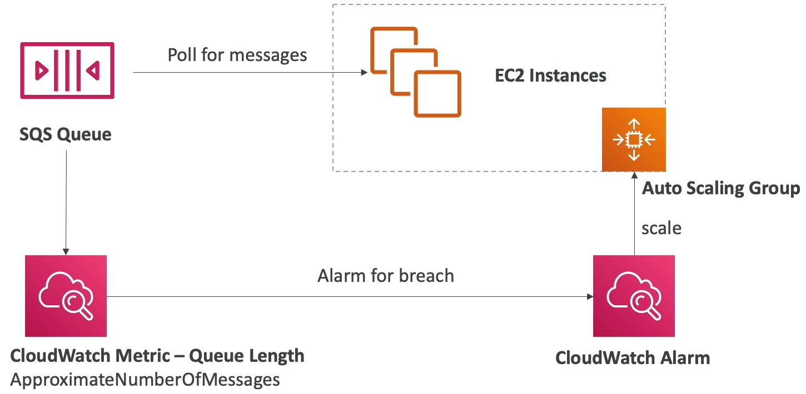

#### SQS to decouple between application tiers

* Front end send a message into an SQS queue
* Backend will process the message from this queue
* This architecture we can scale both frontend and backend independently

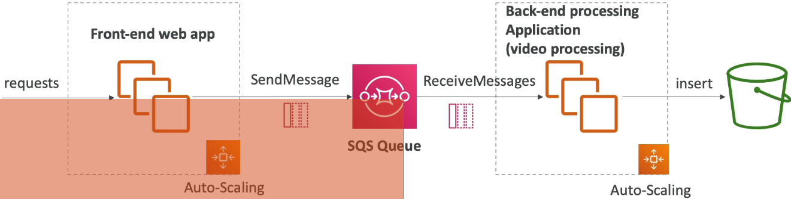

#### SQS - Security

* Encryption:
  * In-flight encryption using HTTPS API
  * At-rest encryption using KMS keys
  * Client-side encryption if the client wants to perform encryption/decryption itself
* Access Controls: IAM policies to regulate access to the SQS API
* SQS Access Policies(similar to S3 bucket policies):
  * Useful for cross-account access to SQS queues
  * Useful for allowing other service(SNS, S3) to write to an SQS queue

#### Message Visibility Timeout

* After a message is polled by a consumer, it becomes invisible to other consumers
* By default, the "message visibility timeout" is **30 seconds**
* That means the message has 30 seconds to be processed.
* After the message visibility timeout is over, the message is "visible" is SQS

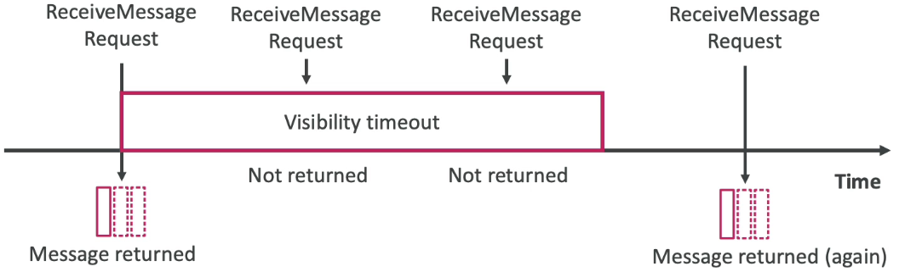

* If a message is not processed within the visibility timeout, it will be processed **twice**
* A consumer could call the **ChangeMessageVisibility** API to get more time
* If visibility timeout is high, and consumer crashes, re-processing will take time
* If visibility timeout is too low(second), we may get duplicates

#### Long Polling

* When a consumer requests messages from the queue, it can optionally "wait" for messages to arrive if there are none in the queue.
* This is called Long Polling
* **LongPolling decreases the number of API calls made of SQS while increasing the efficiency and latency of your application**
* The wait time can be between 1 sec to 20 sec(20 sec preferable)
* Long Polling is preferable to Short Polling
* Long polling can be enabled at the queue level or at the API level using **WaitTimeSeconds**

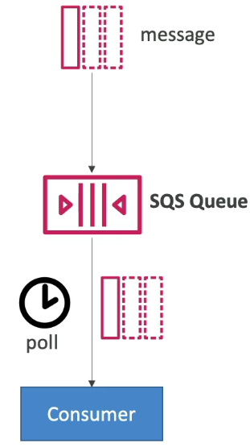

#### FIFO Queue

* Ordering of messages in the queue

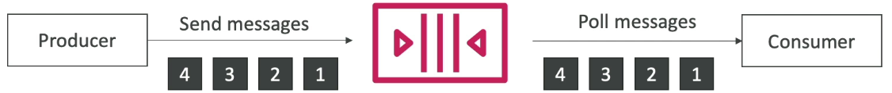

* Limited throughput: 300 msg/s without batching, 3000 msg/s with
* Exactly-once send capability(by removing duplicates)
* Messages are processed in order by the consumer

#### SQS with Auto Scaling Group(ASG)

* Based on the metric `ApproximateNumberOfMessages` in `CloudWatch` alarm the `ASG` can scale up and down the `ec2` instances 

### SQS as a buffer to database writes

* By using SQS as a buffer, we don't miss any request during the high load, since we delete messages only if system process it.

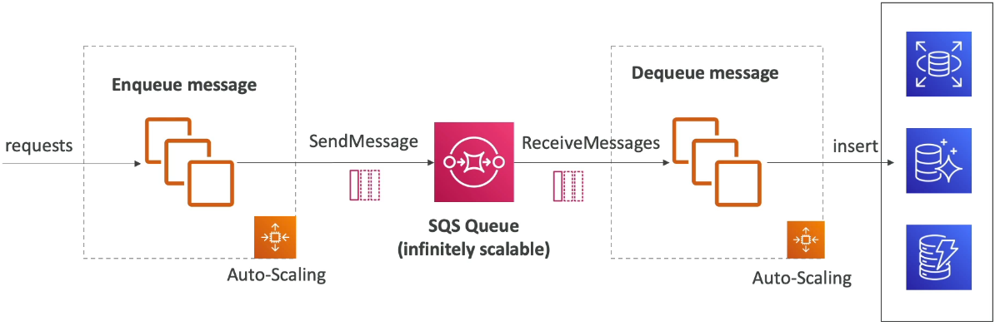

### Amazon SNS

* What if you want to send one message to many receivers

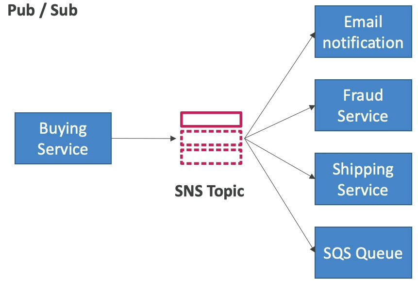

* The "event producer" only sends message to one SNS topic
* As many "event receivers"(subscriptions) as we want to listen to the SNS topic notifications.
* Each subscriber to the topic will get all the message(note: new feature to filter messages)
* Up to 12,500,000 subscriptions per topic
* 100,000 topics limit

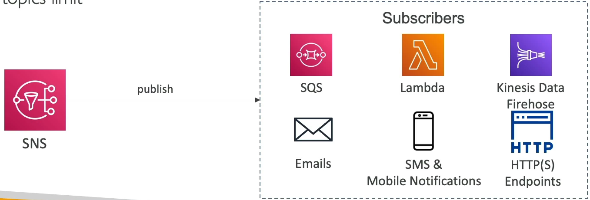

* Many AWS services can send data directly to SNS for notifications

#### SNS - How to publish

* Topic Publish(using the SDK)
  * Create a topic
  * Create one or many subscription(or many)
  * Publish to the topic
* Direct Publish(for mobile apps SDK)
  * Create a platform application
  * Create a platform endpoint
  * Publish to the platform endpoint
  * Works with Google GCM, Apple APNS, Amazon ADM...

#### SNS - Security

* **Encryption**:
  * In-flight encryption using HTTPS API
  * At-rest encryption using KMS keys
  * Client-side encryption if the client wants to perform encryption/decryption itself

* **Access Controls**: IAM policies to regulate access to the SNS API

* **SNS Access Policies**(similar to S3 bucket policies)
  * Useful for cross-account access to SNS topics
  * Useful for allowing other services(S3...) to write to an SNS topic

========================================================================================================================

### What is a Queueing System?

**What is a Messaging System?**

Used to provide asynchronous communication and decouple processes via messages / events from a sender and receiver.

| Queueing                                               | Streaming                                                                                |
|--------------------------------------------------------|------------------------------------------------------------------------------------------|
| Generally will delete messages once they are consumed. | Multiple consumers can react to events(messages).                                        |
| Simple Communication                                   | Event live in the stream for long periods of time, so complex operations can be applied. |
| **Not Real time**                                      | **Real-time**                                                                            |
| Have to pull                                           |                                                                                          |
| Not reactive                                           |                                                                                          |
|                  |                                                   |

### Intro

* SQS is for **Application Integration**
* AWS SQS is a solution for the distributed queueing of messages generated by your application. It connects isolate applications together by passing along message to one another.
* A **queue** is a temporary repo for messages that are awaiting processing.
* Using the AWS SDK you write code which publishes messages onto the queue, or you pull the queue for messages.
**SQS is pull based Not push based**

### Use-case

1. App publishes messages to the queue
2. Other app pulls the queue and find the message and does something
3. Other app reports that they completed their task and marks the message for completion
4. Original app pulls the queue and sees the message is no longer in the queue.

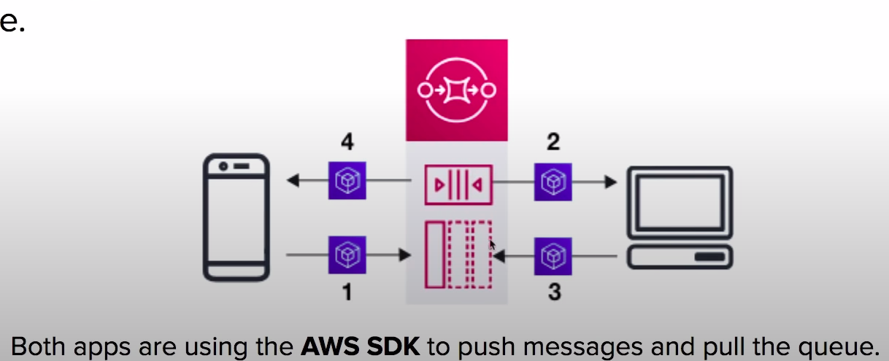

### Limits and Retentions

* **Message Size:** The size of a message can be between **1 byte and 256KB**
* **Amazon SQS Extended Client Library for Java** lets you send messages **256KB to 2GB** in size. The message will be stored in S3 and library will reference the S3 object.

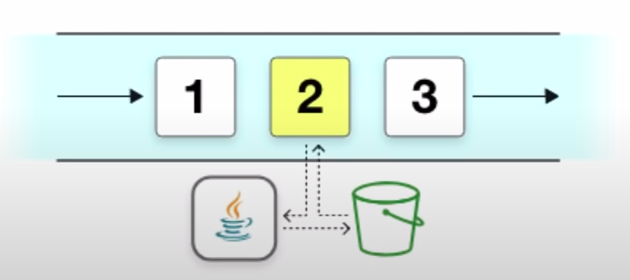

**Message Retention**

* Message retention by default is **4 days**, can be adjusted from a minimum of 60 seconds to a **max of 14 days**

### Queue Types

**Standard Queue**

* Allows you a **nearly-unlimited** number of transactions per second.
* Guarantees that a message will be delivered **AT LEAST once.**
* **More than one copy** of a message could be potentially delivered **out of order**
* Provides **best-effort ordering** that helps ensure a message is generally delivered in the same order that it was sent.

**FIFO**
* Supports multiple ordered message groups within a single queue.
* Limited to **300 transactions** per second.
* SWS FIFO queues have all the same capabilities of a Standard Queue.

### Visibility Timeout

* **How do we prevent another app from reading a message while another one is busy with that message(Avoid someone doing the same task)**
* A **visibility time-out** is the period that messages are **invisible in the SQS queue,** after a reader picks up that message.
* Messages will be **deleted** from the queue **after a job has processed.**(before the visibility timeout expires)
* If a job is **NOT** processed before the visibility time-out period, the message will **become visible again** and another reader will process it. This can result in the same message being delivered twice.

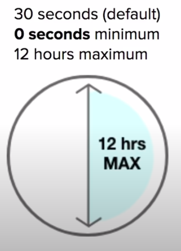

### Short vs Long Polling

* Polling is the method in which we retrieve message from the queues.
* **Short Polling(default)** returns message immediately, even if the message queue being polled is empty.
* When you need a message **right away.** short polling is what you want to use.
* **Long polling** wait until message arrive in the queue or the long poll timeout expires.
* Long polling makes it **inexpensive to retrive message** from your queue as soon as the messages are available.
* Using long polling will reduce the cost because you can reduce the number of empty receives.
* Most use-cases you want to use Long Polling.