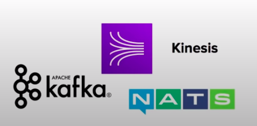

### Simple Queue Service(SQS)

* Fully managed **queuing service** that enables you to decouple and scale microservices, distributed systems, and serverless applications.

### What is a Queueing System?

**What is a Messaging System?**

Used to provide asynchronous communication and decouple processes via messages / events from a sender and receiver.

| Queueing                                               | Streaming                                                                                |
|--------------------------------------------------------|------------------------------------------------------------------------------------------|
| Generally will delete messages once they are consumed. | Multiple consumers can react to events(messages).                                        |
| Simple Communication                                   | Event live in the stream for long periods of time, so complex operations can be applied. |
| **Not Real time**                                      | **Real-time**                                                                            |
| Have to pull                                           |                                                                                          |
| Not reactive                                           |                                                                                          |
|                  |                                                   |

### Intro

* SQS is for **Application Integration**
* AWS SQS is a solution for the distributed queueing of messages generated by your application. It connects isolate applications together by passing along message to one another.
* A **queue** is a temporary repo for messages that are awaiting processing.
* Using the AWS SDK you write code which publishes messages onto the queue, or you pull the queue for messages.
**SQS is pull based Not push based**

### Use-case

1. App publishes messages to the queue
2. Other app pulls the queue and find the message and does something
3. Other app reports that they completed their task and marks the message for completion
4. Original app pulls the queue and sees the message is no longer in the queue.

### Limits and Retentions

* **Message Size:** The size of a message can be between **1 byte and 256KB**
* **Amazon SQS Extended Client Library for Java** lets you send messages **256KB to 2GB** in size. The message will be stored in S3 and library will reference the S3 object.

**Message Retention**

* Message retention by default is **4 days**, can be adjusted from a minimum of 60 seconds to a **max of 14 days**

### Queue Types

**Standard Queue**

* Allows you a **nearly-unlimited** number of transactions per second.
* Guarantees that a message will be delivered **AT LEAST once.**
* **More than one copy** of a message could be potentially delivered **out of order**
* Provides **best-effort ordering** that helps ensure a message is generally delivered in the same order that it was sent.

**FIFO**
* Supports multiple ordered message groups within a single queue.
* Limited to **300 transactions** per second.
* SWS FIFO queues have all the same capabilities of a Standard Queue.

### Visibility Timeout

* **How do we prevent another app from reading a message while another one is busy with that message(Avoid someone doing the same task)**
* A **visibility time-out** is the period that messages are **invisible in the SQS queue,** after a reader picks up that message.
* Messages will be **deleted** from the queue **after a job has processed.**(before the visibility timeout expires)
* If a job is **NOT** processed before the visibility time-out period, the message will **become visible again** and another reader will process it. This can result in the same message being delivered twice.

### Short vs Long Polling

* Polling is the method in which we retrieve message from the queues.
* **Short Polling(default)** returns message immediately, even if the message queue being polled is empty.
* When you need a message **right away.** short polling is what you want to use.
* **Long polling** wait until message arrive in the queue or the long poll timeout expires.
* Long polling makes it **inexpensive to retrive message** from your queue as soon as the messages are available.
* Using long polling will reduce the cost because you can reduce the number of empty receives.
* Most use-cases you want to use Long Polling.