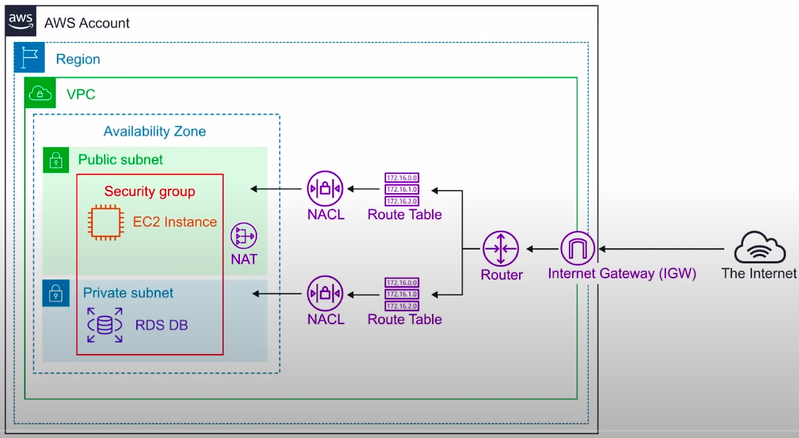
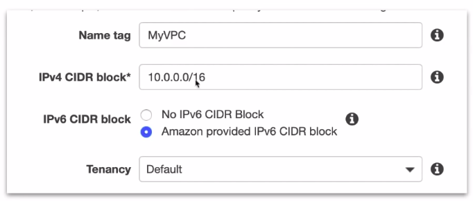
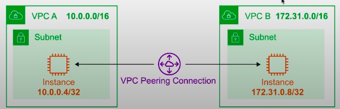
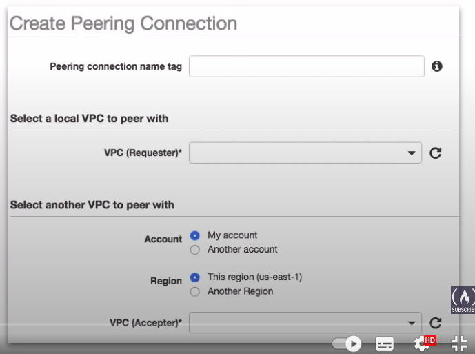
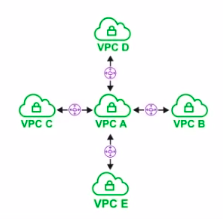
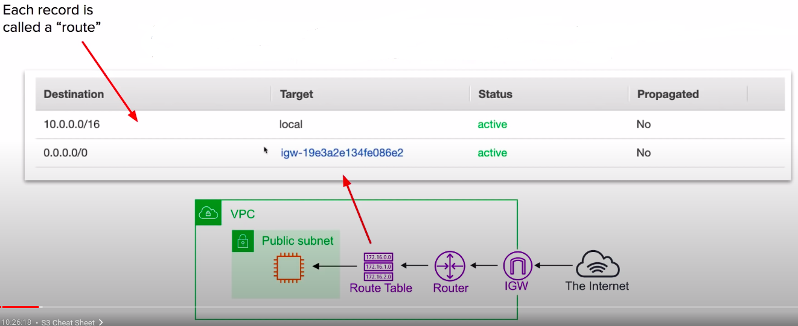
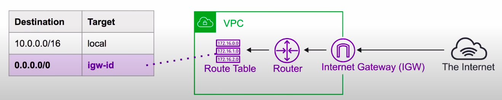
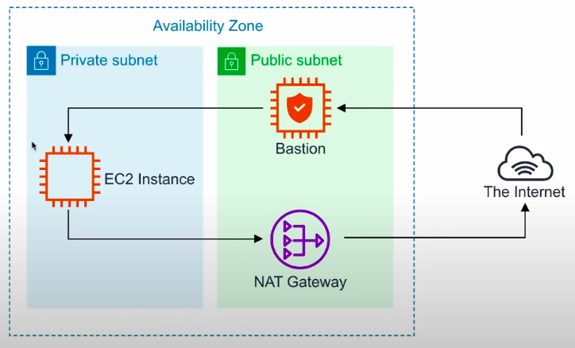
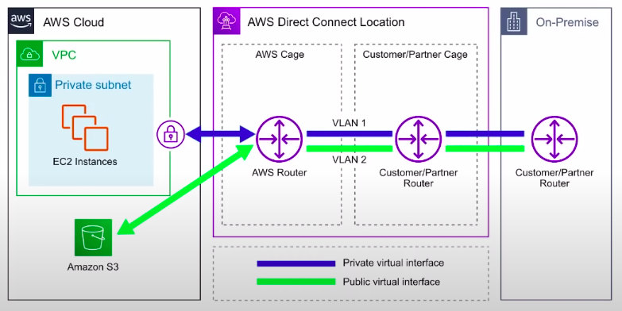

### Virtual Private Cloud:

Provision a **logically isolated section of the AWS Cloud** where you can launch AWS resources in a **virtual network** that you define.

* Think of an AWS VPC as your own personal data centre.
* Gives you complete control over your virtual networking environment.

**Core components**

Combining these components and services is what makes up your VPC

* Internet Gateway(IGW)
* Virtual Private Gateway(VPN Gateway)
* Routing tables
* Network Access Control List(NACLs) - stateless
* Security Groups(SG) stateful
* Public Subnets
* Private Subnets
* Nat Gateway
* Customer Gateway
* VPC Endpoints
* VPC Peering

**Key Features**

* VPCs are **Region Specific** they do not span regions. 
* You can create upto **5 VPC** per region 
* Every region comes with a default VPC 
* You can have **200 subnets** per VPC 
* You can use **IPv4 Cidr Block** and in addition to a **IPv6 Cidr Blocks**(the address of the VPC). Example: **IPv6 Cidr: 2600:1f16:9e0:8d00::/56**
* **Cost nothing**: VPC's, Route Tables, Nacls, Internet Gateways, Security Groups and Subnets, VPC Peering. 
* **Some things cost money**: NAT gateway, VPC Endpoints, VPN Gateway, Customer Gateway 
* **DNS hostnames** (should your instance have domain name addresses) When you launch EC2 instances,it will get a public IP it will only get a public DNS which looks like a domain name, but if `DNS hostnames` isn't turned on,that ec2 instances won't get one.

**Default VPC:**

AWS has a default VPC in every region, so you can **immediately** deploy instances.

* Create a VPC with size /16 IPv4 CIDR block(172.31.0.0/16)
* Create a size /20 **default subnet in each Availability Zone.** 
* Create an **Internet Gateway** and connect it to your default VPC.
* Create a **default security group** and associate it with your default VPC.
* Create a **default network access control list(NACL)** and associate it with your default VPC. 
* Associate the **default DHCP(Dynamic Host Configuration Protocol)** options set for your AWS account with your default VPC. 
* *When you create a VPC, it automatically has a main route table.

**Default Everywhere IP:**
		
* 0.0.0.0/0 is also known as **default**
* It represents **all possible IP addresses.** 
* When we specify 0.0.0.0/0 in **route table for IGW we are allow internet access**. 
* When we specify 0.0.0.0/0 in our **security groups inbound rules** we are allowing all traffic from the internet access our public resources. 
* When you see 0.0.0.0/0 just think of giving access from anywhere or the internet.

**VPC Peering:**

**VPC Peering** allows you to connect one VPC with another over a **direct network route** using **private IP addresses**.

* Instances on peered VPCs behave just like they are on the same network.
* Connect VPCs across **same** or **different AWS accounts** and **regions**.
* Peering uses a **Star configuration: 1 Central VPC - 4 other VPCs**.
* **No Transitive peering**(peering must take place directly between VPCs)
  * Needs a one to one connect to immediate VPC.
* **No Overlapping CIDR Blocks**.

**What is overlapping CiDR Blocks?**

If 
* VPC A has an IP address of 10.0.0.0/16 and 
* VPC B has an IP address of 172.31.0.0/16, then the CiDR is not overlapping.
* If both has same IP address 172.31.0.0./16 and 172.31.0.0/16 then it is an overlap.

**Route tables:**

* Route tables are used to determine **where network traffic is directed**.
* Each **subnet** in your VPC **must be associated** with a route table.
* A subnet can only be associated **with one route table at a time**, but you can associate multiple subnets with the same route table.

**Internet gateway(IGW):**
			
The Internet Gateway allows your VPC access to the internet.
		
IGW does two things:
			
1. provide a target in your VPC route tables for internet-routable traffic.
2. perform network address translation(NAT) for instances that have been assigned **PUBLIC IPv4 addresses**.

To route out to the internet you need to add in your route tables a route.
To the internet gateway and set the Destination to be 0.0.0.0/0

**Bastion/Jumpbox:**

* Bastions are EC2 instances which are **security harden.** They are designed to help you gain access to your EC2 instances via SSH or RCP. That are in a **private subnet**.
* They are also known as Jump Boxes because you are jumping from one box to access another.
* NAT Gateways/Instances are only intended for EC2 instances to gain outbound access to the internet for things such as security updates. **NATs cannot/should not be used as Bastions.**

System Manager's **Sessions Manager** replaces the need for Bastions.

**Direct Connect:**

* AWS Direct Connect is the AWS solution for establishing **dedicated network connections from on-premises location to AWS**.
* Very fast network Lower Bandwidth 50M-500M or Higher Bandwidth 1GB or 10GB.

* Helps **reduce network costs** and **increase bandwidth throughput**(great for high traffic networks)
* Provides a **more consistent network experience** than a typical internet-based connection(reliable and secure).