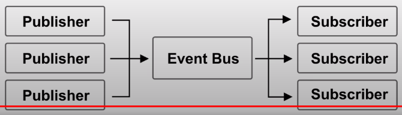
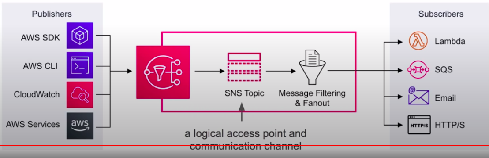
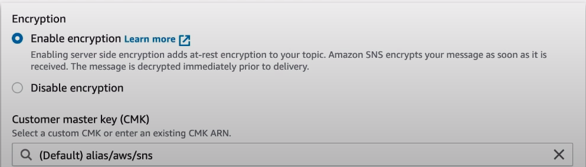
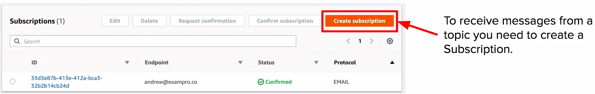
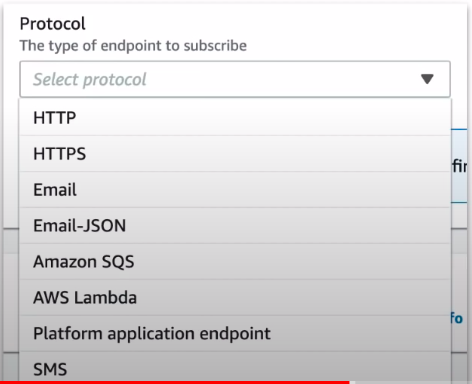
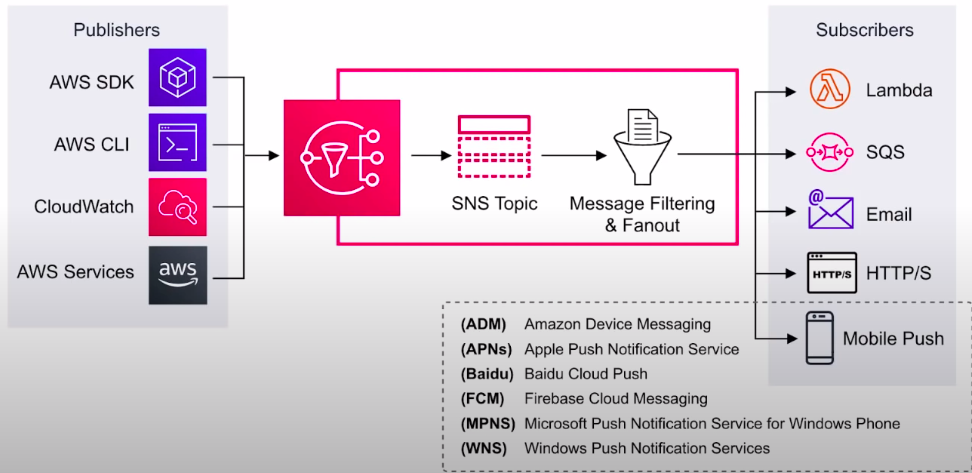

### Simple Notification Service

**Subscribe** and send notifications via text message email, webhooks, lambdas, SQS, and mobile notifications

### What is Pub/Sub?

Publish-subscribe pattern commonly implemented in **messaging systems.** In a pub/sub system the sender of messages(publishers) do not send their messages directly to receivers. THey instead send their messages to an event bus. The event bus categorizes their messages in groups. Then receivers of message subscribe to these groups. Whenever new messages appear within their subscription the messages are immediately delivered to them

* Publisher have no knowledge of who their subscribers are 
* Subscribers do not pull for messages
* Messages are instead automatically and immediately pushed to subscribers.
* Messages and events are interchangeable terms in pub/sub

**SNS** is a highly available, durable, secure, fully managed **pub/sub messaging** service that enables you to **decouple** ms, ds, and serverless applications.

**Application Integration!**
* Publisher **push** events to an SNS Topic
* Subscribers subscribe to SNS Topic to have events **pushed** to them

### Topics

* Topics allow you to group **multiple subscriptions together.**
* A topic is able to deliver a **multiple protocols** at once e.g. email, text message, http(s)
* When topics deliver messages to subscribers it will automatically format your message according to the subscriber's chosen protocol
* You can encrypt Topics via **KMS**

### Subscriptions

* A subscription can only subscribe to one protocol and one topic. The following protocols:
  * **HTTP and HTTPs** create webhooks into your web-application
  * **Email** good for internal email notification(only supports plain text)
  * **Email-JSON** sends you json via email
  * **Amazon SQS** place SNS message into SQS queue.
  * **AWS Lambda** triggers a lambda function
  * **SMS** send a text message
  * **Platform application endpoints** Mobile Push

### Application As Subscriber

* Send push notification message directly to apps on mobile devices.
* Push notification message sent to a mobile endpoint can appear in the mobile app as message alerts, badge updates or even sound alerts.

### CheatSheet
* SNS is a fully managed pub/sub messaging service
* SNS is for **Application Integration.** It allows decoupled services and apps to communicate with each other
* **Topic** a logical access point and communication channel
* A topic is able to deliver to multiple protocols
* You can encrypt topcis via KMS
* **Publishers** use the AWS API via AWS CLI or SDK to push messages to a topic. Many AWS services integrate with SNS and act as publishers
* **Subscriptions** subscribe to topic. WHen a topic receives a message it automatically and immediately pushes messages to subscribers
* All messages published to SNS are stored redundantly across multiple AZ
* The following protocols:
  * HTTP
  * Email
  * EmaillJSON
  * Amazon SQS
  * AWS Lambda
  * SMS
  * **Platform application endpoints** Mobile push eg. Apple, Google, Microsoft, Baidu notification systems.