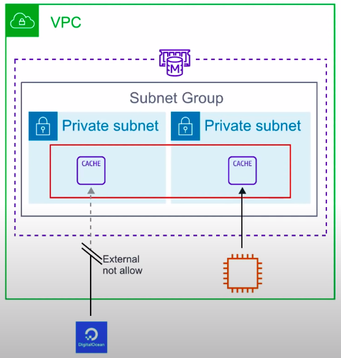

### ElastiCache

Managed **caching** service which either runs **Redis** or **Memcached**.

**Caching**

* Caching is the process of storing data in a cache. A cache is a **temporary storage** area. Caches are optimized for fast retrieval with the trade off that data is not durable.

**In memory data store**

* When data is stored In-Memory(think of RAM). The trade-off is high volatility(low durability, risk of data loss) but **access** to data to **very fast.**

### Introduction of ElastiCache

* Deploy, run and scale **popular open source compatible in-memory** data stores.
* Frequently identical queries are stored in the cache.
* ElastiCache is only accessible to resource operating with the same VPC to ensure low latency.
* ElastiCache supports 2 open-source caching engines:

1. Memcached
2. Redis

### Caching Comparison

* **Memcached** is generally preferred for caching **HTML fragments**. Memcache is a simple key/value store. The trade-off it to being simple is that **it's very fast**.
* **Redis** can perform many kinds of operations on your data. It is very good for leaderboards, keep track of unread notification data. It's very fast but **arguably** not as fast as Memcached.

|                                                  | Memcached | Redis |
|--------------------------------------------------|-----------|-------|
| Sub-millisecond latency                          | Y         | Y     |
| Developer ease of use                            | Y         | Y     |
| Data partitioning                                | Y         | Y     |
| Support for a broad set of programming languages | Y         | Y     |
| Advanced data strucutures                        | -         | Y     |
| Multi-thread arch                                | Y         | -     |
| Snapshots                                        | -         | Y     |
| Replication                                      | -         | Y     |
| Transaction                                      | -         | Y     |
| Pub/Sub                                          | -         | Y     |
| Lua scripting                                    | -         | Y     |
| Geospatial support                               | -         | Y     |

### CheatSheet

* Is a managed in-memory caching service
* Can launch either Memcached or Redis
* **Memcached** is a simple key/value store preferred for caching HTML fragments and is arguably faster than Redis
* **Redis** has richer data types and operations. Great for leaderboard, geospatial data or keeping track of unread notifications.
* A cache is a **temporary storage** area.
* Most frequently identical queries are stored in the cache
* Resources only **within the same VPC** may connect to ElasticCache to ensure low latencies.