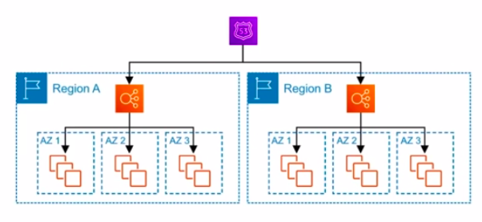

### High Availability

The ability for a system to remain available

**Think about what could cause a service to become unavailable**
1. When an AZ becomes unavailable eg. data-center flooded
2. When a Region becomes unavailable eg. meteor strike
3. When a web-application becomes unresponsive e.g. too much traffic
4. When a instance becomes unavailable e.g. instance failure
5. When a web-application becomes unresponsive due to distance in geographic location.

The solution we need to implement in order to ensure **High Avialability:**

1. We should run our instances in Multi-AZ an **Elastic Load Balancer** can route traffic to operational AZs.
2. We should run instances in another regions. We can route traffic to another Region via **Route53**
3. We should use **Auto Scaling Groups** to increase the amount of instances to meet the demand of traffic
4. We should use **Auto Scaling Groups** to ensure a minimum amount of instances are running and have **ELB** route traffic to healthy instances.
5. We should use **CLoudFront** to cache static content for faster delivery in nearby regions. We can also run out instances in nearby regions and route traffic using a geolocation policy in **Route53**

