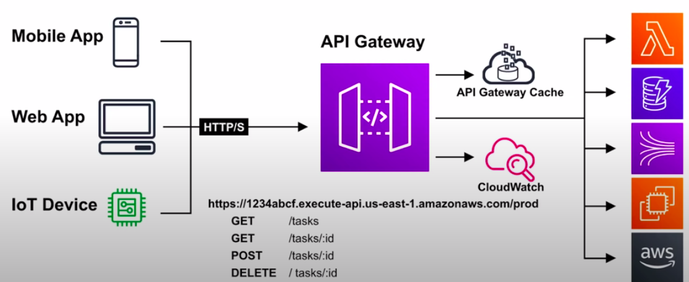
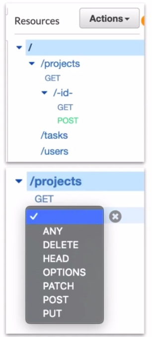
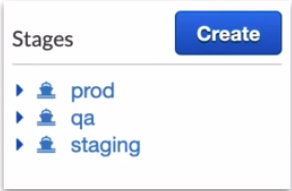
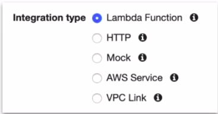
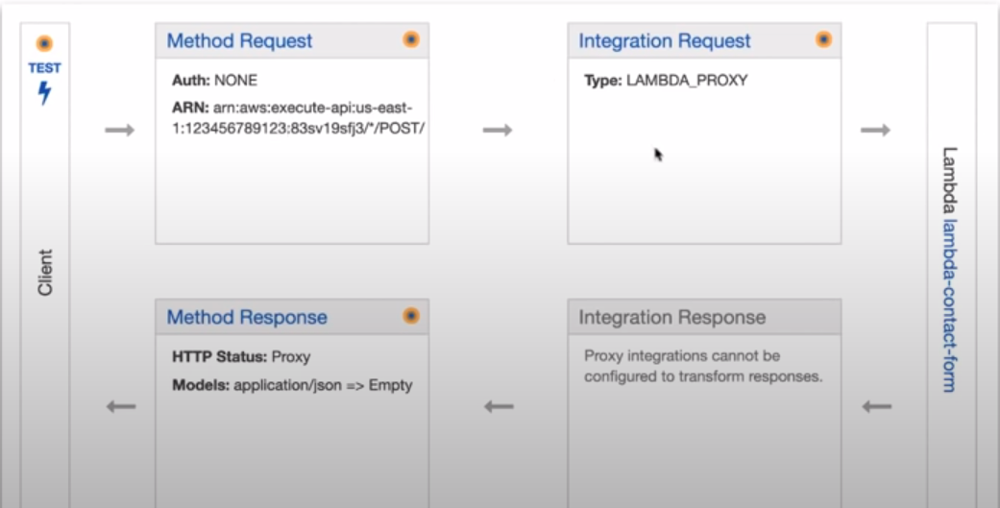
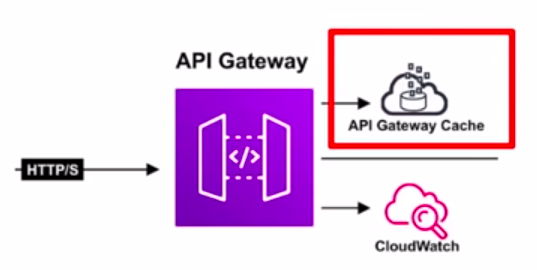
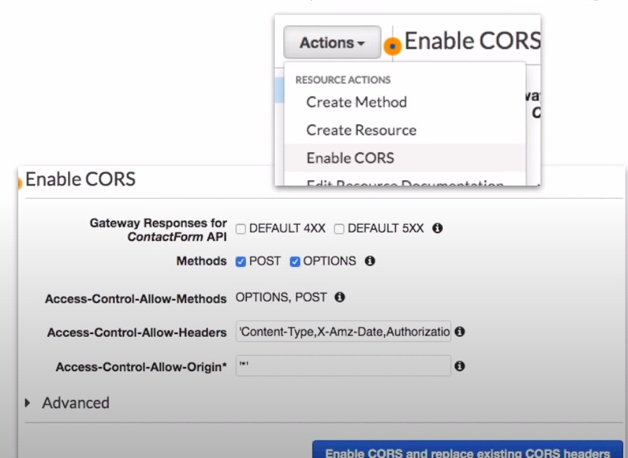

### API Gateway

* Fully managed service to create, publish, maintain, monitor, and secure APIs at any scale.
* API Gateway is a solution for **creating secure APIs** in your cloud environment at **any scale**.
* Create APIs that act as a **front door** for applications to **access data, business logic or functionality from back-end service.**

### Key Features

* API Gateway handles all the tasks involved in accepting and processing **up to hundreds of thousands of concurrent API calls,** including traffic management, authorization and monitoring.
* Allows you to **track** and **control any usage** of the API. **Throttle** requests to help **prevent attacks.**
* Expose HTTPS endpoints to define a **RESTful API.**
* Highly scalable **(happens automatically)** and cost-effective.
* Send each API endpoint to a different target.
* Maintain **Multiple versions** of you API

### Configuration

**Resources**

* When you create an API you need to also create multiple **Resources**
* Resources are the urls you define eg. /projects
* Resources can have child resources eg. /projects/-id-/edit

**Methods**

* You need to define **Methods** on Resources
* You can define multiple **Methods** on a Resources
* Methods allow you to make API calls that resource url with that protocol
* eg. 
  * GET /projects/-id-
  * POST /projects/-id-

**Stages**

* In order to use your API you need to Deploy it to Stages. Stages are version of you API

**Invoke URL**

* For each stage AWS provides you an Invoke URL. This is where you'll make your API calls. It is possible to use a custom domain for your Invoke URL.

**Deploy API**

* Everytime you make a change to your API you need to Deploy it via the **Deploy API** action. When you deploy you choose the stage.
* When you create an API Method on a resource you need to choose the integration type.
* The most common Integration type is **Lambda**.

* You have fine tune control over the **Request** and **Response** for the Method Execution.

### Caching

* **API Caching can be enabled to cache your endpoints response to API calls.**

* When enabled on a stage, API Gateway caches responses from your endpoint for a specified **time-to-live(TTL)** period
* API Gateway responds to requests by **looking up the response from cache.**
* **Reduces the number of calls** made to your endpoint
* **Improves Latency** of the requests made to your API.

### Cross-Origin Resource Sharing(CORS)

* Is a way that the server at the other end(not client code in the browser) can **relax a same-origin policy**.

* Allows restricted resources(i.e. Fonts) on a webpage to be requested from a **different domain than the initial resource** that it came from.
* Should always be enabled if using Javascript/AJAX that uses multiple domains with an API gateway.
* CORs is always enforced by the client.

### Same Origin Policy

* **Same Origin Policy** is a concept in the application security model, where a web browser permits **scripts contained in a first web page, to access data in a second webpage.**
* Same Origin Policies are used to help prevent Cross-Site Scripting(XSS) attacks.
* They only works if both web pages have the same origin
* They are enforced at the web browser level
* They ignore tools such as Postman or Curl

### CheatSheet

* API Gateway is a solution for creating secure APIs in your cloud environment at any scale.
* Create APIs that act as a front door for applications to access data, business logic, or functionality from back-end services.
* API Gateway throttles api endpoints at **10,000** requests per second(can be increase via service request through AWS support)
* **Stages** allow you to have multiple published versions of your API e.g. prod, staging, QA
* Each stage have an **Invoke URL** which is the endpoint you use to interact with your API
* You can use a custom domain for your Invoke URL eg. api.exampro.co
* You need to publish your API via Deploy API. You choose with Stage you want to publish your API
* Resources are your URLs eg. /project
* Resource can have child resources eg. /projects/-id-/edit
* You defined multiple Methods on your Resources eg. GET, POST, DELETE
* CORS issues are common with API Gateway, CORS can be enabled on all or individual endpoints
* Caching improves latency and reduces the amount of calls mage to your endpoint.
* Same Origin Policies help to prevent XSS attacks
* Same Origin Policies ignore tolls like postman or curl
* CORS is always enforced by the client.
* You can require Authorization to your API via AWS Cognito or a custom Lambda.