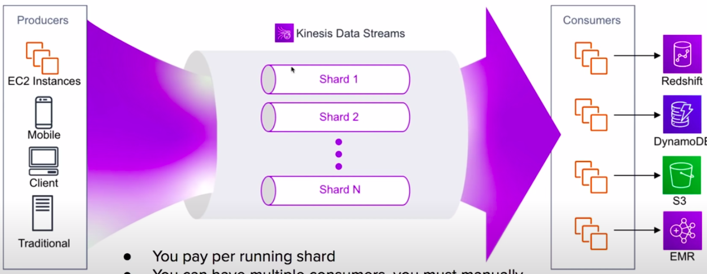
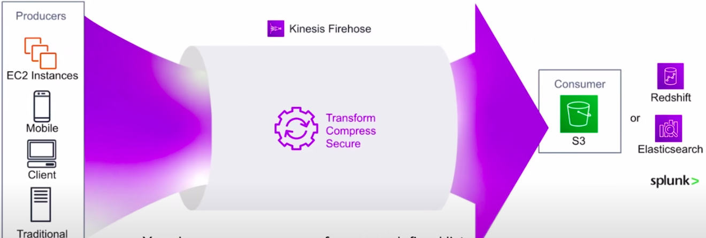
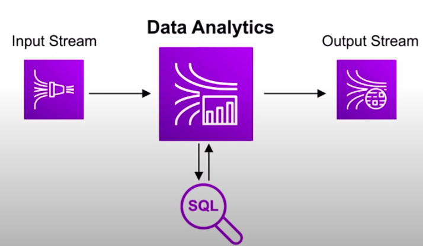
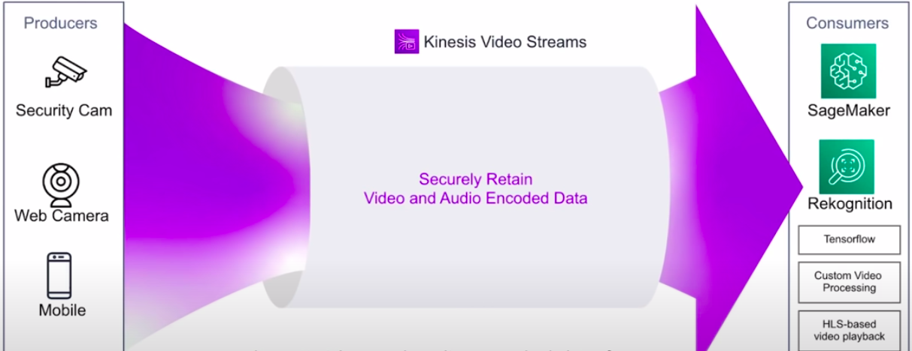

### Amazon Kinesis

* Scalable and durable **real-time data streaming** service. To ingest, and analyze data in real-time from multiple source.
* Amazon kinesis is the AWS fully managed solution for **collecting, processing, and analyzing streaming data** in the cloud.

When you need **real-time** think kinesis.

Streaming Data Examples
* Stock prices
* Game Data(as the player plays)
* Social Network Data
* Geospatial Data
* Click Stream Data

There are 4 different types of kinesis streams

* Kinesis Data Streams
* Kinesis Firehose Delivery Streams
* Kinesis Data Analytics
* Kinesis Video Analytics

### Kinesis Data Streams

* You pay **per running shard**
* You can have multiple consumers, you must manually configure your consumers.
* Data can be persisted from **24 hours(default)** to 168 hours before it disappears from the stream.

### Kinesis Firehose Delivery Streams

* You choose **one consumer** from a predefined list
* Data **immediately disappears** once it's consumed.
* You can convert incoming data to other to a **few file formats, compress and secure data**
* You pay only for data that is ingested.

### Kinesis - Data Analytics

* You can specify Firehose or Data Streams as an input and an output.
* Data that pass through Data Analytics is run through **custom SQL** you provide and the results are then output.
* This allows for real-time analytics of your data.

### Kinesis Video Streams

* Ingest video and audio encoded data from various devices and or service.
* Output video data to ML or video processing services

### CheatSheet

* Amazon Kinesis is the AWS solution for **collecting, processing and analyzing streaming data** in the cloud. When you need **real-time** think kinesis.
* **kinesis Data Streams** per running shard, data can persist within the stream, data is ordered and every consumer keep its own position. Consumers have to manually added(coded), Data persists for **24 hours(default) to 168 hours**
* **Firehose** - Pay for only the data ingested, data **immediately disappears** once processed. Consumer of choice if from a predefined set of service. S3, Redshift, Elasticsearch or splunk.
* **Data Analytics** allows you to perform queries in real-time. Needs a kinesis Data Streams/Firehose as the input and output.
* **Video Analytics** securely ingests and stores video and audio encoded data to consumers such as SageMakets, Rekognition or other services to apply Machine Learning and video processing.
* KPL(kinesis Producer Library) is a Java Library to write data to a stream
* You can write data to stream using AWS SDK, but KPL is more efficient.