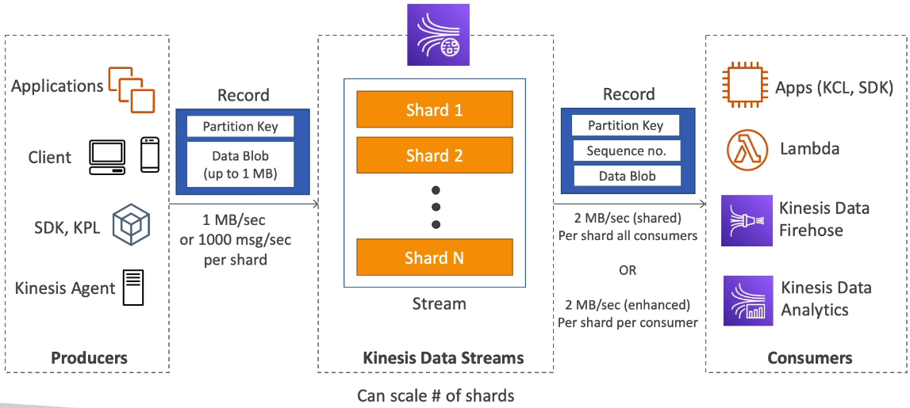
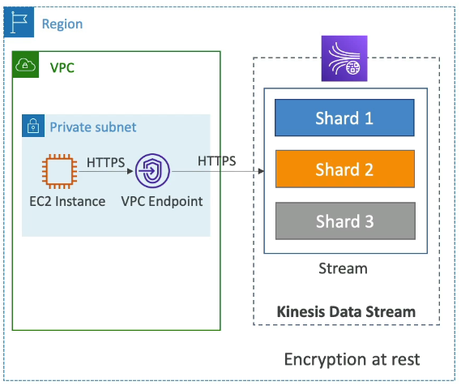
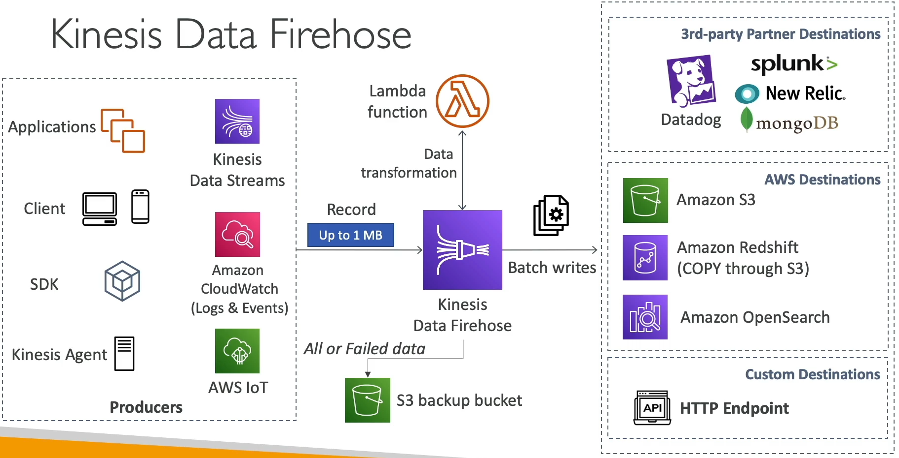

### Amazon Kinesis

* Makes it easy to **collect, process and analyze** streaming data in real-time
* Ingest real-time data such as: Application Logs, Metrics, Website clickstreams, IoT Telemetry data...

* **Kinesis Data Streams:** capture, process, and store data streams
* **Kinesis Data Firehose**: load data streams into AWS data stores
* **Kinesis Data Analytics**: analyze data streams with SQL or Apache Flink
* **Kinesis Video Stream**: capture, process, and store video streams

### Kinesis Data Streams

* Streams big data into the systems
* Made up of multiple **shards**, and the shards are numbered 1, 2, ...N, and this must be provisioned ahead of time.
* **Shards** define you stream capacity in terms of ingestion and consumption rates.
* **Producers**
  * Producers sends **records** to shards
  * Records is made of **partition key**(determine which shard will the record go) and **data blob** up to one megabyte
  * Can send data at a rate of **one megabyte per second, or a thousand messages per second per shard**.
* **Consumers**
  * Receives a record with partition key, a sequence number, and data blob
  * **Sequence number** represents where record was in the shard.
  * It gets two megabytes per second, per shard, for all consumers.

* Retention between **1 day to 365 days**
* Ability to reprocess data
* Once data is inserted in Kinesis, it can't be **deleted**(immutability)
* Data that shares the same partition goes to the same shard(ordering)
* Producers: AWS SDK, Kinesis Producer Library(KPL), kinesis Agent
* Consumers:
  * Write your own: Kinesis Client Library(KCL), AWS SDK
  * Managed: AWS Lambda, Kinesis Data Firehose, Kinesis Data Analytics

#### Kinesis Data Streams - Capacity Modes

* **Provisioned mode**:
  * You choose the number of shards provisioned, scale manually or using API
  * Each shard get 1 MB/s in(or 1000 records per second)
  * Each shard get 2 MB/s out(classic or enhanced fan-out consumer)
  * You pay per shard provisioned per hour
* **On-demand mode**:
  * No need to provision or manage the capacity
  * Default capacity provisioned(4 MB/s in or 4000 records per second)
  * Scales automatically based on observed throughput peak during the last 30 days
  * Pay per stream per hour & data in/out per GB

#### Kinesis Data Streams Security

* Control access/authorization using IAM policies
* Encryption in flight using HTTPS endpoint
* Encryption at rest using KMS
* You can implement encryption/decryption of data on client side(harder)
* VPC Endpoints available for Kinesis to access within VPC
* Monitor API calls using CloudTrail

### Kinesis Data Firehose

* Fully Managed Service, no administration, automatic scaling, serverless
  * AWS: Redshift / Amazon S3 / OpenSearch
  * 3rd party partner: Splunk / MongoDB / DataDog / NewRelic/ ...
  * Custom: send to any HTTP endpoint
* Pay for data going through Firehose
* **Near Real Time**
  * Buffer interval: 0 seconds(no buffering) to 900 seconds
  * Buffer size: minimum 1 MB
* Supports many data formats, conversions, transformations, compression
* Support custom data transformations using AWS Lambda
* Can send failed or all data to a backup S3 bucket.

| Kinesis Data Streams                    | Kinesis Data Firehose                                                         |
|-----------------------------------------|-------------------------------------------------------------------------------|
| Streaming service for ingest at scale   | Load streaming data into S3 / Redshift / OpenSearch / 3rd party / custom HTTP |
| Write custom code(producer/consumer)    | Fully managed                                                                 |
| Real time(~200 ms)                      | Near real-time                                                                |
| Manage scaling(shard splitting/merging) | Automatic scaling                                                             |
| Data storage for 1 to 365 days          | No data storage                                                               |
| Supports replay capability              | Doesn't support replay capability                                             |
