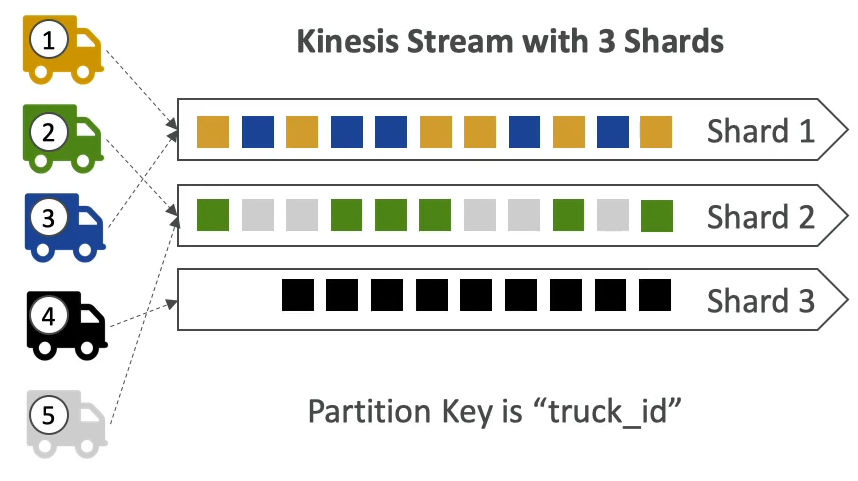
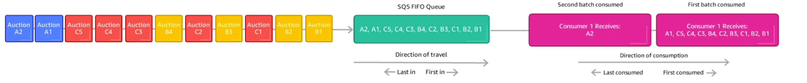
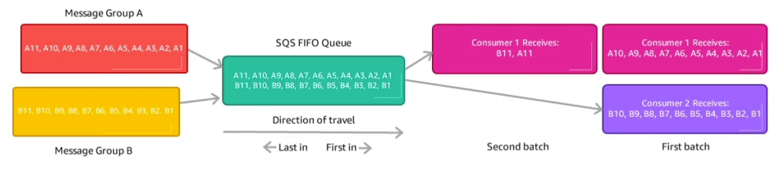
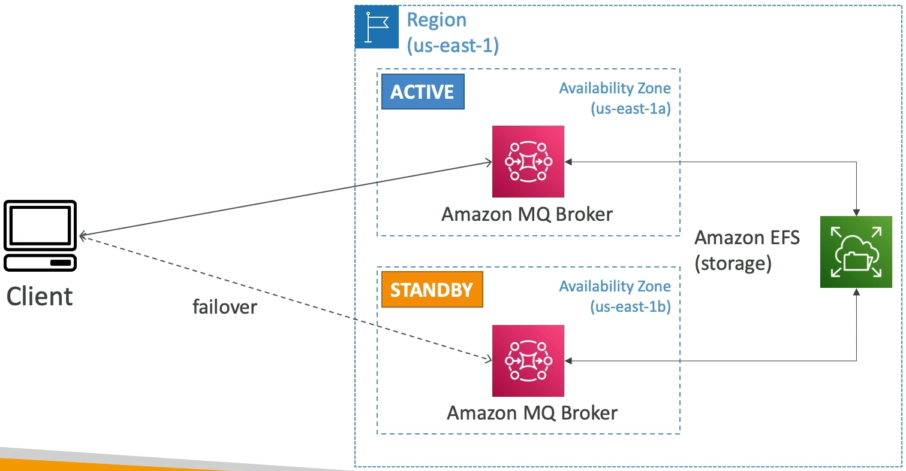

### Amazon Kinesis

* Makes it easy to **collect, process and analyze** streaming data in real-time
* Ingest real-time data such as: Application Logs, Metrics, Website clickstreams, IoT Telemetry data...

* **Kinesis Data Streams:** capture, process, and store data streams
* **Kinesis Data Firehose**: load data streams into AWS data stores
* **Kinesis Data Analytics**: analyze data streams with SQL or Apache Flink
* **Kinesis Video Stream**: capture, process, and store video streams

### Kinesis Data Streams

* Streams big data into the systems
* Made up of multiple **shards**, and the shards are numbered 1, 2, ...N, and this must be provisioned ahead of time.
* **Shards** define you stream capacity in terms of ingestion and consumption rates.
* **Producers**
  * Producers sends **records** to shards
  * Records is made of **partition key**(determine which shard will the record go) and **data blob** up to one megabyte
  * Can send data at a rate of **one megabyte per second, or a thousand messages per second per shard**.
* **Consumers**
  * Receives a record with partition key, a sequence number, and data blob
  * **Sequence number** represents where record was in the shard.
  * It gets two megabytes per second, per shard, for all consumers.

* Retention between **1 day to 365 days**
* Ability to reprocess data
* Once data is inserted in Kinesis, it can't be **deleted**(immutability)
* Data that shares the same partition goes to the same shard(ordering)
* Producers: AWS SDK, Kinesis Producer Library(KPL), kinesis Agent
* Consumers:
  * Write your own: Kinesis Client Library(KCL), AWS SDK
  * Managed: AWS Lambda, Kinesis Data Firehose, Kinesis Data Analytics

#### Kinesis Data Streams - Capacity Modes

* **Provisioned mode**:
  * You choose the number of shards provisioned, scale manually or using API
  * Each shard get 1 MB/s in(or 1000 records per second)
  * Each shard get 2 MB/s out(classic or enhanced fan-out consumer)
  * You pay per shard provisioned per hour
* **On-demand mode**:
  * No need to provision or manage the capacity
  * Default capacity provisioned(4 MB/s in or 4000 records per second)
  * Scales automatically based on observed throughput peak during the last 30 days
  * Pay per stream per hour & data in/out per GB

#### Kinesis Data Streams Security

* Control access/authorization using IAM policies
* Encryption in flight using HTTPS endpoint
* Encryption at rest using KMS
* You can implement encryption/decryption of data on client side(harder)
* VPC Endpoints available for Kinesis to access within VPC
* Monitor API calls using CloudTrail

### Kinesis Data Firehose

* Fully Managed Service, no administration, automatic scaling, serverless
  * AWS: Redshift / Amazon S3 / OpenSearch
  * 3rd party partner: Splunk / MongoDB / DataDog / NewRelic/ ...
  * Custom: send to any HTTP endpoint
* Pay for data going through Firehose
* **Near Real Time**
  * Buffer interval: 0 seconds(no buffering) to 900 seconds
  * Buffer size: minimum 1 MB
* Supports many data formats, conversions, transformations, compression
* Support custom data transformations using AWS Lambda
* Can send failed or all data to a backup S3 bucket.

| Kinesis Data Streams                    | Kinesis Data Firehose                                                         |
|-----------------------------------------|-------------------------------------------------------------------------------|
| Streaming service for ingest at scale   | Load streaming data into S3 / Redshift / OpenSearch / 3rd party / custom HTTP |
| Write custom code(producer/consumer)    | Fully managed                                                                 |
| Real time(~200 ms)                      | Near real-time                                                                |
| Manage scaling(shard splitting/merging) | Automatic scaling                                                             |
| Data storage for 1 to 365 days          | No data storage                                                               |
| Supports replay capability              | Doesn't support replay capability                                             |

### Ordering data into Kinesis

* Imagine you have 100 trucks(truck_1, truck_2, ... truck_100) on the road sending their GPS positions regularly in AWS.
* You want to consume the data in order for each truck, so that you can track their movement accurately
* How should you send that data into Kinesis?

* **Answer: send using a "Partition Key" value of the "truck_id"**
* **The same key will always go to the same shard**

#### Ordering data into SQS

* For SQS standard there is no ordering
* For SQS FIFO, if you don't use a Group ID, message are consumed in the order they are sent, **with only one consumer**

* You want to scale the number of consumers, but you want messages to be "grouped" when they are related to each other.
* Then you use a Group ID(similar to Partition key in kinesis)

#### Kinesis vs SQS ordering

* Let's assume 100 trucks, 5 kinesis shards, 1 SQS FIFO
* **Kinesis Data Streams:**
  * On average you'll have 20 trucks per shard
  * Trucks will have their data ordered within each shard
  * The maximum amount of consumers in parallel we can have is 5
  * Can receive up to 5 MB/s of data
* **SQS FIFO**
  * You only have one SQS FIFO queue
  * You will have 100 Group ID
  * You can have up to 100 Consumers(due to the 100 Group ID)
  * You have up to 300 messages per second(or 3000 if using batching)

| SQS                                            | SNS                                                  | Kinesis                                                 |
|------------------------------------------------|------------------------------------------------------|---------------------------------------------------------|
| Consumer "pull data"                           | Push data to many subscribers                        | Standard: pull data(2 MB per shard)                     |
| Data is deleted after being consumed           | Up to 12,500,000 subscribers                         | Enhanced-fan out: push data(2MB per shard per consumer) |
| Can have as many workers(consumers) as we want | Data is not persisted(lost if not delivered)         | Possibility to replay data                              |
| No need to provision throughput                | Pub/Sub                                              | **Meant for real-time big data, analytics and ETL**     |
| Ordering guarantees only on FIFI queues        | Up to **100,000** topics                             | **Ordering at the shard level**                         |
| Individual message delay capability            | No need to provision throughput                      | Data expires after X days(1 to 365 as of today)         |
|                                                | Integrates with SQS for fan-out architecture pattern | **Provisioned** mode or **on-demand** capacity mode     |
|                                                | FIFO capability for SQS FIFO                         |                                                         |

### Amazon MQ

* SQS, SNS are "cloud-native" service: proprietary protocol from AWS
* Traditional applications running from on-premises many use open protocols such as MQTT, AMQP, STOMP, Openwire, WSS
* **When migrating to the cloud**, instead of re-engineering the application to use SQS and SNS, we can use Amazon MQ
* Amazon MQ is a managed message broker service for:
  * Rabbit MQ
  * Active MQ
* Amazon MQ doesn't scale as much as SQS/SNS
* Amazon MQ runs on servers, can run in Multi-AZ with failover
* Amazon MQ has both queue feature(~SQS) and topic features(~SNS)

#### Amazon MQ - High Availability

