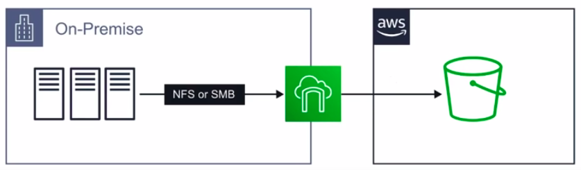
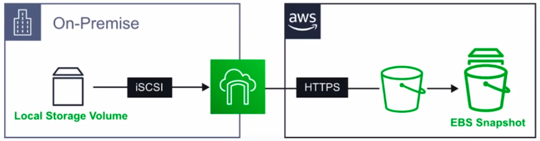
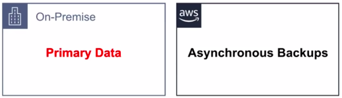
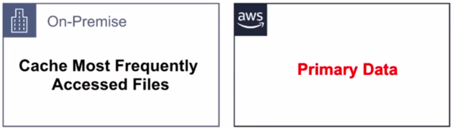
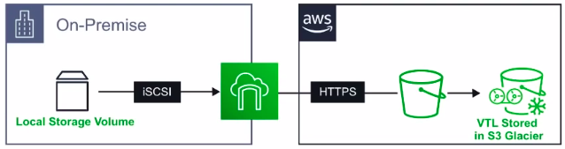

### Storage Gateway[9:22:26]

* Extending, backing up **on-premise storage to the cloud**
* AWS Storage Gateway **connects an on-premises software appliance with cloud-based storage.**
* Provides you seamless and secure integration between your organization's on-premises IT environment and AWS's storage infrastructure.
* Securely store your data to the AWS cloud for scalable and cost-effective storage.
* Software appliance is available as a **virtual machine(VM) image.**
* Supports both **VMware ESXi** and **Microsoft Hyber-V**
* Once installed and activated you can use the **AWS Console** to **create your gateway**

### Types

* **File gateway(NFS)** (store your files in S3)
* **Volume Gateway(iSCSI)** (store copies of your hard disk drives in S3)
  * Stored Volumes
  * Cached Volumes
* **Tape Gateway(VTL)** (Virtual Tape Library)

### File Gateway(NFS)

* Your files are stored as objects inside your S3 buckets.
* Access your files through **Network File System(NFS)** or SMB mount point.

* Ownership, permissions, and timestamps are all stored within **S3 metadata** of the object associated with the file.
* Once a file is transferred to S3, it can be managed as a **native S3 object.**
* **Bucket Policies, Versioning, Lifecycle Management and Cross-Region Replication** apply directly to objects stored in your bucket.

### Volume Gateway(iSCSI)

* Volume Gateway presents your applications with disk volumes using the **Internet Small Computer Systems Interface(iSCSI)** block protocol.

* Data that is written to volumes can be asynchronously backed up as **point-in-time snapshots** of the volumes, and stored in the cloud as **AWS EBS Snapshots.**
* **Snapshots** are incremental backups that capture only changed blocks in the volume.
* All Snapshot storage is also **compressed** to help minimize your storage charges.

### Stored Volumes

* Primary data is **stored locally,** which **asynchronously backing up** that data to AWS
* Provide your on-premises application with low-latency access to their entire datasets, while still providing durable off-site backups.
* Create storage volumes and **mount them as iSCSI devices** from your on-premises servers.
* Any data written to stored volumes is **stored on your on-premises** storage hardware.
* Amazon Elastic Block Store **(EBS) snapshots** are backed up to **AWS S3.**
* **Stored Volumes** can be between **1GB-16TB** in size.

### Cached Volumes

* Lets you **use AWS S3 as your primary data storage,** while retaining **frequently accessed data locally** in your storage gateway.
* Minimizes the need to scale your on-premises storage infrastructure, while still providing your applications with low-latency data access.
* Create storage volumes up to 32TB in size and **attach them as iSCSI devices** from your **on-premises servers.** 
* **Your gateway stores data that you write to these volumes in S3, and retains recently read data in your on-premises storage** gateway cache and upload buffer storage.
* **Cached Volumes** can be between **1GB-32GB** in size.

### Tape Gateway(VTL)(Understanding lacking)

* A durable, cost-effective solution to archive your data in the AWS Cloud.
* The **VTL** interface it provides let you leverage existing tape-based backup application infra-structure.
* Store data on **virtual tape cartridges** that you create on your tape gateway.
* Each tape gateway is **pre-configured with a media changer and tape drives,** which are **available to your existing client backup applications as iSCSI devices.**
* You **add tape cartridges** as you need to archive your data
* Supported by **NetBackup, Backup Exec and Veeam**

### CheatSheet

* **Storage Gateway** connects on-premise storage to cloud storage
* There are three types of Gateways: File, Volume, Tape
* **File**: lets S3 act a local file system using NFS or SMB, extends your local hard drive to S3
* **Volume**: is used to backups and has two types: **Stored** and **Cached**
  * **Stored**: continuously backup local storage to S3 as EBS Snapshots **Primary Data on-Premise** and its stored volumes are **1GB to 16TB** in size.
  * **Cached**: caches the frequently used files on-premise, **Primary Data** is stored on S3, and its cached volumes are **1GB to 32GB** in size.
* **Tape Gateway** backups up virtual tapes to S3 Glacier for long archive storage.