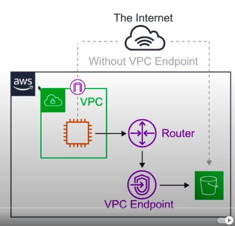

**VPC Endpoints**

* Think of a secret tunnel where you don't have to leave the AWS network.
* **VPC Endpoints** allow you to **privately connect you VPC with other AWS services** and VPC endpoint services.



* **Eliminates** the need for an **Internet Gateway, NAT device, VPN connection or AWS Direct Connect** connections.
* **Instances** in the VPC **do not require a public IP address** to communicate with service resources.
* **Traffic** between your VPC and other services **does not leave the AWS network**.
* **Horizontally scaled, redundant, and highly available** VPC component.
* Allow secure communication between instances and services - **without adding availability risks or bandwidth constraints** on your traffic.

There are 2 types of VPC Endpoints.
1. Interface Endpoints.
2. Gateway Endpoints.

**Interface Endpoint:**

* Interface Endpoints are **Elastic Network Interfaces(ENI)** with a **private IP address**.
* They serve as an entry point for traffic going to a supported service.
* Interface Endpoints are powered by **AWS PrivateLink**.
* Access Services hosted on AWS easily and securely by keeping your network traffic within the AWS network.

```
Pricing per VPC endpoint per AZ($/hour) 0.01
Pricing per GB data processed($) 0.01
It comes around $7.5/month
```

Interface Endpoints supports the following AWS Services.

* API Gateway
* Cloud Formation
* Cloud watch
* Kinesis
* SageMaker
* Code build
* AWS Config
* EC2 API
* ELB API
* AWS KMS
* Secrets Manager
* Security Token Service
* Service Catalog
* SNS
* SQS
* System Manager
* Marketplace Partner Services
* Endpoint Services in other AWS accounts.

**Gateway Endpoint:**

VPC Gateway Endpoints are **Free**!!!

* A **Gateway Endpoint** is a gateway that is a target **for a specific route** in your **route table**, used for traffic destined for a supported AWS service.
* To create a Gateway Endpoint, you must specify the VPC in which you want to create the endpoint, and the service to which you want to establish the connection.
* AWS Gateway Endpoint currently only supports 2 services.
    * Amazon S3
    * DynamoDB