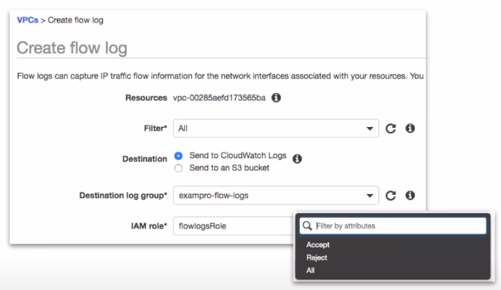

### VPC Flow Logs

* **VPC Flow Logs** allow you to capture IP traffic information in-and-out of Network Interface within you VPC.

Flow Logs can be created for.



1. **VPC**
2. **Subnets**
3. **Network Interface**

All log data is stored using **Amazon CloudWatch** Logs
After a Flow Log is created it can be reviewed in details within CloudWatch Logs.

**Breakdown**

```
    <version> <account-id> <interface-id> <srcaddr> <dstaddr> <dstport> <protocol> <packets> <bytes> <start> <end> <action> <log-status>
```

* Version => The VPC Flow Logs Version
* account-id => The AWS account ID for the flow log.
* interface-id => The Id of the network interface for which the traffic is recorded.
* srcaddr => The source IPv4 or IPv6 address.(The IPv4 address of the network interface is always its private IPv4 address.
* dstaddr => The destination IPv4 or IPv6 address. The IPv4 address of the network interface is always its private IPv4 address.
* srcport => The source port of the traffic
* dstport => The designation port of the traffic
* protocol => The IANA protocol number of the traffic(see Assigned Internet Protocol Number)
* packets => The number of packets transferred during the capture window.
* bytes => The number of bytes transferred during the capture window.
* start => The time in Unix second, start of the capture window.
* end => The time in Unix second, end of the capture window.
* action => The action associated with the traffic:
  * ACCEPT: The recorded traffice was permitted by the secutity groups or network ACLs. 
  * REJECT The recorded traffice was not permitted by the security groups or network ACLS.
* log-status: The logging status of the flow logs. 
  * OK => Data is logging normally to the chosen destinations.
  * NODATA => There was no network traffic to or from the network interface during the capture window.
  * SKIPDATA => Some flow log records were skipped during the capture window. This may be because of an internal capacity constraint, or an internal error.