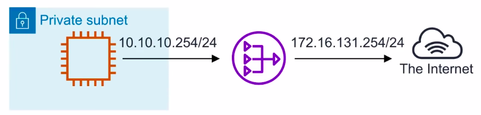
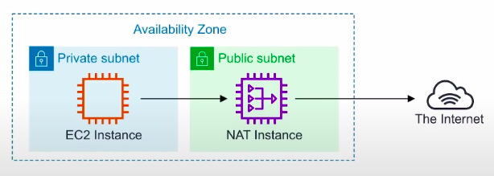
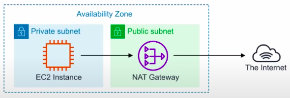

### Network Address Translation(NAT)

* Is the method of **re-mapping** one IP address space into another.

* If you have a private network, and you need to help gain outbound access to the internet you would need to use a NAT gateway to remap the Private IPs. 
* If you have **two networks which have conflicting network addresses** you can use a NAT to make the addresses more agreeable.

**NAT Instances vs NAT Gateways:**

NATs have to run within a **Public Subnet**

| NAT Instances                                                                                   | NAT Gateways                                                                                |
|-------------------------------------------------------------------------------------------------|---------------------------------------------------------------------------------------------|
| NAT Instance(legacy) are individual EC2 instances. Community AMIs exist to launch NAT Instances | NAT Gateways is a managed service which launches redundant instances within the selected AZ |
|                                               |                                            |