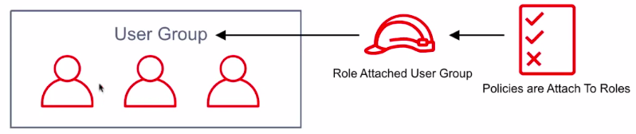
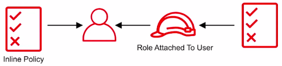
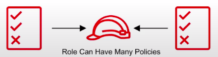
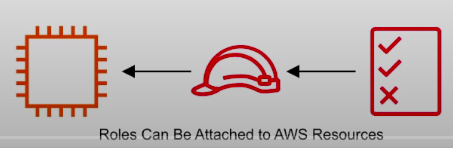
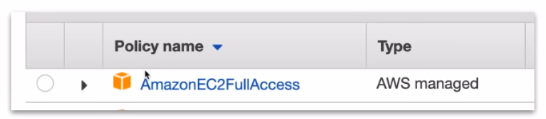
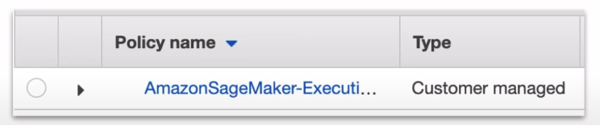
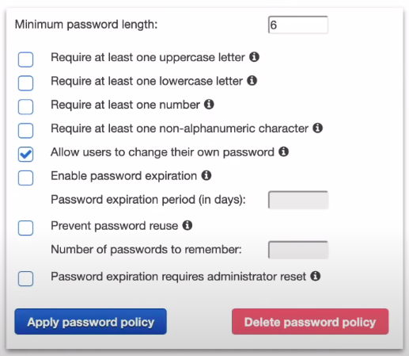
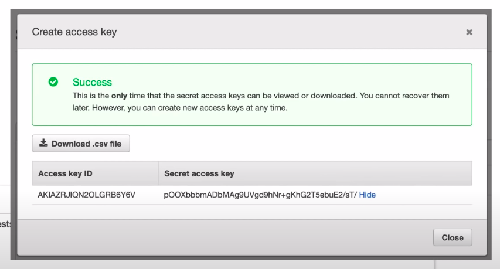
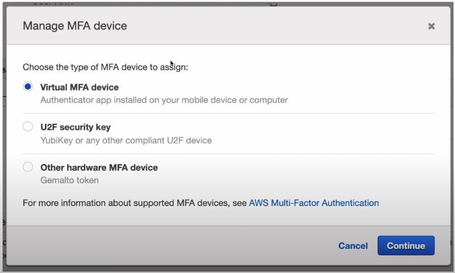

### IAM

Manages access of AWS **users** and **resources.**

**Core Components**

IAM allows **management** of access of **users** and **resources**.

* **IAM Users**: End users who log into the console or interact with AWS resource programmatically.
* **IAM Groups**: Group up your Users, so they all share permission levels of the group e.g: Administrators, Developers, Auditors
* **IAM Roles**: Associate permissions to a **Role and then assign this to a Users or Groups**.
* **IAM Policies**: JSON documents which grant permissions for a specific user, group, or role to access services. Policies are attached to **IAM identities**.


* A user can belong to a group. Roles can be applied to groups to quickly add and remove permissions en-masse to users.



* A user can have a role directly attached. A policy can be directly attached to a user(called an Inline Policy)



* Roles can have many policies attached. 



* Various AWS resources allow you to attach roles directly to them.




**Types of Policies**

* **Managed Policies**: A policy which is managed by **AWS which you cannot edit**. Managed policies are labelled with an orange box.



* **Customer Managed Policies**: A policy created by the customer which is editable. Customer policies have no symbol beside them.



* **Inline policies**: A policy which is directly attached to the user.


**Policy Structure**:

```json
{
    "Version": "2012-10-17",
    "Statement": [{
        "Sid": "Deny-Barclay-S3-Access",
        "Effect": "Deny",
        "Action": "s3:*",
        "Principal": {"AWS": ["arn:aws:iam::123456789012:barclay"]},
        "Resource": "arn:aws:s3:::my-bucket"
    },
    {
        "Effect": "Allow",
        "Action": "iam:CreateServiceLinkedRole",
        "Resource": "*",
        "Condition": {
            "StringLike": {
               "iam:AWSServiceName": [
                    "rds.amazonaws.com",
                    "rds.application-autoscaling.amazonaws.com"
               ] 
            }
        }
    }]
}
```

* **Version:** policy language version.
* **Statement:** **container for the policy element** you are allowed to have multiples.
* **Sid(optional):** a way of labelling your statement.
* **Effect:** Set whether the policy will Allow or Deny
* **Principal:** account, user, role or federated user to which you would like to allow or deny access.
* **Action:** list of actions that the policy allows or denies
* **Resource:** the resource to which the action(s) applies.
* **Condition(optional):** circumstance under which the policy grant permissions.
* **IAM-Password Policy:** In IAM you can set a **Password Policy.** To set the minimum requirements of a password and rotate passwords so users have to update their passwords after X days.
* **IAM-Access Keys:** Access keys allow users to interact with AWS service **programmatically** via the AWS CLI or AWS SDK.

**Password Policies:**

* In IAM, you can set **Password Policy**
* To set the minimum requirement of a password and rotate password so users have to update their passwords after X days.



**Access Keys**

* Access keys allow users to interact with AWS service programmatically via AWS CLI or AWS SDK.
* You're allowed two Access Keys per user.



**Multi-Factor Authentication:(MFA):** 

* Can be turned on per user. 
* The user has to turn on MFA themselves, Administrator cannot directly enforce users to have MFA. 
* The Administrator account could create a policy requiring MFA to access certain resources.



**IAM CheatSheet**:

1. Is used to manager access to users and resources.
2. Is a universal system. IAM is a free service.
3. A root account is the account initially created with AWS is set up.
4. New IAM accounts have no permissions by default until granted.
5. New users get assigned an Access Key Id and Secret when first created when you given them programmatic access.
6. Access Keys are only used for CLI and SDK.
7. Access Keys are only shown once when created. If lost they must be deleted/recreated again.
8. Always setup MFA for Root Accounts.
9. Users must enable MFA on their own, Administrator cannot turn it on for each user.
10. IAM allows your set password policies to set minimum password requirements or rotate passwords.
11. IAM identities: as Users, Groups, and Roles
12. IAM users: End users who log into the console or interact with AWS resources programmatically.
13. IAM Groups: Group up your Users, so they all share permission levels of the group.
14. IAM Roles: Associate permissions to a ROle and then assign this to an Users or Groups.
15. IAM Policies: JSON documents which can grant permissions for a specific user, group or role to access services.
16. Policies are attached to IAM identities
17. Managed Policies are policies provided by AWS and cannot be edited.
18. Customer Managed Policies are policies created by use the customer, which you can edit.
19. Inline policies are policies which are directly attached to a user.