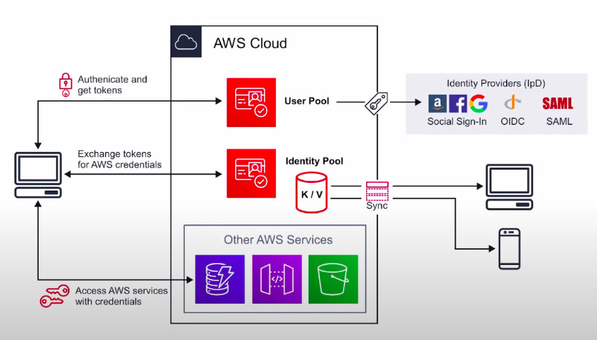
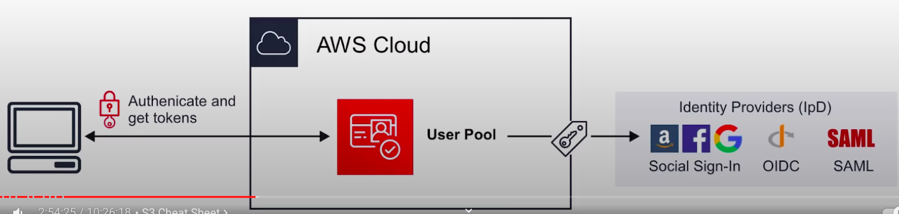
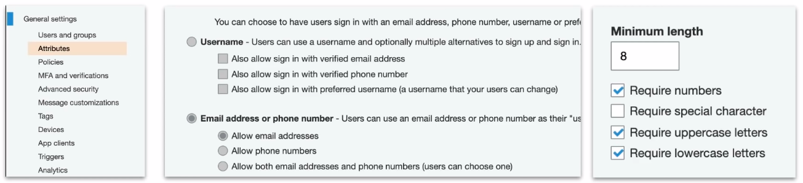
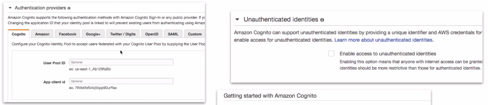
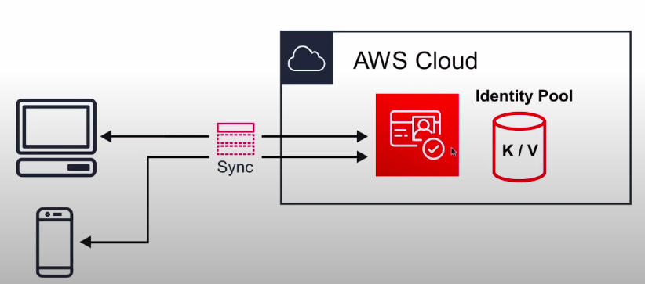

### Amazon Cognito

* Decentralized Managed **Authentication**.
* Sign-up, sign-in integration for your apps. 
* Social identity provider e.g. Facebook, Google.

* **Cognito User Pools:** User directory with authentication to IpD(Identity provider) to grant access to your app.
* **Cognito Identity Pools:** Provide **temporary** credentials for user to access AWS services.
* **Cognito Sync:** Syncs user data and preferences across all devices.

**Web Identity Federation and IpD:** 

* **Web Identity Federation:** To exchange identity and security information between an identity provider(IdP) and an application.
* **Identity Provider(IdP):** a trusted provider of your user identity that lets you use authenticate to access other services. Identity Providers could be Facebook, Amazon, Google, Twitter, Github, LinkedIn
* **Types of Identity Providers:**
  * Single Sign-On(SAML)
  * OAuth(OpenId)

**Cognito User Pools:**

* User Pools are user directories used to manage the actions for web and mobile apps such as:
  * **Sign-up** 
  * **Sign-In** 
  * **Account recovery** 
  * **Account confirmation** 
* Allow users to sign-in directly to the User Pool, or using Web Identity Federation. 
* Uses AWS Cognito as the **identity broker** between AWS and the identity provider. 
* Successful user authentication generates a JSON web Token(JWTs)
* User Pools can be thought of as the account used to access the system(i.e: email address and password)

Using this you can choose 
* What attributes
* password requirements 
* Apply MFA
* Restrict whether users are allow to sign up on their own or need admin verification
* Analytics with PinPoint for user campaigns
* Trigger custom log via Lambdas after action such as after signup.

**Identity Pools:** 

Identity Pools provide **temporary AWS credentials** to access services eg. S3, DynamoDB. Identity Pools can be thought of as the actual mechanism authorizing access to the AWS resources.

Choose who to provide access to:

**Cognito - Sync:** 

* Sync **user data** and **preferences** across devices with one line of code. Cognito uses **push synchronization** to push updates and synchronize data.
* Use SNS(Simple Notification Service) to send notifications to all user devices when data in the cloud changes.

**CheatSheet**

1. Cognito is decentralized managed authentication system. When you need to easily add authentication to your mobile and desktop app _think_ Cognito.
2. **User Pools** user directory, allows users to authenticate using OAuth to IpD such as Facebook, Google, Amazon to connect to web-applications. Cognito User Pool is in itself a IpD.
3. User Pools use JWTs for to persists authentication.
4. Identity Pools provide **temporary AWS credentials** to access services e.g. S3, Dynamo.
5. Cognito Sync can sync **User data and preferences** across devices with one line of code(powered by SNS)
6. **Web Identity Federation** exchange identity and security information between an identity provider(IdP) and an application
7. Identity Provider(IdP) a trusted provider of your identity that lets you use authenticate to access other services. eg. Facebook, Twitter, Google, Amazon.
8. **OIDC** is a type of Identity Provider with uses Oauth.
9. **SAML** is a type of Identity Provider which is used for Single Sign-On.
