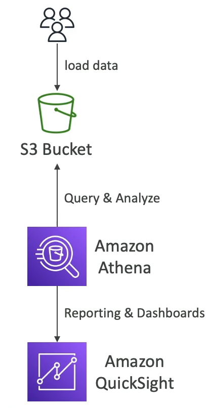
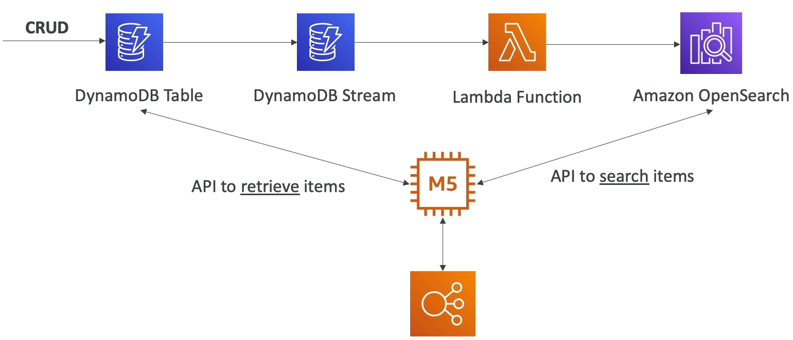
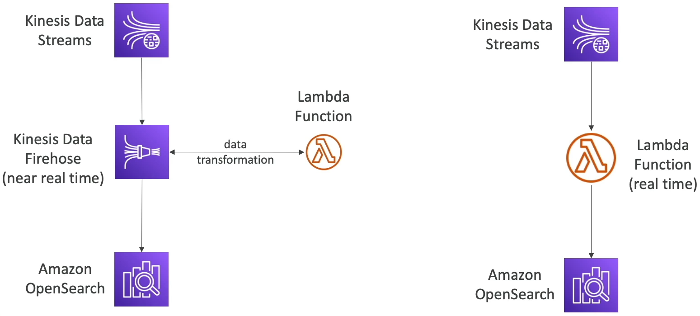

### Amazon Athena

* **Serverless** query service to analyze data stored in Amazon S3.
* Uses standard SQL language to query the files(built on Presto)
* Support CSV, JSON, ORC, Avro and Parquet.
* Pricing $5.00 per TB of data scanned
* Commonly used with Amazon Quicksight for reporting/dashboards.

* **Use cases:** Business intelligence / analytics / reporting, analyze & query VPC Flow Logs, ELB Logs, **CloudTrail trails**, etc...
* **Exam Tip:** analyze data in S3 using serverless SQL, use Athena

#### Athena - Performance

* Use **columnar data** for cost saving(less scan)
    * Apache Parquet or ORC is recommended
    * Huge Performance improvement
    * Use Glue to convert your data to Parquet or ORC
* **Compress data** for smaller retrieval(bzip2, gzip, lz4, snappy, zlip, zstd...)
* **Partition** datasets in S3 for easy querying on virtual columns
    * s3://yourBucket/pathToTable
      /<PARTITION_COLUMN_NAME>=<VALUE>
      /<PARTITION_COLUMN_NAME>=<VALUE>
      /<PARTITION_COLUMN_NAME>=<VALUE>
      /etc...
    * Example: s3://athena-examples/flight/parquet/year=1991/month=1/day=1/
* Use larger files (> 128 MB) to minimize overhead

#### Amazon Athena - Federated Query

* Allows you to run SQL queries across data stored in relational, non-relational, object, and custom data sources(AWS or on-premises)
* Uses Data Source Connectors that run on AWS Lambda to run Federated Queries(e.g., CloudWatch Logs, DynamoDB, RDS,...)
* Store the results back in Amazon S3

### Amazon Redshift

* Redshift is based on PostgreSQL, but **it's not used for OLTP(Online Transaction Processing)**
* **It's OLAP - online analytical processing(analytics and data warehousing)**
* 10x better performance than other data warehouses, scale to Peta Bytes of data.
* **Columnar** storage of data & parallel query engine
* Pay as you go based on the instance provisioned
* Has SQL interface for performing the queries
* BU tools such as Amazon Quickshift ot Tableau integrate with it
* vs Athena: faster queries / joins/ aggregations thanks to indexes

#### Redshift Cluster

* Leader node: for query planning, results aggregation
* Compute node: for performing the queries, send result to leader
* You provision the node size in advance
* You can use Reserved Instances for cost savings.

#### Redshift - Snapshots & DR

* **Redshift has Multi-AZ mode for some clusters**
* Snapshots are point-in-time backups of a cluster, stored internally in S3
* Snapshots are incremental(only what has changed in saved)
* You can restore a snapshot into a **new cluster**
* Automated: every 8 hours, every 5 GB, or on a schedule. Set retention
* Manual: snapshot is retained until you delete it.

* You can configure Amazon Redshift to automatically copy snapshots(automated or manual) of a cluster to another AWS Region

#### Loading data into Redshift

#### Redshift Spectrum

* Query data that is already in S3 without loading it
* **Must have a Redshift Cluster available to start the query**
* The query is then submitted to thousands of Redshift Spectrum nodes.

### OpenSearch

* _**Amazon OpenSearch is successor to Amazon ElasticSearch**_
* In DynamoDB, queries only exist by primary key or indexes...
* **With OpenSearch, you can search any field, even partially matches**
* It's common to use OpenSearch as a complement to another database
* Two modes: managed cluster or serverless cluster
* Does _not_ natively support SQL(can be enabled via a plugin)
* Ingestion from Kinesis Data Firehose, AWS IoT, and CloudWatch Logs
* Security through Cognito & IAM, KMS encryption, TLS
* Comes with OpenSearch Dashboards(visualization)

#### OpenSearch Patterns

##### DynamoDB

* DynamoDB data can be loaded into OpenSearch

##### CloudWatch Logs

* Cloudwatch logs can be loaded into OpenSearch

##### Kinesis Data Streams & Kinesis Data Firehose

* Loading data from Kinesis data stream and kinesis data firehose

### Amazon EMR

* EMR stands for "Elastic MapReduce"
* EMR helps creating **Hadoop clusters (Big Data)** to analyze and process vast amount of data.
* The clusters can be made of **Hundreds of EC2 instances**
* EMR comes bundled with Apache Spark, HBase, Presto, Flint...
* EMR takes care of all the provisioning and configuration
* Auto-scaling and integrated with Spot Instances

* **Use cases: data processing, machine learning, web indexing, big data...**

#### Amazon EMR - Node type & purchasing

* **Master Node**: Manage the cluster, coordinate, manage health - must be long-running
* **Core Node:** Run tasks and store data - long running
* **Task Node (optional):** Just to run tasks - usually Spot
* **Purchasing options:**
  * On-demand: reliable, predictable, won't be terminated
  * Reserved(min 1 year): Cost savings(EMR will automatically use if available)
  * Spot Instances: cheaper, can be terminated, less reliable
  
* Can have long-running cluster, or transient(temporary) cluster
