### Amazon Athena

* **Serverless** query service to analyze data stored in Amazon S3.
* Uses standard SQL language to query the files(built on Presto)
* Support CSV, JSON, ORC, Avro and Parquet.
* Pricing $5.00 per TB of data scanned
* Commonly used with Amazon Quicksight for reporting/dashboards.

* **Use cases:** Business intelligence / analytics / reporting, analyze & query VPC Flow Logs, ELB Logs, **CloudTrail trails**, etc...
* **Exam Tip:** analyze data in S3 using serverless SQL, use Athena

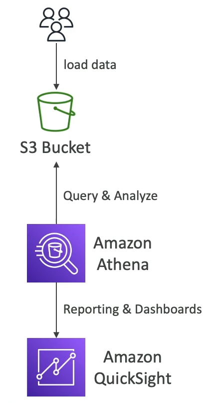

#### Athena - Performance

* Use **columnar data** for cost saving(less scan)
    * Apache Parquet or ORC is recommended
    * Huge Performance improvement
    * Use Glue to convert your data to Parquet or ORC
* **Compress data** for smaller retrieval(bzip2, gzip, lz4, snappy, zlip, zstd...)
* **Partition** datasets in S3 for easy querying on virtual columns
    * s3://yourBucket/pathToTable
      /<PARTITION_COLUMN_NAME>=<VALUE>
      /<PARTITION_COLUMN_NAME>=<VALUE>
      /<PARTITION_COLUMN_NAME>=<VALUE>
      /etc...
    * Example: s3://athena-examples/flight/parquet/year=1991/month=1/day=1/
* Use larger files (> 128 MB) to minimize overhead

#### Amazon Athena - Federated Query

* Allows you to run SQL queries across data stored in relational, non-relational, object, and custom data sources(AWS or on-premises)
* Uses Data Source Connectors that run on AWS Lambda to run Federated Queries(e.g., CloudWatch Logs, DynamoDB, RDS,...)
* Store the results back in Amazon S3

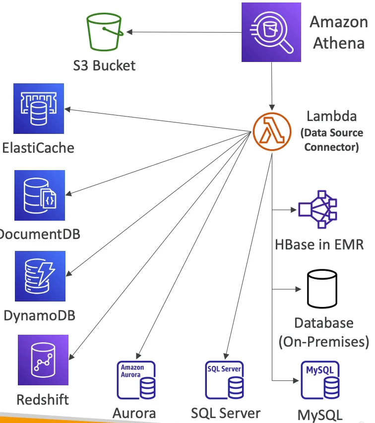

### Amazon Redshift

* Redshift is based on PostgreSQL, but **it's not used for OLTP(Online Transaction Processing)**
* **It's OLAP - online analytical processing(analytics and data warehousing)**
* 10x better performance than other data warehouses, scale to Peta Bytes of data.
* **Columnar** storage of data & parallel query engine
* Pay as you go based on the instance provisioned
* Has SQL interface for performing the queries
* BU tools such as Amazon Quickshift ot Tableau integrate with it
* vs Athena: faster queries / joins/ aggregations thanks to indexes

#### Redshift Cluster

* Leader node: for query planning, results aggregation
* Compute node: for performing the queries, send result to leader
* You provision the node size in advance
* You can use Reserved Instances for cost savings.

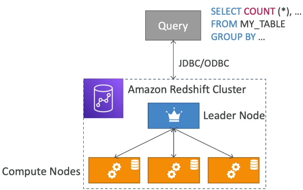

#### Redshift - Snapshots & DR

* **Redshift has Multi-AZ mode for some clusters**
* Snapshots are point-in-time backups of a cluster, stored internally in S3
* Snapshots are incremental(only what has changed in saved)
* You can restore a snapshot into a **new cluster**
* Automated: every 8 hours, every 5 GB, or on a schedule. Set retention
* Manual: snapshot is retained until you delete it.

* You can configure Amazon Redshift to automatically copy snapshots(automated or manual) of a cluster to another AWS Region

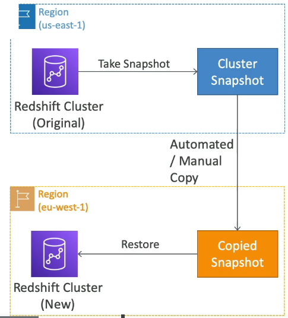

#### Loading data into Redshift

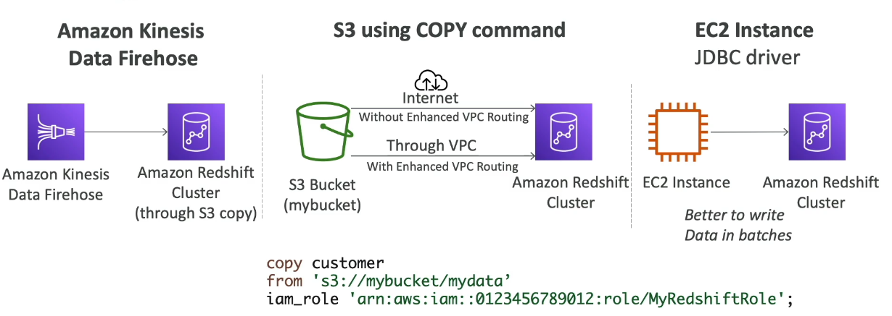

#### Redshift Spectrum

* Query data that is already in S3 without loading it
* **Must have a Redshift Cluster available to start the query**
* The query is then submitted to thousands of Redshift Spectrum nodes.

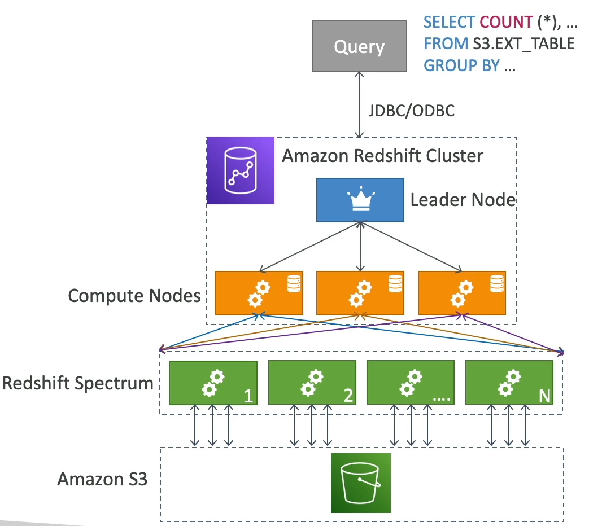

### OpenSearch

* _**Amazon OpenSearch is successor to Amazon ElasticSearch**_
* In DynamoDB, queries only exist by primary key or indexes...
* **With OpenSearch, you can search any field, even partially matches**
* It's common to use OpenSearch as a complement to another database
* Two modes: managed cluster or serverless cluster
* Does _not_ natively support SQL(can be enabled via a plugin)
* Ingestion from Kinesis Data Firehose, AWS IoT, and CloudWatch Logs
* Security through Cognito & IAM, KMS encryption, TLS
* Comes with OpenSearch Dashboards(visualization)

#### OpenSearch Patterns

##### DynamoDB

* DynamoDB data can be loaded into OpenSearch

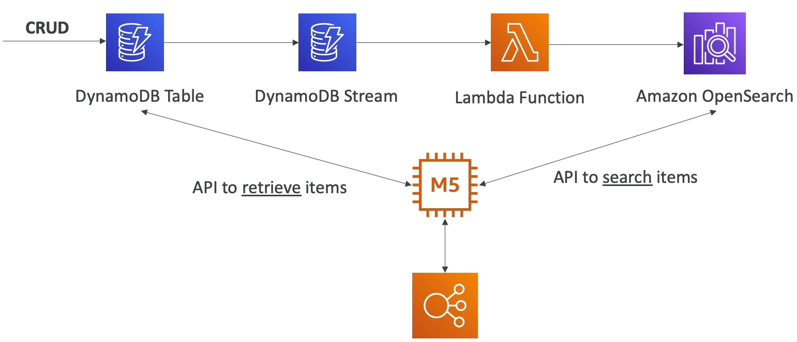

##### CloudWatch Logs

* Cloudwatch logs can be loaded into OpenSearch

##### Kinesis Data Streams & Kinesis Data Firehose

* Loading data from Kinesis data stream and kinesis data firehose

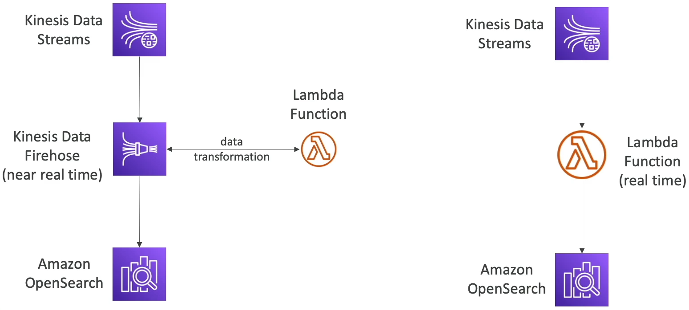

### Amazon EMR

* EMR stands for "Elastic MapReduce"
* EMR helps creating **Hadoop clusters (Big Data)** to analyze and process vast amount of data.
* The clusters can be made of **Hundreds of EC2 instances**
* EMR comes bundled with Apache Spark, HBase, Presto, Flint...
* EMR takes care of all the provisioning and configuration
* Auto-scaling and integrated with Spot Instances

* **Use cases: data processing, machine learning, web indexing, big data...**

#### Amazon EMR - Node type & purchasing

* **Master Node**: Manage the cluster, coordinate, manage health - must be long-running
* **Core Node:** Run tasks and store data - long running
* **Task Node (optional):** Just to run tasks - usually Spot
* **Purchasing options:**
  * On-demand: reliable, predictable, won't be terminated
  * Reserved(min 1 year): Cost savings(EMR will automatically use if available)
  * Spot Instances: cheaper, can be terminated, less reliable
  
* Can have long-running cluster, or transient(temporary) cluster

### Amazon QuickSight

* **Serverless machine learning-powered business intelligence service to create interactive dashboards**
* Fast, automatically, scalable, embeddable, with per-session pricing
* Use cases:
  * Business analytics
  * Building visualization
  * Perform ad-hoc analysis
  * Get business insights using data
* Integrated with RDS, Aurora, Athena, RedShift, S3...
* **In-memory computation using SPICE** engine if data is imported into QuickSight
* Enterprise edition: Possibility to set up **Column-Level security (CLS)**

#### QuickSight Integrations

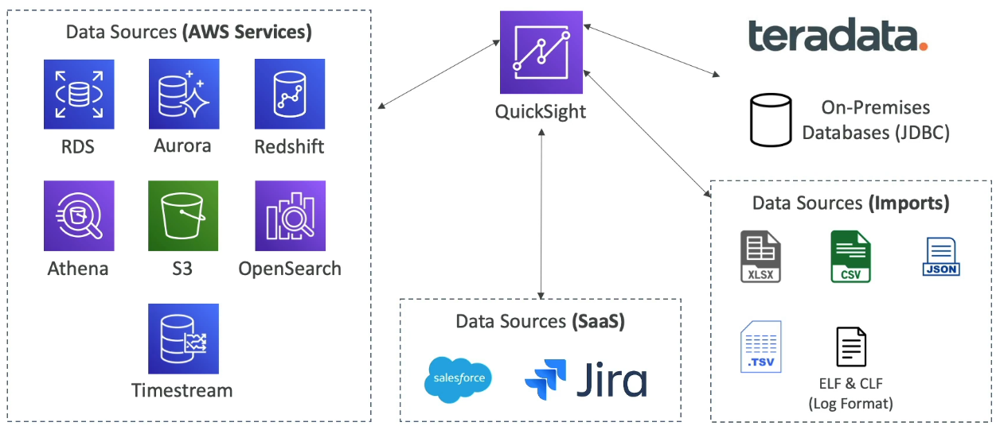

#### QuickSight - Dashboard & Analysis

* Define users(standard versions) and Groups(enterprise version)
  * These users & groups only exist within Quick Sight, not IAM !!!
* A dashboard...
  * is a read-only snapshot of an analysis that you can share
  * preserves the configuration of the analysis(filtering, parameters, controls, sort)

* **You can share the analysis or the dashboard with Users or Groups**
* To share a dashboard, you must first publish it.
* Users who see the dashboard can also see the underlying data.

### AWS Glue

* Managed **Extract, Transform, and Load (ETL)** service
* Useful to prepare and transform data for analytics
* Fully **serverless** service

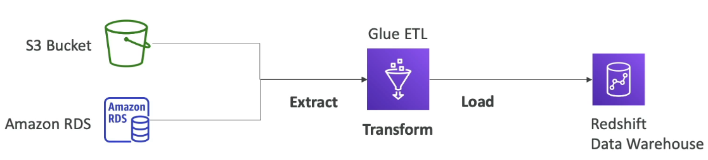

#### AWS Glue - Convert data into Parquet Format

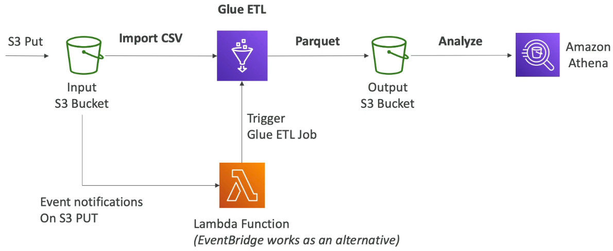

#### Glue Data Catalog: catalog of datasets

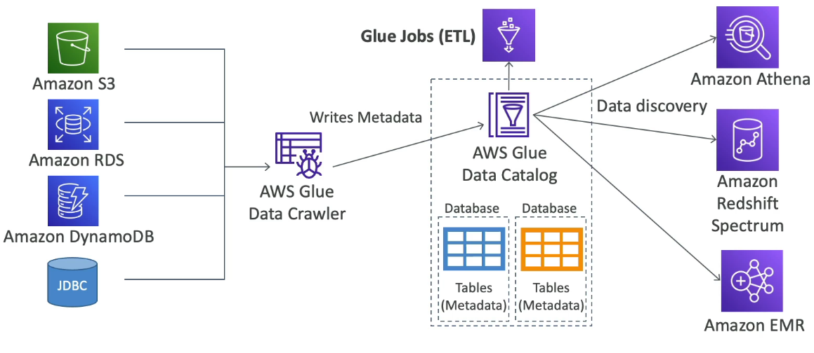

#### Things to know at a high-level

* **Glue Job Bookmarks**: prevent re-processing old data
* **Glue Elastic Views**:
  * Combine and replicate data across multiple data stores using SQL
  * No custom code, Glue monitors for changes in the source data, serverless
  * Leverages a "virtual table"(materialized view)
* **Glue DataBrew:** clean and normalize data using pre-built transformation
* **Glue Studio:** new GUI to create, run and monitor ETL jobs in Glue
* **Glue Streaming ETL** (built in Apache Spark Structured Streaming): compatible with Kinesis Data Streaming, Kafka, MSK(managed Kafka)

### AWS Lake Formation

* Data Lake = central place to have all your data for analytics purposes
* Fully managed service that makes it easy to setup a data lake in days
* Discover, cleanse, transform, and ingest data into your Data Lake
* It automates many complex manual steps(collecting, cleansing, moving, cataloging data,...) and de-duplicate (using ML Transform)
* Combine structured and unstructured data in the data lake
* **Out-of-the-box source blueprints:** S3, RDS, Relational & NoSQL DB
* **Fine-grained Access Control of your applications(row and column-level)**
* Build on top of AWS Glue

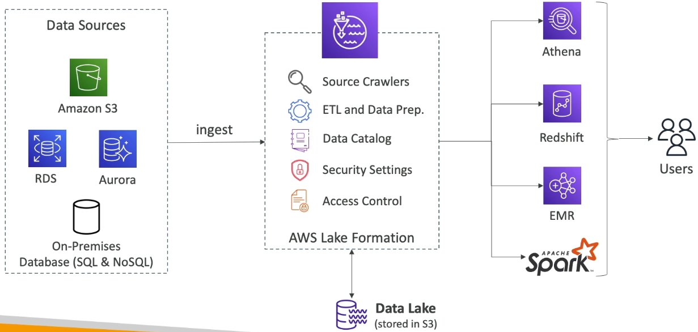

#### Lake Formation - Centralized Permissions Example

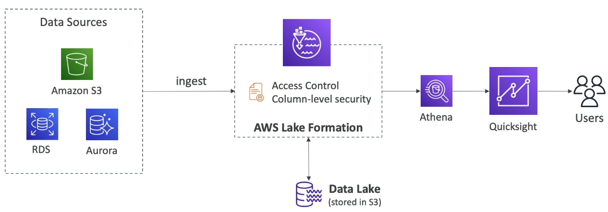

### Kinesis Data Analytics

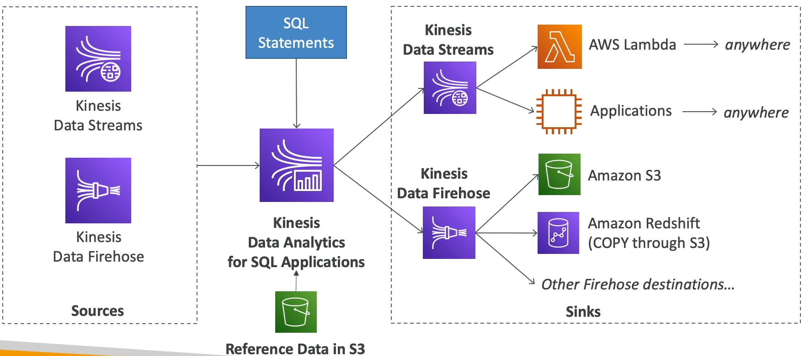

* Real-time analytics on **Kinesis Data Streams & Firehose** using SQL
* Add reference data from Amazon S3 to enrich streaming data
* Fully managed, no servers to provision
* Automatic scaling
* Pay for actual consumption rate
* Output:
  * Kinesis Data Streams: create streams out of the real-time analytics queries
  * Kinesis Data Firehose: send analytics query results to destination
* Use cases:
  * Time-series analytics
  * Real-time dashboards
  * Real-time metrics

#### Kinesis Data Analytics For Apache Flink

* Use Flink(Java, Scala or SQL) to process and analyze streaming data
* Run any Apache Flink application on a managed cluster on AWS
  * provisioning compute resources, parallel computation, automatic scaling
  * application backups(implemented as checkpoints and snapshots)
  * Use any Apache Flink programming features
  * Flink does not read from Firehose(use Kinesis Analytics for SQL instead)

### Amazon Managed Streaming for Apache Kafka (Amazon MSK)

* Alternative to Amazon Kinesis
* Fully managed Apache Kafka on AWS
  * Allow you to create, update, delete clusters
  * MSK creates & manages Kafka brokers nodes & Zookeeper nodes for you
  * Deploy the MSK cluster in your VPC multi-AZ(up to 3 for HA)
  * Automatic recovery from common Apache Kafka failures
  * Data is stored on EBS volumes **for as long as you want**
* **MSK Serverless**
  * Run Apache Kafka on MSK without managing the capacity
  * MSK automatically provisions resources and scales compute & storage

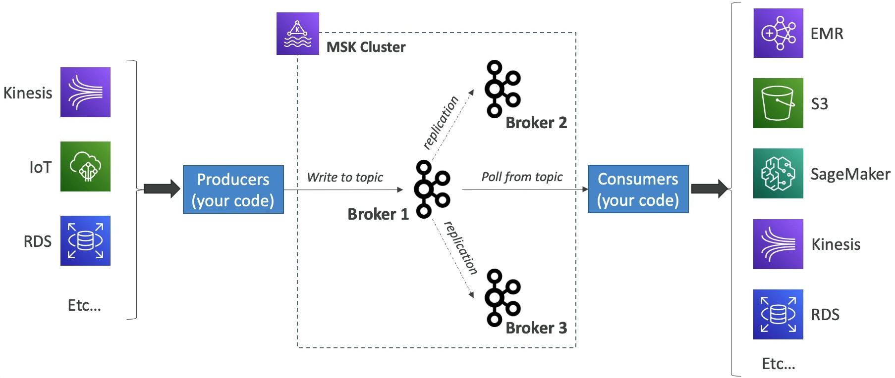

#### Kinesis Data Stream vs Amazon MSK

| Kinesis Data Stream       | Amazon MSK                            |
|---------------------------|---------------------------------------|
| 1 MB message size limit   | 1MB default, configure for higher     |
| Data Steams with Shards   | Kafka Topics with Partitions          |
| Shard Splitting & Merging | Can only add partitions to a topic    |
| TLS In-Flight encryption  | PLAINTEXT or TLS In-flight Encryption |
| MKS at-rest encryption    | KMS at-rest encryption                |

#### Amazon MSK Consumers

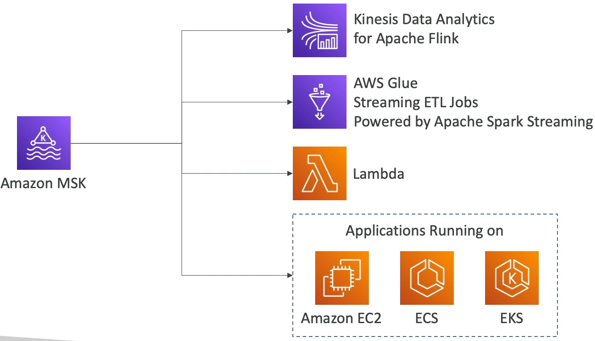

### Big Data Ingestion Pipeline

* IoT Core allows you to harvest data from IoT devices
* **Kinesis is great for real-time data collection**
* **Firehose helps with data delivery to S3 in near real-time(1 minute)**
* Lambda can help Firehose with data **transformations**
* Amazon S3 can trigger notifications with SQS
* Lambda can subscribe to SQS(we could have connecter S3 to Lambda)
* **Athena is a serverless SQL service** and results are stored in S3
* The reporting bucket contains analyzed data and can be used by reporting tools such as AWS QuickSight, RedShift, etc...

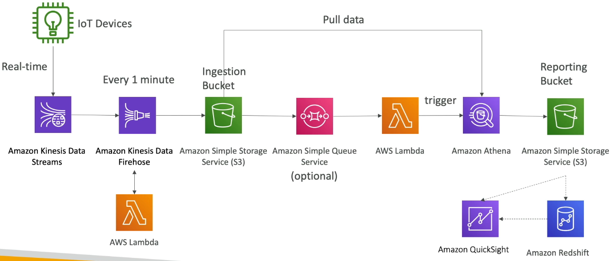