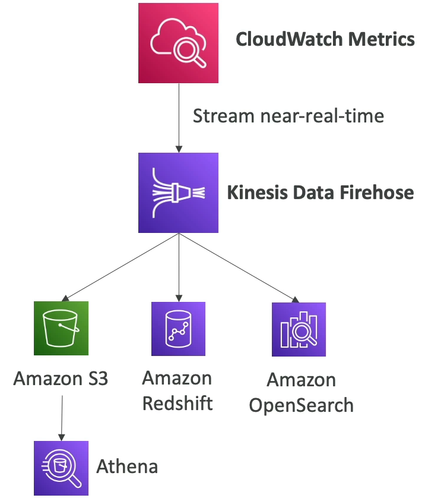
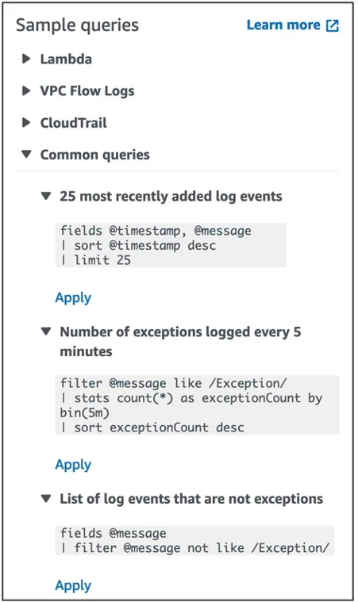
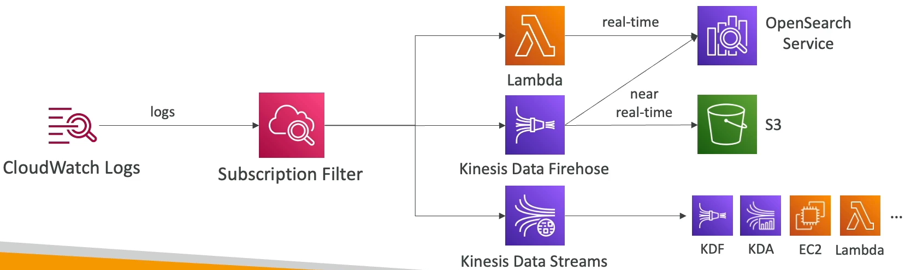
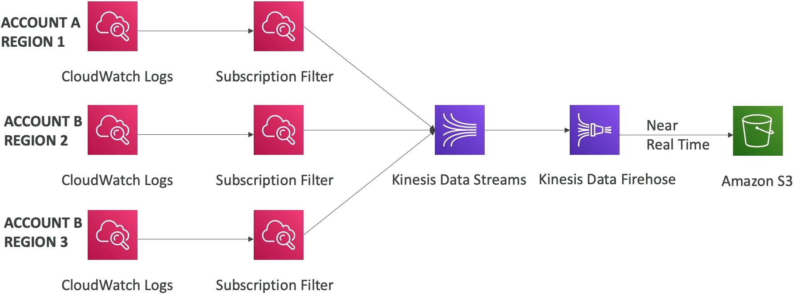
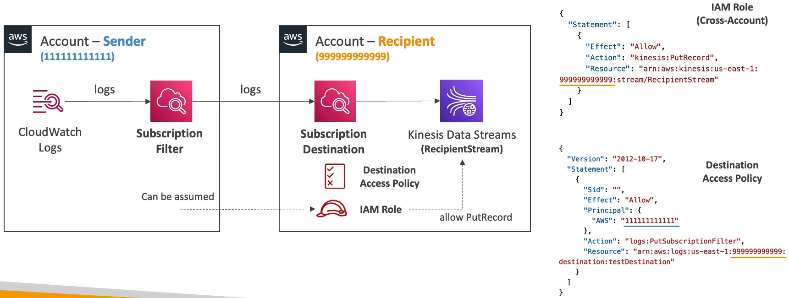

### CloudWatch Metrics

* CloudWatch provides metrics for every service in AWS
* **Metrics** is a variable to monitor(CPUUtilization, NetworkIn,...)
* Metrics belong to **namespaces**
* **Dimension** is an attribute of a metric(instance id, environment, etc...)
* Up to 30 dimensions per metric
* Metrics have **timestamps**
* Can create CloudWatch dashboards of metrics
* Can create **CloudWatch Custom Metrics**(for the RAM for example)

#### CloudWatch Metric Streams

* Continually stream CloudWatch metrics to a destination of your choice, with **near-real-time delivery** and low latency.
  * Amazon Kinesis Data Firehose(and then its destination)
  * 3rd party service providers: Datadog, Dynatrace, New Relic, Splunk, Sumo Logic,...

* Option to **filter metrics** to only stream a subset of them

### CloudWatch Logs

* **Log groups**: arbitrary name, usually representing an application
* **Log streams**: instances within application / log files / containers
* Can define log expiration policies(never expire, 1 day to 10 years...)
* **CloudWatch Logs can send logs to**:
  * Amazon S3(exports)
  * Kinesis Data Streams
  * Kinesis Data Firehose
  * AWS Lambda
  * OpenSearch
* Logs are encrypted by default
* Can set up KMS based encryption with your own keys

#### Sources

* SDK, CloudWatch Logs Agent, CloudWatch Unified Agent
* Elastic Beanstalk: collection of logs from application
* ECS: collection from containers
* AWS Lambda: collection from function logs
* VPC Flow Logs: VPC specific logs
* API Gateway
* CloudTrail based on filter
* Route53: Log DNS queries

#### CloudWatch Logs Insights

* Search and analyze log data stored in CloudWatch Logs
* Example: find a specific IP inside a log, count occurences of "ERROR" in your logs
* Provides a purpose-build query language
  * Automatically discovers fields from AWS services and JSON log events
  * Fetch desired event fields, filter based on conditions, calculate aggregate statistics, sort events, limit number of events
  * Can save queries and add them to CloudWatch Dashboards
* Can query multiple Logs Groups in different AWS accounts
* It's a query engine, not a real-time engine

#### CloudWatch Logs - S3 Export

* Log data can take **up to 12 hours** to become available for export
* The API call is **CreateExportTask**

* Not near-real time or real-time... use Logs Subscriptions instead

#### CloudWatch Logs Subscriptions

* Get a real time log events from CloudWatch Logs for processing and analysis
* Send to Kinesis Data Streams, Kinesis Data Firehose or Lambda
* Subscription Filter - filter which logs are events delivered to you destination

#### CloudWatch Logs Aggregation: Multi-Account & Multi Region

* Cross Account Subscription - send log events to resources in a different AWS account(KDS, KDF)

