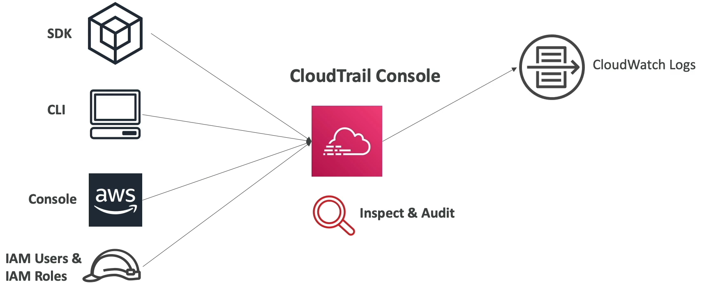

<!-- TOC -->
  * [CloudWatch Metrics](#cloudwatch-metrics)
    * [CloudWatch Metric Streams](#cloudwatch-metric-streams)
  * [CloudWatch Logs](#cloudwatch-logs)
    * [Sources](#sources)
    * [CloudWatch Logs Insights](#cloudwatch-logs-insights)
    * [CloudWatch Logs - S3 Export](#cloudwatch-logs---s3-export)
    * [CloudWatch Logs Subscriptions](#cloudwatch-logs-subscriptions)
    * [CloudWatch Logs Aggregation: Multi-Account & Multi Region](#cloudwatch-logs-aggregation-multi-account--multi-region)
  * [CloudWatch Logs for EC2](#cloudwatch-logs-for-ec2)
    * [CloudWatch Logs Agent & Unified Agent](#cloudwatch-logs-agent--unified-agent)
    * [CloudWatch Unified Agent - Metrics](#cloudwatch-unified-agent---metrics)
  * [CloudWatch Alarms](#cloudwatch-alarms)
    * [CloudWatch Alarm Targets](#cloudwatch-alarm-targets)
    * [CloudWatch Alarms - Composite Alarms](#cloudwatch-alarms---composite-alarms)
    * [CloudWatch Alarm: good to know](#cloudwatch-alarm-good-to-know)
  * [Amazon EventBridge](#amazon-eventbridge)
    * [EventBridge Rules](#eventbridge-rules)
    * [Event Bus](#event-bus)
    * [EventBridge - Schema Registry](#eventbridge---schema-registry)
    * [EventBridge - Resource-based Policy](#eventbridge---resource-based-policy)
  * [CloudWatch Insights and Operational Visibility](#cloudwatch-insights-and-operational-visibility)
    * [CloudWatch Lambda Insights](#cloudwatch-lambda-insights)
    * [CloudWatch Contributor Insights](#cloudwatch-contributor-insights)
    * [CloudWatch Application Insights](#cloudwatch-application-insights)
  * [CloudTrail](#cloudtrail)
    * [CloudTrail Events](#cloudtrail-events)
    * [CloudTrail Event Retention](#cloudtrail-event-retention)
    * [CloudTrail EventBridge - Intercept API Calls](#cloudtrail-eventbridge---intercept-api-calls)
  * [AWS Config](#aws-config)
    * [AWS Config Rules](#aws-config-rules)
    * [Config Rules - Remediations](#config-rules---remediations)
  * [CloudWatch vs CloudTrail vs Config](#cloudwatch-vs-cloudtrail-vs-config)
    * [For an Elastic Load Balancer](#for-an-elastic-load-balancer)
<!-- TOC -->

### CloudWatch Metrics

* CloudWatch provides metrics for every service in AWS
* **Metrics** is a variable to monitor(CPUUtilization, NetworkIn,...)
* Metrics belong to **namespaces**
* **Dimension** is an attribute of a metric(instance id, environment, etc...)
* Up to 30 dimensions per metric
* Metrics have **timestamps**
* Can create CloudWatch dashboards of metrics
* Can create **CloudWatch Custom Metrics**(for the RAM for example)


#### CloudWatch Metric Streams

* Continually stream CloudWatch metrics to a destination of your choice, with **near-real-time delivery** and low latency.
  * Amazon Kinesis Data Firehose(and then its destination)
  * 3rd party service providers: Datadog, Dynatrace, New Relic, Splunk, Sumo Logic,...


* Option to **filter metrics** to only stream a subset of them

### CloudWatch Logs

* **Log groups**: arbitrary name, usually representing an application
* **Log streams**: instances within application / log files / containers
* Can define log expiration policies(never expire, 1 day to 10 years...)
* **CloudWatch Logs can send logs to**:
  * Amazon S3(exports)
  * Kinesis Data Streams
  * Kinesis Data Firehose
  * AWS Lambda
  * OpenSearch
* Logs are encrypted by default
* Can set up KMS based encryption with your own keys

#### Sources

* SDK, CloudWatch Logs Agent, CloudWatch Unified Agent
* Elastic Beanstalk: collection of logs from application
* ECS: collection from containers
* AWS Lambda: collection from function logs
* VPC Flow Logs: VPC specific logs
* API Gateway
* CloudTrail based on filter
* Route53: Log DNS queries

#### CloudWatch Logs Insights

* Search and analyze log data stored in CloudWatch Logs
* Example: find a specific IP inside a log, count occurrences of "ERROR" in your logs
* Provides a purpose-build query language
  * Automatically discovers fields from AWS services and JSON log events
  * Fetch desired event fields, filter based on conditions, calculate aggregate statistics, sort events, limit number of events
  * Can save queries and add them to CloudWatch Dashboards
* Can query multiple Logs Groups in different AWS accounts
* It's a query engine, not a real-time engine


#### CloudWatch Logs - S3 Export

* Log data can take **up to 12 hours** to become available for export
* The API call is **CreateExportTask**

* Not near-real time or real-time... use Logs Subscriptions instead

#### CloudWatch Logs Subscriptions

* Get a real time log events from CloudWatch Logs for processing and analysis
* Send to Kinesis Data Streams, Kinesis Data Firehose or Lambda
* Subscription Filter - filter which logs are events delivered to you destination


#### CloudWatch Logs Aggregation: Multi-Account & Multi Region


* Cross Account Subscription - send log events to resources in a different AWS account(KDS, KDF)


### CloudWatch Logs for EC2

* By default, no logs from your EC2 machine will go to CloudWatch
* You need to run a CloudWatch agent on EC2 to push the log files you want
* Make sure IAM permissions are correct
* The CloudWatch log agent can be setup on-premises too


#### CloudWatch Logs Agent & Unified Agent

* For virtual servers(EC2 instances, on-premises servers...)
* **CloudWatch Logs Agent**
  * Old version of the agent
  * Can only send to CloudWatch logs
* **CloudWatch Unified Agent**
  * Collect additional system-level metrics such as RAM, processes, etc...
  * Collect logs to send to CloudWatch logs
  * Centralized configuration using SSM Parameter Store

#### CloudWatch Unified Agent - Metrics

* Collected directly on your Linux server / EC2 instance

* **CPU**(active, guest, idle, system, user, steal)
* **Disk Metrics**(free, used, total), Disk IO(writes, reads, bytes, iops)
* **RAM**(free, inactive, used, total, cached)
* **Netstat**(number of TCP and UDP connections, net packets, bytes)
* **Processes**(total, dead, bloqued, idle, running, sleep)
* **Swap Space**(free, used, used%)

* Reminder: out-of-box metrics for EC2 - disk, CPU, network(high-level)

### CloudWatch Alarms

* Alarms are used to trigger notifications for any metrics
* Various options(sampling, %, max, min, etc...)
* Alarm States:
  * OK
  * INSUFFICIENT_DATA
  * ALARM
* Period
  * Length of time in second to evaluate the metric
  * High resolution custom metrics: 10 sec, 30 sec or multiples of 60 sec

#### CloudWatch Alarm Targets

* Stop, Terminate, Reboot, or Recover an EC2 Instance
* Trigger Auto Scaling Action
* Send notification to SNS(from which you can do pretty much anything)

#### CloudWatch Alarms - Composite Alarms

* CloudWatch Alarms are on single metric
* **Composite Alarms are monitoring the states of multiple other alarm**
* **AND** and **OR** conditions
* Helpful to reduce "alarm noise" by creating complex composite alarms


* **Recovery**: Same Private, Public, Elastic IP, metadata, placement group

#### CloudWatch Alarm: good to know

* Alarms can be created based on CloudWatch Logs Metrics Filters


* To test alarms and notifications, set the alarm state to Alarm using CLI

```
aws cloudwatch set-alarm-state --alarm-name "myalarm" --state-value ALARM --state-reason "testing purposes"
```

### Amazon EventBridge

* Schedule: Cron jobs(schedule scripts)


 
* Event Pattern: Event rules to react to a service doing something


* Trigger Lambda functions, send SQS/SNS messages...

#### EventBridge Rules


#### Event Bus


* Event buses can be accessed by other AWS accounts with Resource-based Policies
* You can **archive events**(all/filter) sent to an event bus(indefinitely or set period)
* Ability to **replay archived events**

#### EventBridge - Schema Registry

* EventBridge can analyze the events in your bus and infer the **schema**
* The **Schema Registry** allows you to generate code for your application, that will know in advance how data is structured in the event bus
* Schema can be versioned

#### EventBridge - Resource-based Policy

* Manage permission for a specific Event Bus
* Example: allow/deny events from another AWS account or AWS region
* Use case: aggregate all events from your AWS Organization in a single AWS account or AWS regions


### CloudWatch Insights and Operational Visibility

* Collect, aggregate, summarize **metrics and logs** from containers
* Available for containers on
  * Amazon Elastic Container Service(Amazon ECS)
  * Amazon Elastic Kubernetes Services(Amazon EKS)
  * Kubernetes platforms on EC2
  * Fargate(both for ECS and EKS)


* **In Amazon EKS and Kubernetes, CloudWatch Insights is using a containerized version of the CloudWatch Agent to discover containers**

#### CloudWatch Lambda Insights

* Monitoring and troubleshooting solution for serverless applications running on AWS Lambda
* Collects, aggregates and summarizes system-level metrics including CPU time, memory, disk, and network
* Collects, aggregates and summarizes diagnostic information such as cold starts and Lambda worker shutdowns
* Lambda Insights is provided as a Lambda Layer

#### CloudWatch Contributor Insights

* Analyze log data and create time series that display contributor data.
  * **See metrics about the top N-Contributor**
  * The total number of unique contributors, and their usage
* This helps you find a top talkers and understand who or what is the impacting system performance
* Works for any AWS-generated logs(VPC, DNS, etc...)
* For example, you can find bad hosts, **identify the heaviest network users**, or find the URLs that generates the most errors.


* You can build your rules from scratch, or you can also use sample rules that AWS has created - **leverages your CloudWatch Logs**
* CloudWatch also provides built-in rules that you can use to analyze metrics from other AWS services

#### CloudWatch Application Insights

* Provides automated dashboards that show potential problems with monitored applications, to help isoalte ongoing issues
* You applications run on Amazon EC2 Instances with select technologies only(Java, .NET, Microsoft IIS Web server, databases...)
* And you can use other AWS resources such as Amazon EBS, RDS, ELS, ASG, Lambda,...

* Powered by SageMaker
* Enhanced visibility into your application health to reduce the time it will take you to troubleshoot and repair you applications
* Finding and alerts are sent to Amazon EventBridge and SSM OpsCenter

### CloudTrail

* **Provides governance, compliance and audit for your AWS Account**
* CloudTrail in enabled by default
* Get **an history of events / API calls made within your AWS Account by:**
  * Console
  * SDK
  * CLI
  * AWS Services
* Can put logs from CloudTrail into CloudWatch Logs or S3
* **A trails can be applied to All regions(default) or a single Region.**
* If a resource is deleted in AWS, investigate CloudTrail first.



#### CloudTrail Events

* **Management Events**
  * Operations that are performed on resources in your AWS account
  * Examples:
    * Configuring security (IAM **AttachRolePolicy**)
    * Configuring rules for routing data (Amazon EC2 **CreateSubnet**)
    * Setting up logging (AWS CloudTrail **CreateTrail**)
  * **By default, trails are configured to log management events**
  * Can separate **Read Events** from **Write Events**
* **Data Events**
  * **By default, data events are not logged(because high volume operations)**
  * Amazon S3 object-level activity(ex: **GetObject**, **DeleteObject**, **PutObject**): can separate Read and Write Events
  * AWS Lambda function execution activity(the **Invoke** API)
* **CloudTrail Insights**
  * Enabled **CloudTrail Insights to detect unusual activity** in your account
    * inaccurate resource provisioning
    * hitting service limit
    * Bursts of AWS IAM actions
    * Gaps in periodic maintenance activity
  * CloudTrail Insights analyzes normal management events to create a baseline
  * And then **continuously analyzes write events to detect unusual patterns**
    * Anomalies appear in the CloudTrail console
    * Event is sent to Amazon S3
    * An EventBridge event is generated(for automation needs)


#### CloudTrail Event Retention

* Events are stored for 90 days in CloudTrail
* To keep events beyond this period, log them to S3 and use Athena


#### CloudTrail EventBridge - Intercept API Calls


### AWS Config

* Helps with auditing and recording **compliance** of your AWS resources
* Helps record configurations and changes over time
* Questions that can be solved be AWS Config:
  * Is there unrestricted SSH access to my security groups?
  * Do my buckets have any public access?
  * How has my ALB configuration changed over time?
* You can receive alerts(SNS notifications) for any changes
* AWS Config is a per-region service
* Can be aggregates across regions and accounts
* Possibility of storing the configuration data into S3(analyzed by Athena)

#### AWS Config Rules

* Can use AWS managed config rules(over 75)
* Can make custom config rules(must be defined in AWS Lambda)
  * Ex: evaluate if each EBS disk is of type gp2
  * Ex: evaluate if each EC2 instance is t2.micro
* Rules can be evaluated / triggered:
  * For each config change
  * And / or : at regular time intervals
* **AWS Config Rules does not prevent actions from happening**

* Pricing: no free tier, $0.0003 per configuration item recorded per region, $0.001 per config rule evaluation per region

#### Config Rules - Remediations

* Automate remediation of non-compliant resources using **SSM Automation Documents**
* Use AWS-Managed Automation Documents or create custom Automation Documents
  * Tip: you can create custom Automation Documents that invokes Lambda function
* You can set **Remediation Retries** if the resource is still non-compliant after auto-remediation


### CloudWatch vs CloudTrail vs Config

* CloudWatch
  * Performance monitoring(metrics, CPU, network, etc...) & dashboard
  * Events & Alerting
  * Log Aggregation & Analysis
* CloudTrail
  * Record API calls made within your Account by everyone
  * Can define trails for specific resources
  * Global Service
* Config
  * Record configuration changes
  * Evaluate resources against compliance rules
  * Get timeline of changes and compliance

#### For an Elastic Load Balancer

* CloudWatch
  * Monitoring incoming connection metric
  * Visualize error codes as a % over time
  * Make a dashboard to get an idea of your load balancer performance
* Config
  * Track security group rules for the load balancer
  * Track Configuration changes for the load balancer
  * Ensure an SSL certificate is always assigned to the Load Balancer
* CloudTrail
  * Track you made any changes to the Load Balancer with API calls