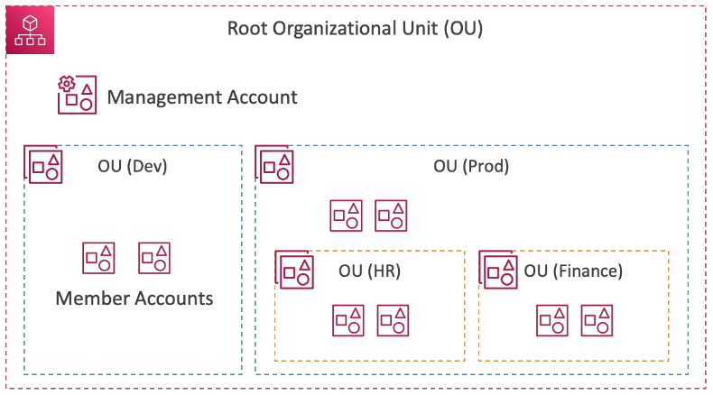
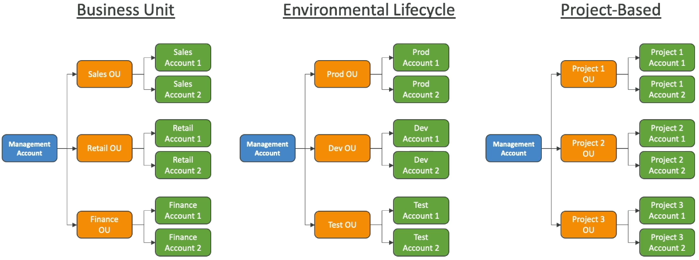
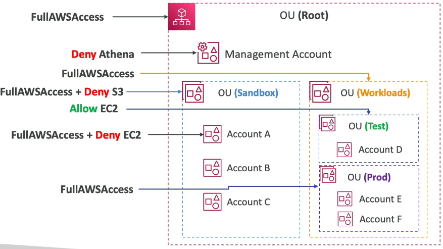

### AWS Organizations

* Global service
* Allows to manage multiple AWS accounts
* The main account is the management account
* Other accounts are member accounts
* Member accounts can only be part of one organization
* Consolidated Billings across all accounts - single payment method
* Pricing benefits from aggregated usage(volume discount for EC2, S3...)
* **Shared reserved instances and Saving Plans discounts across accounts**
* API is available to automate AWS account creation

#### Advantages

* Multi Account vs One Account Multi VPC
* Use tagging standards for billing purposes
* Enable CloudTrail on all accounts, send logs to central S3 account
* Send CloudWatch Logs to central logging account
* Establish Cross Account Roles for Admin purposes

#### Security: Service Control Policies

* IAM policies applied to OU or Accounts to restrict Users and Roles
* They do not apply to the management account(full admin power)
* Must have an explicit allow from the root through each OU in the direct path to the target account(does not allow anything by default - like IAM)

#### SCP Hierarchy

* Management Account
  * Can do anything(no SCP apply)
* Account A
  * Can do anything
  * Except S3
  * Execpt EC2
* Account B & C
  * Can do anything
  * Except S3
* Account D
  * Can access EC2
* Prod OU & Account E & F
