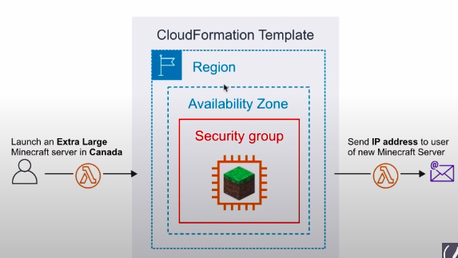
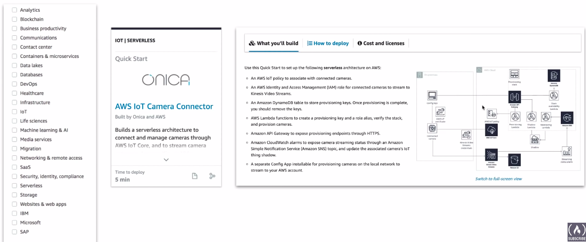

### AWS CloudFormation: Infrastructure as Code

A Templating Language that **defines AWS resources** to be provisioned. **Automating** the creation of resources via code.

### Intro

**What is Infrastructure As Code(IaC)?**

The process of managing and provisioning computer data centers(e.g. AWS) through machine-readable definition files(eg, YAML, JSON files) rather than physical hardware configuration or interactive configuration tools.

**Use Case**

* People pay a monthly subscription, and we run a Minecraft server. They choose **where** they want and **what size** of server they want to run.
* We can use their **inputs** and use an AWS Lambda to create a new CloudFormation stack. We have a lambda send them the email of their new Minecraft Server IP address and details.



### Template Formats

CloudFormation can be written in 2 different formats.

```json
{
  "AWSTemplateFormatVersion": "2010-09-09",
  "Description": "Launch an EC2 instance running apache and expose default page",
  "Parameters": {
    "InstanceType": {
      "Description": "WebServer EC2 instance type",
      "Type": "String",
      "Default": "t2.micro",
      "AllowValues": [
        "t2.nano",
        "t2.micro"
      ]
    }
  },
  "Resources": {
    "WebServer": {
      "Type": "AWS::EC2::Instance",
      "Properties": {
        "Tags": [
          {
            "Key": "Name",
            "Value": "Apache Default WebServer"
          }
        ],
        "InstanceType": {
          "Ref": "InstanceType"
        },
        "ImageId": "ami-0bw38498748397487",
        "SecurityGroupIds": [
          {
            "Fn::GetAtt": [
              "SecurityGroup",
              "GroupId"
            ]
          }
        ],
        "UserData": {
          "Fn::Base64": {
            "Fn::Sub": "#!/usr/bin/env bash\nsu ec2-user\nsudo yum install..."
          }
        }
      }
    },
    "SecurityGroup": {
      "Type": "AWS::EC2::SecurityGroup",
      "Properties": {
        "GroupDescription": "Enable internet user to access",
        "SecurityGroupIngress": [
          {
            "IpProtocol": "tcp",
            "FromPort": "80",
            "ToPort": "80",
            "CidrIp": "0.0.0.0/0"
          }
        ]
      }
    }
  }
}
```


### Template Anatomy

| Term            | Desc                                                                            |
|-----------------|---------------------------------------------------------------------------------|
| **Metadata**    | Additional information about the template                                       |
| **Description** | A description of what this template is suppose to do                            |
| **Parameters**  | Values to pass to your template at **runtime**                                  |
| **Mapping**     | A lookup table. Maps keys to values so you change your values to something else |
| **Conditions**  | Whether resources are created or properties are assigned                        |
| **Transform**   | Applies marcos(like applying a mod which change the anatomy to be custom)       |
| **Resources**   | A resource you want to create eg. **IAM Role, EC2 Instance, Lambda, RDS**       |
| **Outputs**     | Values that returned eg. an ip-address of new server created                    |

CloudFormation Templates requires you to **at least list one resource**.

### AWS Quick start

AWS Quick Starts are a collection of **pre-build CloudFormation templates**



### CheatSheet
* When being asked to automate the provisioning of resources thing CloudFormation
* When Infrastructure as Code is mentioned think CloudFormation
* CloudFormation can be written in either JSON or YAML
* When CloudFormation encounters an error it will rollback to **ROLLBACK_IN_PROGRESS**
* CloudFormation's templates larger than 51,200 bytes are too large to upload directly, and must be imported into CloudFormation via an S3 bucket
* **NestedStacks** helps you break up you CloudFormation template into smaller reusable templates that can be composed into larger templates.
* **At least one resource** under resources: must be defined for a CloudFormation template **to be valid**