<!-- TOC -->
  * [AWS CloudFront](#aws-cloudfront)
    * [CloudFront - Origins](#cloudfront---origins)
    * [CloudFront at a high level](#cloudfront-at-a-high-level)
    * [CloudFront - S3 as an Origin](#cloudfront---s3-as-an-origin)
    * [CloudFront vs S3 Cross Region Replication](#cloudfront-vs-s3-cross-region-replication)
    * [CloudFront - ALB or EC2 as an origin](#cloudfront---alb-or-ec2-as-an-origin)
    * [CloudFront Geo Restriction](#cloudfront-geo-restriction)
    * [CloudFront - Price Classes](#cloudfront---price-classes)
      * [CloudFront - Price Classes](#cloudfront---price-classes-1)
    * [CloudFront - Cache Invalidations](#cloudfront---cache-invalidations)
    * [Global users for our application](#global-users-for-our-application)
      * [Unicast IP vs Anycast IP](#unicast-ip-vs-anycast-ip)
    * [AWS Global Accelerator](#aws-global-accelerator)
    * [AWS Global Accelerator vs CloudFront](#aws-global-accelerator-vs-cloudfront)
<!-- TOC -->

### AWS CloudFront

* Content Delivery Network(CDN)
* **Improves read performance, content is cached at the edge**
* Improves users experience
* 216 Point of Presence globally(edge locations)
* **DDoS protection(because worldwide), integration with Shield, AWS Web Application Firewall**

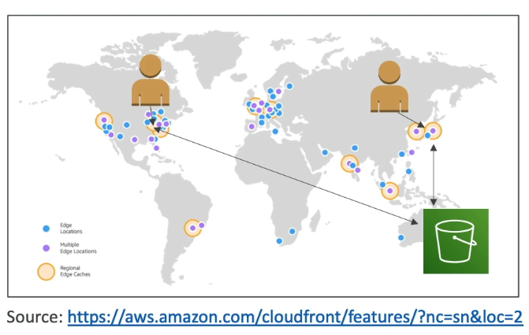

#### CloudFront - Origins

* S3 bucket
  * For distributing files and caching them at the edge
  * Enhanced security with CloudFront **Origin Access Control(OAC)**
  * OAC is replacing Origin Access Identity(OAI)
  * CloudFront can be used as an ingress(to upload files to S3)
* **Custom Origin(HTTP)**
  * Application Load Balancer
  * EC2 instance
  * S3 Website(must first enable the bucket as a static S3 website)
  * Any HTTP backend you want

#### CloudFront at a high level

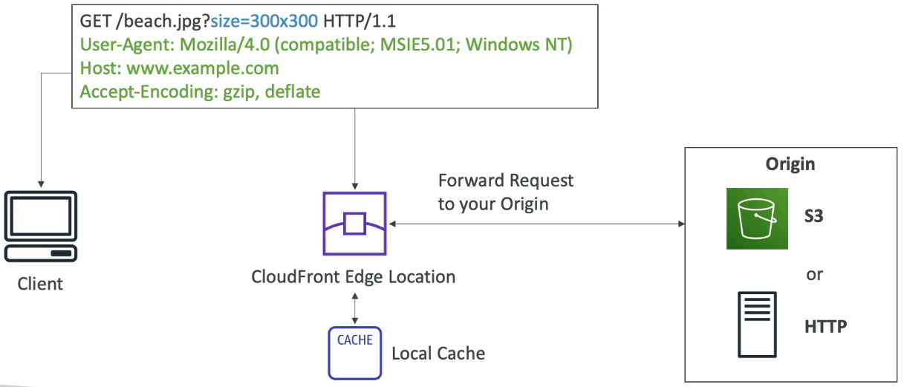

#### CloudFront - S3 as an Origin

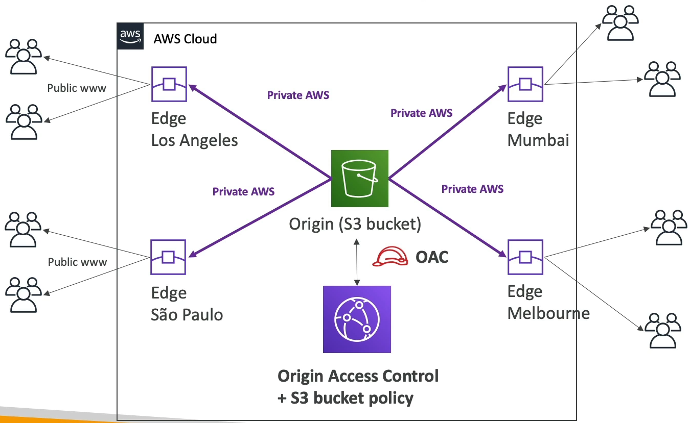

#### CloudFront vs S3 Cross Region Replication

* CloudFront:
  * Global Edge network
  * Files are cached for a TTL(maybe a day)
  * Great for **static content** that must be available everywhere
* S3 Cross Region Replication:
  * Must be setup for each region you want o replication to happen
  * Files are updated in near real-time
  * Read only
  * Great for **dynamic content** that needs to be available at low-latency in few regions.

#### CloudFront - ALB or EC2 as an origin

* EC2 instance can serve **as an origin** for Cloud-Front
* EC2 instance must allow access to all the **Edge Location's IP**

* Similarly, ALB can serve **as an origin** for Cloud-Front
* ALB must allow access to all the **Edge Location's IP**

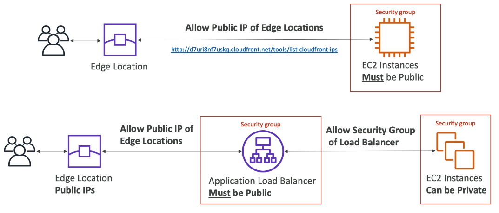

#### CloudFront Geo Restriction

* You can restrict who can access your distribution
  * Allowlist: Allow your users to access your content only if they're in one of the countries on a list of approved countries
  * Blocklist: Prevent your users from accessing your content if they're in one of the countries on a list of banned countries
* The "country" is determined using a 3rd party Geo-IP database
* Use-case: Copyright Laws to content access to content

#### CloudFront - Price Classes

* CloudFront Edge locations are all around the world
* The cost of data out per edge location varies

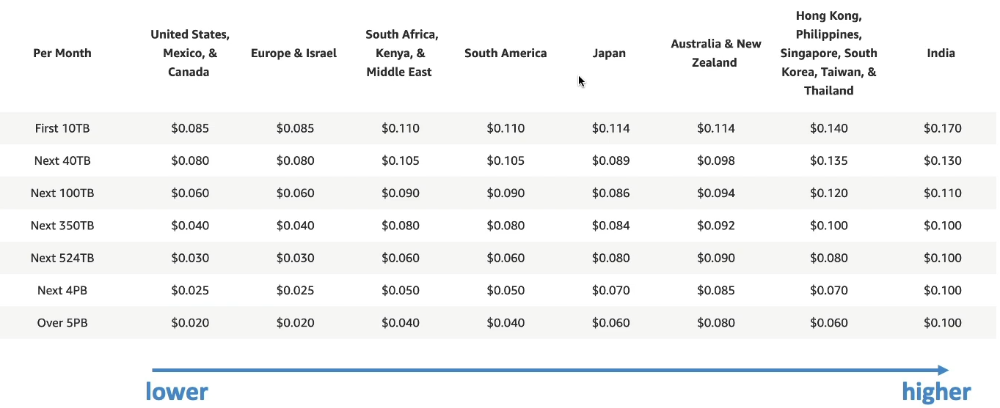

##### CloudFront - Price Classes

* You can reduce the number of edge locations for **cost reductions**
* Three price classes:
  * Price Class All: all regions - best performance
  * Price Class 200: most regions, but excludes the most expensive regions
  * Price Class 100: only the least expensive regions

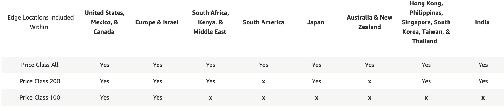

#### CloudFront - Cache Invalidations

* In case you update the backend origin, CloudFront doesn't know about it and will only get the refreshed content after the TTL has expired
* However, you can force an entire or partial cache refresh(thus bypassing the TTL) by performing **CloudFront Invalidation**
* You can invalidate all files(*) or a special path(/images/*)

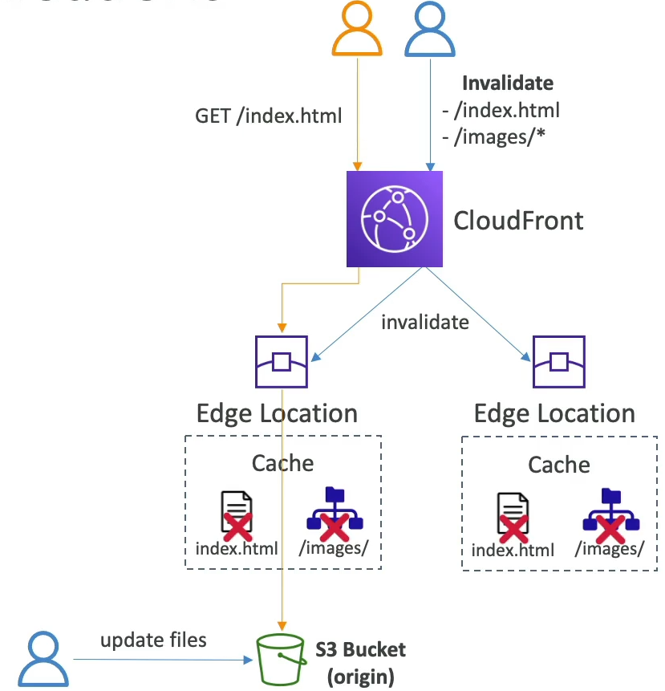

#### Global users for our application

* You have deployed an application and have global users who want to access it directly
* The go over the public internet, which can add a lot of latency due to many hops
* We wish to go as fast as possible through AWS network to minimize latency

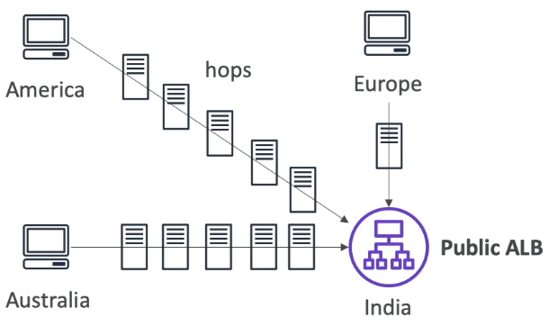

##### Unicast IP vs Anycast IP

* Unicast IP: one server holds one IP address

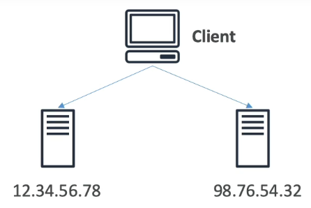

* Anycast IP: all server hold th same IP address and the client is routed to the nearest one

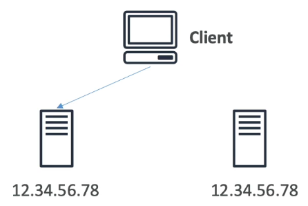

#### AWS Global Accelerator

* Leverage the AWS internal network to route to your application
* **2 Anycast IP** are created for your application
* The Anycast IP send traffic directly to Edge Locations
* The Edge locations send the traffic to your application

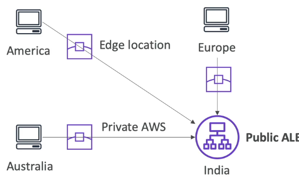

* Works with Elastic IP, EC2 instances, ALB, NLB, public or private
* Consistent Performance
  * Intelligent routing to the lowest latency and fast regional failover
  * No issue with client cache(because the IP doesn't change)
  * Internal AWS network
* Health Checks
  * Global Accelerator performs a health check of you application
  * Helps make you application global(failover less than 1 minute for healthy)
  * Great for disaster recovery(thanks to the health checks)
* Security
  * only 2 external IP need to be whitelisted
  * DDoS protection thanks for to AWS Shield

#### AWS Global Accelerator vs CloudFront

* They both use the AWS global network and its edge locations around the world
* Both services integrate with AWS Shield for DDoS protection
* **CloudFront**
  * Improves performance of both cacheable content(such as images and videos)
  * Dynamic content(suck as API acceleration and dynamic site delivery)
  * Content is served at the edge
* **Global Accelerator**
  * Improves performance for wide range of application over **TCP or UDP**.
  * Proxying packets at the edge to applications running in one or more AWS regions.
  * Good fit for non-HTTP use cases, such as gaming(UDP), IoT(MQTT) or Voice over IP
  * Good for HTTP use cases that require static IP addresses
  * Good for HTTP use cases that required deterministic, fast regional failover.