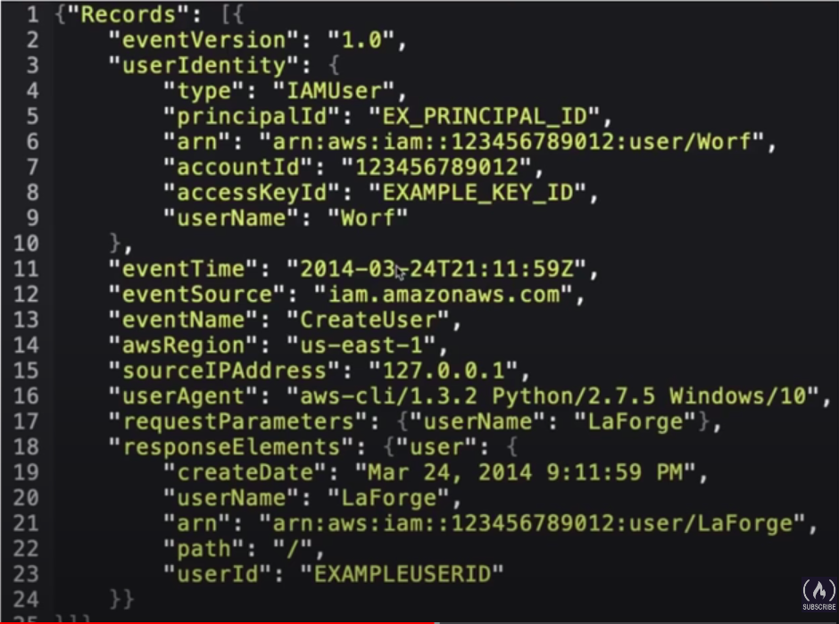
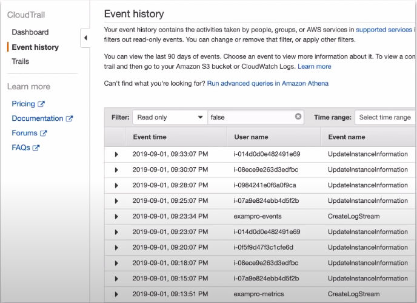
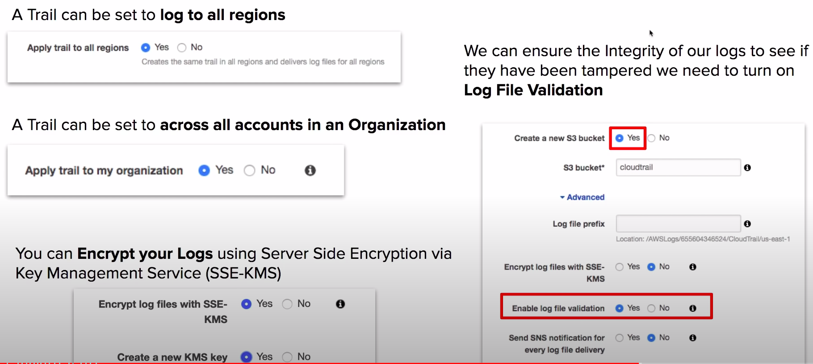
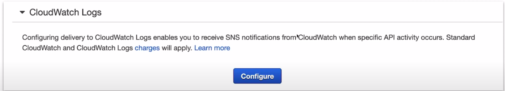

### Cloud Trail

* Logs API calls between AWS services.
* AWS CloudTrail is a service that enables **governance, compliance, operation auditing, and risk auditing** of your AWS account.
* AWS CloudTrail is used to **monitor API calls** and **Actions** made on an AWS accout.

**Easily identify which users and accounts made that call to AWS eg**

* **Where** source IP Address
* **When** EventTime
* **Who** User, UserAgent
* **What** Region, Resource, Action

### Event History

* CloudTrail is already logging by default and will collect logs for last 90 days via **Event History**
* If you need more than 90 days you need to create a **Trail**
* Trails are output to S3 and do not have GUI like Event History. To analyze a Trail you'd have to use **Amazon Athena**

### Trails Options

* Trail can be set to **log to all regions**
* Trail can be set to **across all account in an Organization**
* You can **Encrypt your Logs** using Server Side Encryption via Key Management Service(SSE-KMS)
* We can ensure the Integrity of our logs to see if they have been tampered we need to turn on **Log File validation**

### CloudTrail to CloudWatch

CloudTrail can be set to deliver event to a CloudWatch Log.

### Management Events vs Data Events

**Management Events**

Tracks management operations. Turned on by default. Can't be turned off.

* **Configuring security**(e.g. IAM AttachRolePolicy API operations)
* **Registering Devices**(e.g. Amazon EC2 CreateDefaultVpc API operations)
* **Configuring rules for routing data** (e.g. Amazon EC2 CreateSubnet API operations)
* **Setting up Logging** (e.g. AWS CloudTrail CreateTrail API operations)

**Data Events**

* Tracks specific operations for specific AWS Services. Data events are high volume logging and will result in addition charges. **Turned off by default**
* The two services that can be tracked is S3 and Lambda. So it would track action such as: GetObject, DeleteObject, PutObject

<Follow Along>

### CheatSheet
* CloudTrail logs calls between AWS services.
* governance, compliance, operational auditing, and risk auditing are keywords relating to CloudTrail
* When you need to know **who to blame** think CloudTrail
* CloudTrail by default logs event data for the past 90s days via Event History
* To Track beyond 90 days you need to create Trails
* To ensure logs have not been tampered with you need to turn on **Log File Validation** option
* CloudTrail logs can be encrypted using **KMS**
* CloudTrail logs can be set to log across all AWS accounts in an Organization and all regions in an account
* CloudTrail logs can be streamed into CloudWatch Logs
* Trails are outputted to an S3 bucket that you specify
* CloudTrail logs two kinds of events: **Management Events** and **Data Events**
* **Data Events** are disabled by default when creating Trail
* Trail Logs in S3 can be analyzed using Athena