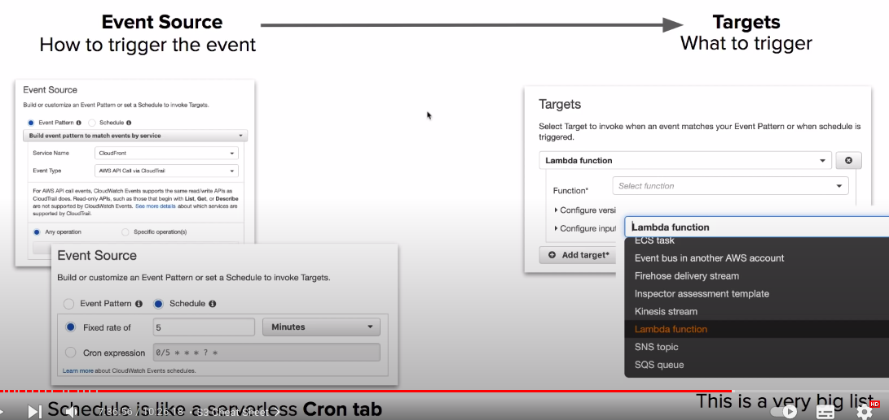
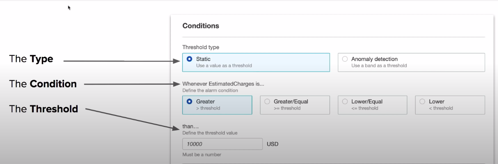
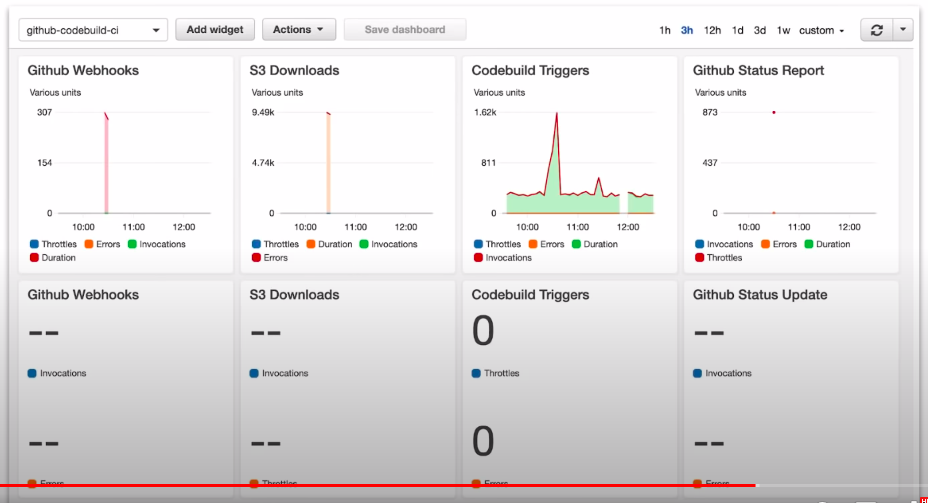

A collection of monitoring services for logging, reacting and visualizing log data.

AWS Cloudwatch is a monitoring solution for your AWS resources. 
CloudWatch is a collection of monitoring tools as follows:

| Services                 | Desc                                                                         |
|--------------------------|------------------------------------------------------------------------------|
| CloudWatch **Logs**      | any custom log data, Memory Usage, Rails Logs, Nginx Logs                    |
| CloudWatch **Metrics**   | metrics that are based off of logs eg. Memory Usage                          |
| CloudWatch **Events**    | trigger an event based on a condition eg. every hour take snapshot of server |
| CloudWatch **Alarms**    | triggers notification based on metrics which breach a defined threshold      |
| CloudWatch **Dashboard** | create visualizations based on metrics                                       |

### CloudWatch Logs

Used to monitor, store and access your log files.

* A **Log Group** is a collection of logs. Log files must belong to a log group.
* A Log in a Log group is called **Log Stream**
* By default, **Logs are kept indefinitely and never expire**

Most AWS Services are integrated with CloudWatch Logs. Logging of services sometimes needs to be turned on or requires the IAM Permissions to write to CloudWatch Logs.

### Cloudwatch Metrics

* Represents a time-ordered set of data points. A variable to monitor
* CloudWatch comes with many **predefined** metrics eg. EC2 Per-Instance Metrics
  * CPU Utilization
  * DiskReadOps
  * DiskWriteOps
  * DiskReadBytes
  * DiskWriteBytes
  * NetworkIn
  * NetworkOut
  * NetworkPacketsIn
  * NetworkPacketsOut

### CloudWatch Events

* Trigger an event based on a condition or on schedule



### Custom Metrics and High Resolution Metrics

* Using the AWS CLI or SDK you can create and publish your own **custom metrics**

```
aws cloudwatch put-metric-data \
    --metric-name Enterprise-D
    --namespace Starfleet
    --unit Bytes
    --value 231434333
    --dimensions HullIntegrity=100,Shield=70,Thrusters=maximum
```

**High Resolution Metrics**

* When you publish a custom metric, you can define it as either standard resolution or high resolution 
* High resolution lets you track under **1 minutes down** to **1 second**
* With High Resolution you can track at:
  * **1 second**
  * 5 seconds
  * 10 seconds
  * 30 seconds
  * multiple of 60 seconds

### CloudWatch Alarms

* Triggers a notifications based on metrics which **breach** a defined threshold



### Dashboards

* Creates custom dashboards from cloudwatch metrics



### CloudWatch Availability

* How often CloudWatch will collect and make available data.

| Monitoring          | EC2               | Other Services                     |
|---------------------|-------------------|------------------------------------|
| Basic Monitoring    | 5 Minute Interval | **1 minute** / 3 minute / 5 minute |
| Detailed Monitoring | 1 Minute Interval |                                    |

### CloudWatch Agent and Host Level Metrics

* Some metrics you might think are tracked **by default for EC2 instances are not**, and require install the **CloudWatch Agent**
* The CloudWatch Agent is a script which can be installed via **System Manager** run command onto the target EC2 instance.
* CloudWatch will track at the Host Level by default:
  * CPU Usage
  * Network Usage
  * Disk Usage
  * Status Check
    * Underlying Hypervisor status
    * Underlying EC2 instance status
* The following require the Agent to get detailed metrics for
  * Memory utilization
  * Disk swap utilization
  * Disk space utilization
  * Page file utilization
  * Log collection

<Follow Along>

### Cheatsheet(only important points)

* CloudWatch Agent needs to be installed on EC2 host to track **Memory Usage** and **Disk Size**
* You can stream custom log file eg. production.log