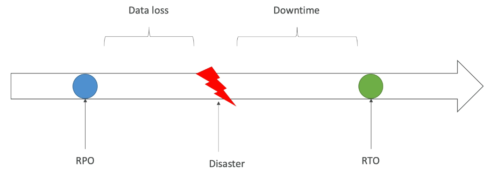
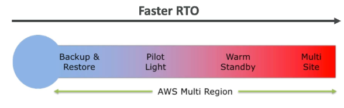
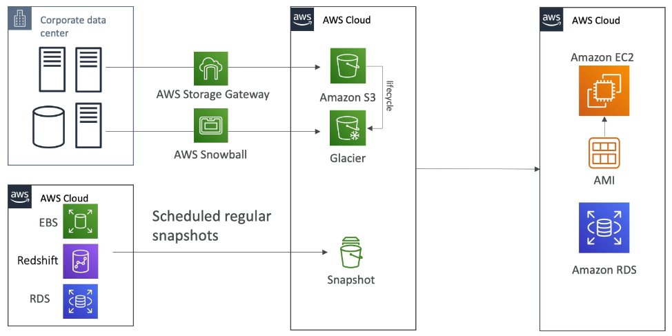
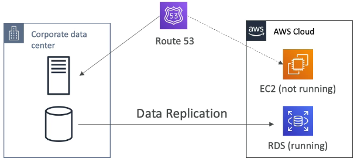
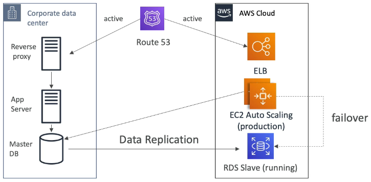
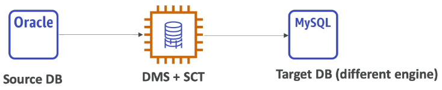
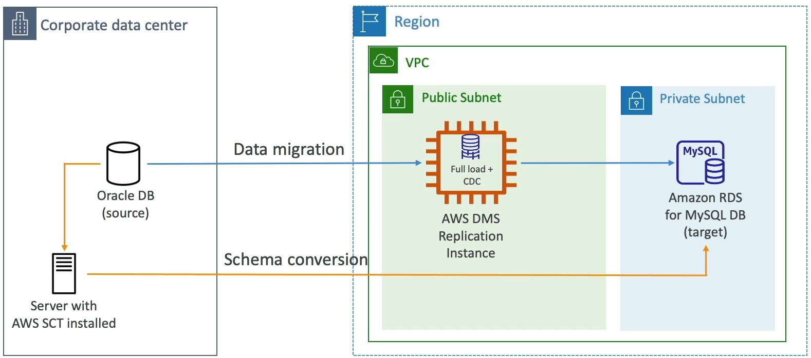
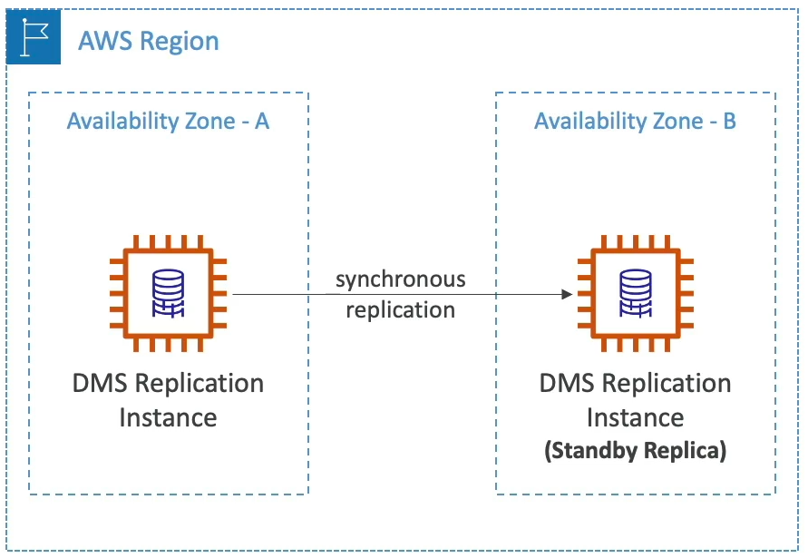
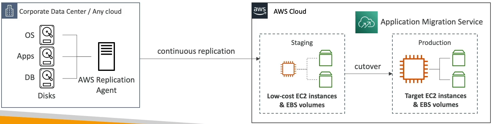
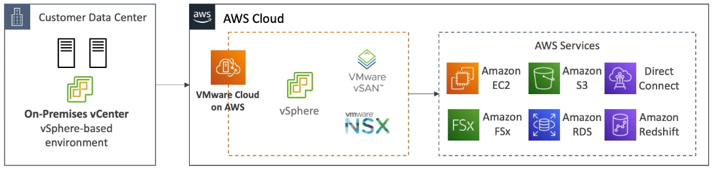

### Disaster Recovery Overview

* Any event that has a negative impact on a company's business continuity or finances is a disaster
* Disaster recovery(DR) is about preparing for and recovering from a disaster
* What kind of disaster recovery?
  * On-premise => On-premise: traditional DR, and very expensive
  * On-premise => AWS Cloud: hybrid recovery
  * AWS Cloud Region A => AWS Cloud Region B
* Need to define two terms
  * RPO: Recovery Point Objective
  * RTO: Recovery Time Objective

#### RPO and RTO

#### Disaster Recovery Strategies

* Backup and Restore
* Pilot Light
* Warm Standby
* Hot Site / Multi Site Approach

#### Backup and Restore(High RPO)

#### Disaster Recovery - Pilot Light

* A small version of the app is always running in the cloud
* Useful for the critical core(pilot light)
* Very similar to Backup and Restore
* Faster than Backup and Restore as critical systems are already up

#### Warm Standby

* Full system is up and running but at minimum size
* Upon disaster, we can scale to production load

#### Multi Site / Hot Site Approach

* Very low RTO(minutes or seconds) - very expensive
* Full Production Scale is running AWS and On Premise

#### Disaster Recovery Tips

* Backup
  * EBS Snapshots, RDS automated backups / Snapshots, etc...
  * Regular pushes to S3 / S3 IA / Glacier, Lifecycle Policy, Cross Region Replication
  * From On-Premise: Snowball or Storage Gateway
* High Availability
  * Use Route53 to migrate DNS over from Region to Region
  * RDS Multi-AZ, ElastiCache Multi-AZ, EFS, S3
  * Site to Site VPN as a recovery from Direct Connect
* Replication
  * RDS Replication(Cross Region), AWS Aurora + Global Databases
  * Database replication from on-premise to RDS
  * Storage Gateway
* Automation
  * CloudFormation / Elastic Beanstalk to re-create a whole new environment
  * Recover / Reboot EC2 instances with CloudWatch if alarms fail
  * AWS Lambda function for customized automations
* Chaos
  * Netflix has a "simian-army" randomly terminating EC2

### DMS - Database Migration Service

* Quickly and securely migrate databases to AWS, resilient, self-healing
* The source database remains available during the migration
* Supports:
  * Homogenous migrations: ex Oracle to Oracle
  * Heterogeneous migrations: ex Microsoft SQL Server to Aurora
* Continuous Data Replication using CDC
* You must create and EC2 instance to perform the replication tasks.

#### DMS Sources and Targets

**SOURCES:**

* On-premises and EC2 instances databases: Oracle, MS SQL Server, MySQL, MariaDB, PostgreSQL, MongoDB, SAP, DB2
* Azure: Azure SQL Database
* Amazon RDS: all including Aurora
* Amazon S3
* Document DB

**TARGETS**

* On-premises and EC2 instances databases: Oracle, MS SQL Server, MySQL, MariaDB, PostgreSQL, SAP
* Amazon RDS
* Redshift, DynamoDB, S3
* OpenSearch Service
* Kinesis Data Streams
* Apache Kafka
* DocumentDB & Amazon Neptune
* Redis & Babelfish

#### AWS Schema Conversion Tool(SCT)

* Convert your Database's Schema from one engine to another
* Example: OLTP(SQL Server or Oracle) to MySQL, PostgreSQL, Aurora
* Example: OLAP: (Teradata or Oracle) to Amazon Redshift

* You do not need to use SCT if you are migrating the same DB engine
  * Ex: On-Premise PostgreSQL => RDS PostgreSQL
  * The DB engiene is still PostgreSQL(RDS is the platform)

#### AWS DMS - Multi AZ Deployment

* When Multi-AZ Enabled, DMS provisions and maintains a synchronously stand replica in a different AZ
* Advantages:
  * Provides Data Redundancy
  * Eliminates I/O freezes
  * Minimizes latency spikes

### RDS & Aurora MySQL Migrations

* RDS MySQL to Aurora MySQL
  * Option 1: DB **Snapshots** from RDS MySQL restored as MySQL Aurora DB
  * Option 2: Create an Aurora **Read Replica** from your RDS MySQL, and when the replication lag is 0, promote it as its own DB cluster(can take time and cost $)
* External MySQL to Aurora MySQL
  * Option 1:
    * Use **Percona XtraBackup** to create a file backup in Amazon S3 
    * Create an Aurora MySQL DB from Amazon S3
  * Option 2:
    * Create an Aurora MySQL DB
    * Use the mysqldump utility to migrate MySQL into Aurora(slower than S3 method)
* **Use DMS if both databases are up and running**

#### RDS & Aurora PostgreSQL Migrations

* RDS PostgreSQL to Aurora PostgreSQL
  * Option 1: DB **Snapshots** from RDS PostgreSQL restored as PostgreSQL Aurora DB
  * Option 2: Create an Aurora **Read Replica** from your RDS PostgreSQL, and when the replication lag is 0, promote it as its own DB cluster(can take time and cost $)
* External PostgreSQL to Aurora PostgreSQL
  * Create a **backup** and put it in Amazon S3
  * Import it using the aws_s3 Aurora extension
* **Use DMS if both databases are up and running**

### On-Premise strategy with AWS

* Ability to download Amazon Linux 2 AMI as a VM(.iso format)
  * VMWare, KVM, VirtualBox(Oracle VM), Mircosoft Hyper-V
* **VM Import/Export**
  * Migrate existing application into EC2
  * Create a DR repository startegy for your on-premise VMs
  * Can export back the VMs from EC2 to on-premise
* **AWS Application Discovery Service**
  * Gather information about your on-premise servers to plan a migration
  * Server utilization and dependency mappings
  * Track with **AWS Migration hub**
* **AWS Database Migration Service(DMS)**
  * replicate On-premise => AWS, AWS => AWS, AWS => On-premise
  * Works with various database technologies(Oracle, MySQL, DynamoDb, etc...)
* **AWS Server Migration Service(SMS)**
  * Incremental replication of on-premise live servers to AWS

### AWS Backup

* Fully Managed service
* Centrally manage and automate backups across AWS services
* No need to create custom scripts and manual processes
* Supported Services
  * EC2, EBS
  * S#
  * RDS, Aurora, DynamoDB
  * DocumentDB / Neptune
  * EFS / FSx
  * Storage Gateway
* Supports cross-region backups
* Supports cross-account backups
* Supports PITS for supported services
* On-Demand and Scheduled backups
* Tag based backup policies
* You create backup polices known as Backup Plans
  * Backup frequency(every 12 hours, daily, weekly monthly, cron expression)
  * Backup Window
  * Transition to Cold Store(Never, Days, Weeks, Months, Years)
  * Retention Period(Always, Days, Weeks, Months, Years)

#### AWS Backup Vault Lock

* Enforce a WORM(Writ Once Read Many) state for all the backups that you store in your AWS Backup Vault
* Additional layer of defense to protect your backups against:
  * Inadvertent or malicious delete operations
  * Updates that shorten or alter retention periods
* Even the root user cannot delete backups when enabled

### AWS Application Discovery Service

* Plan migration projects by gathering information about on-premises data centers
* Server utilization data and dependency mapping are important for migrations

* **Agentless Discovery (AWS Agentless Discovery Connector)**
  * VM inventory, configuration, and performance history such as **CPU, memory, and disk usage**
* **Agent-based Discovery (AWS Application Discovery Agent)**
  * **System configuration, system performance, running processes** and details of the network connections between systems.

* Resulting data can be viewed within AWS Migration Hub

#### AWS Application Migration Service(MGN)

* Lift-and-shift(rehost) solution which simplify "migration" application to AWS
* Converts your physical, virtual and cloud-based servers to run natively on AWS
* Support wide range of platforms, Operating Systems and databases.
* Minimal downtime, reduced costs

### Transferring large amount of data into AWS

* Example: transfer 200TB of data in the cloud. We have a 100 Mbps internet connection.
* **Over the internet / Site-to-Site VPN**
  * Immediate to setup
  * Will take 200(TB) * 1000 (GB) * 1000 (MB) * 8 (MB) / 100 Mbps = 16, 000, 000s = 185d
* **Over direct connect 1 Gbps**
  * Long for the one-time setup(over a month)
  * Will take 200(TB) * 1000 (GB) * 8 (GB) / 1 Gbps = 1, 600, 000s = 18.5d
* **Over Snowball**
  * Will take 2 to 3 snowballs in parallel
  * Takes about 1 week for the end-to-end transfer
  * Can be combined with DMS
* **For on-going replication / transfers**: Site-to-Site VPN or DX with DMS or DataSync

### VMware Cloud on AWS

* Some customer use VMware Cloud to manage their on-premises Data Center.
* They want to extend the Data Center capacity to AWS, but keep using the VMware Cloud software
* The solution is to enter VMware Cloud on AWS
* Use cases:
  * Migrate your VMware vSphere-based workloads to AWS
  * Run your production workloads across VMware vSphere-based private, public and hybrid cloud environments
  * Have a disaster recover strategy

