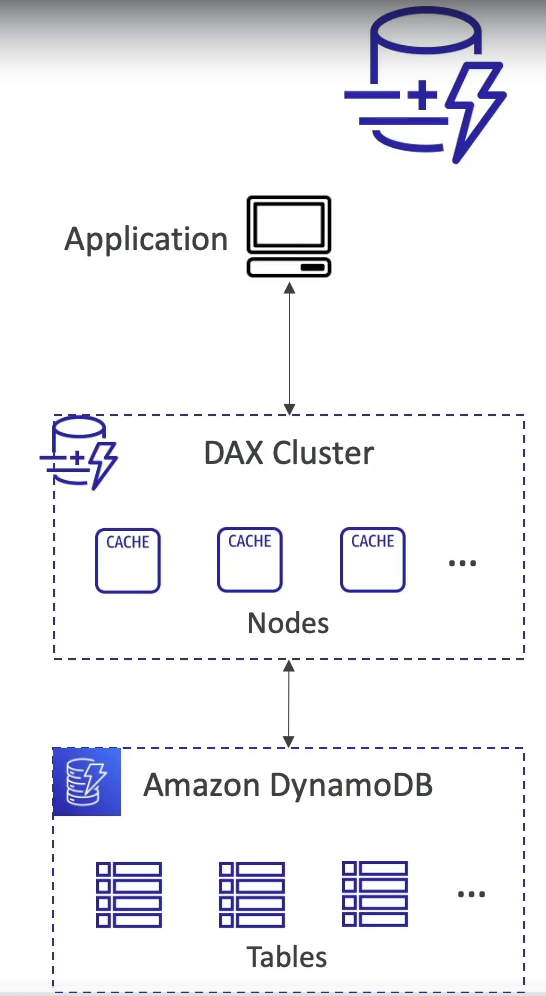

### Dynamo-DB

* Fully managed, highly available with replication across multiple AZs
* NoSQL database - not a relation database - **with transaction support**
* Scales to massive workloads, distributed database
* **Millions of requests per seconds, trillions of row, 100s of TB of storage**
* Fast and consistent in performance(single digit millisecond)
* Integrated with IAM for security, authorization and administration
* Low cost and auto-scaling capabilities
* **No maintenance or patching, always available.**
* **Standard & Infrequent Access(IA) Table Class.**

#### DynamoDB - Basics

* DynamoDB is made of **Tables**
* Each table has a **Primary Key** (must be decided at creation time)
* Each table can have an infinite number of items(=rows)
* Each item has **attributes**(can be added over time - can be null)
* Maximum size of an item is **400KB**
* Data types supported are:
  * **Scalar Types**: String, Binary, Number, Boolean, Null
  * **Document Types**: List, Map
  * **Set Types**: String Set, Number Set, Binary Set
* **Therefore, in DynamoDB you can rapidly evolve schemas**

#### DynamoDB - Read/Write Capacity Modes

* Control how you manage your table's capacity(read/write throughput)

* **Provisioned Mode(default)**
  * You specify the number of reads/writes per second
  * You need to plan capacity beforehand
  * Pay for provisioned Read Capacity Units(RCU) & Write Capacity Unit(WCU)
  * Possibility to add **auto-scaling** mode for RCU & WCU

* **On-Demand Mode**
  * Read/Write automatically scale up/down with your workloads
  * No capacity planning needed
  * Pay for what you use, more expensive($$$)
  * Great for **unpredictable** workloads, **steep sudden spikes**

#### DynamoDB Accelerator(DAX)

* Fully managed, highly available, seamless in-memory cache for DynamoDB
* **Help solve read congestion by caching**
* **Microseconds** latency for cached data
* Doesn't require application logic modification(compatible with existing DynamoDB APIs)
* 5 minutes TTL for cache(default)

#### DynamoDB Accelerator(DAX) vs ElasticCache

#### DynamoDB - Stream Processing

* Ordered stream of item-level modifications(create/update/delete) in a table
* Use cases:
  * React to change in real-time(welcome email to users)
  * Real-time usage analytics
  * Insert into derivative tables
  * Implement cross-region replication
  * Invoke AWS Lambda on changes to your DynamoDB table

##### DynamoDB Stream

* 24 hours retention
* Limited # of consumers
* Process using AWS Lambda Trigger, or DynamoDB Stream Kinesis adapter

##### Kinesis Data Streams(newer)

* 1 year retention
* High # of consumers
* Process using AWS Lambda, kinesis Data Analytics, kinesis Data Firehose, AWS Glue Streaming ETL...

#### DynamoDB Streams

#### DynamoDB Global Tables

* Make a DynamoDB table accessible with low latency in mulitple-regions
* Active-Active replication
* Application can **READ** and **WRITE** to the table in any region
* Must enable DynamoDB Streams as a pre-requisite

#### Time to Live(TTL)

* Automatically delete items after an expiry timestamp
* Use cases: reduce stored data by keeping only current items, adhere to regulatory obligations, web session-handling...

#### Backups for disaster recovery

* Continuous backups using point-in-time recovery(PITR)
  * Optionally enabled for the last 35 days
  * Point-in-time recovery to any time within the backup window
  * The recovery process creates a new table
* On-demand backups
  * Full backups for long-term retention, until explicitly deleted
  * Doesn't affect performance or latency
  * Can be configured and managed in AWS Backup(enables cross-region copy)
  * The recovery process creates a new table

#### Integration with Amazon S3

* Export to S3(must enable PITR)
  * Work for any point of time in the last 35 days
  * Doesn't affect the read capacity of your table
  * Perform data analysis on top of DynamoDB
  * Retain spanshots for auditing
  * ETL on top of S3 data before importing back into DynamoDB
  * Export in DynamoDB JSON or ION format
* Import from S3
  * Import CSV, DynamoDB JSON or ION format
  * Doesn't consume any write capacity
  * Creates a new table
  * Import errors are logged in CloudWatch logs