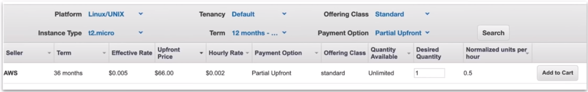
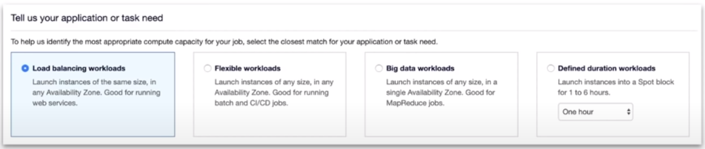

### Pricing 

|                                            |                                                                      |
|--------------------------------------------|----------------------------------------------------------------------|
| **On Demand** [Least Commitment]           | * low cost and flexible                                              |
|                                            | * only pay per hour                                                  |
|                                            | * short-term, spiky, unpredictable workloads                         |
|                                            | * cannot be interrupted                                              |
|                                            | * For first time apps                                                |
| **Reserved** upto 75% off [Best Long-term] | * steady state or predictable usage                                  |
|                                            | * commit to EC2 over a 1 or 3 year term                              |
|                                            | * Can resell unused reserved instances                               |
| **Spot** upto 90% [Biggest Savings]        | * request spare computing capacity                                   |
|                                            | * flexible start and end times                                       |
|                                            | * Can handle interruption                                            |
|                                            | * For non-critical background jobs                                   |
| **Dedicated** [Most Expensive]             | * Dedicated servers                                                  |
|                                            | * Can be on-demand or reserved(upto 70% off)                         |
|                                            | * When you need a guarantee of isolate hardware(enterprise hardware) |
|                                            |                                                                      |
|                                            |                                                                      |
|                                            |                                                                      |

**On Demand Instances**

* When you launch an EC2 instance it is by default using **On-Demand** Pricing. On-demand has **no up-front payment** and **no long-term commitment**.
* You are charged by the **hour** or by the **minute** (varies based on EC2 Instance Types)
**On-Demand** is for applications where the workload is for **short-term**, **spiky**, or **unpredictable**. When you have a **new app** for development, or you want to run experiment.

**Reserved Instances(RI)**

* Designed for applications that have a **steady-state**, **predictable usage** or require **reserved capacity**. Reduced Pricing is based on **Term** x **Class offering** x **Payment Option**

* **Standard** Up to 75% reduced pricing compared to on-demand. Cannot change RI attributes.
* **Convertible** Up to 54% reduced pricing compared to on-demand. Allows you to change RI attributes if greater or equals in value.
* **Scheduled** You reserve instances for specific time periods, eg: once a week for a few hours. Saving vary
* **Term** You commit to 1 Year or 3 Year contract. The longer the term the greater savings.
* **Payment Options** **All Upfront, Partial Upfront and No Upfront** The greater upfront the great the saving.

RIs can be **shared between multiple accounts** within an org **Unused RIs** can be sold in the **Reserved Instance Marketplace**

**Spot Instances**

* AWS has **unused compute capacity** that they want to maximize the utility of their idle servers. It's like when a hotel offers discounts for to fill vacant suites or planes offer discount to fill vacant seats.
* Spot instances provide a discount of **90%** compared to **On-Demand** Pricing. 
* Spot Instances can be terminated if the computing capacity is needed by on-demand customers.

Designed for applications that have flexible start and end times or applications that are only feasible at **very low** compute costs.

**AWS Batch** is an easy and convenient way to use Spot Pricing

**Termination Conditions**

* Instances can be terminated by AWS at anytime.
* If your instance is terminated by AWS, you don't get charged for a partial hour of usage.
* If **you terminate** an instance **you will still be charged** for any hour that it ran.

**Dedicated**

* Designed to meet regulatory requirements. When you have strict **server-bound licensing** that won't support multi-tenancy or cloud deployments.
* **Multi-Tenant:** When multiple customers are running workloads on the same hardware. **Virtual Isolation** is what separate customers(think apartment)
* **Single Tenant:** When a single customer has dedicated hardware. Physical Isolation is what separate customers(think house)
* Offered in both **On-Demand** and **Reserved**(70% off on-demand pricing)
* **Enterprises** and **Large Organizations** may have security concerns or obligations about against sharing the same hardware with other AWS customers.