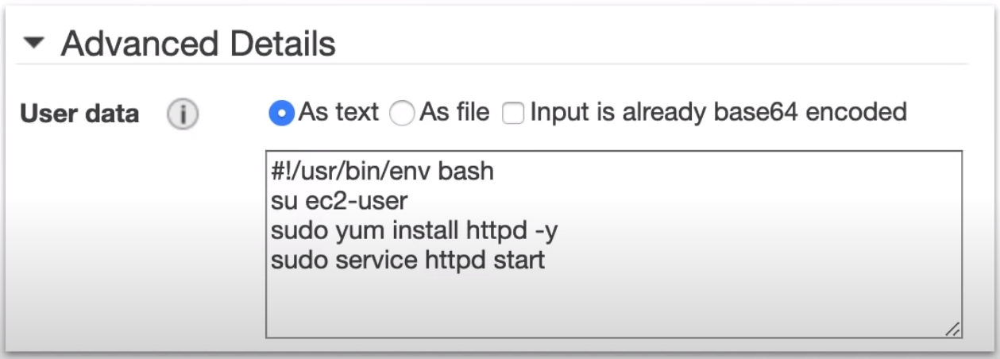

<!-- TOC -->
  * [EC2](#ec2)
  * [Introduction](#introduction)
  * [Instance Types and Usage](#instance-types-and-usage)
    * [General Purpose:](#general-purpose)
    * [Compute Optimized](#compute-optimized)
    * [Memory Optimized](#memory-optimized)
    * [Storage optimized](#storage-optimized)
    * [Instance Sizes](#instance-sizes)
  * [Introduction to Security Groups](#introduction-to-security-groups)
    * [Security Group Deeper Dive](#security-group-deeper-dive)
    * [SG Good to know](#sg-good-to-know)
    * [Referencing other security groups](#referencing-other-security-groups)
    * [Classic Ports to know](#classic-ports-to-know)
  * [EC2 Instances Purchasing Options](#ec2-instances-purchasing-options)
    * [EC2 On Demand](#ec2-on-demand)
    * [EC2 Reserved Instances](#ec2-reserved-instances)
    * [EC2 Savings Plans](#ec2-savings-plans)
    * [EC2 Spot Instances](#ec2-spot-instances)
    * [EC2 dedicated Hosts](#ec2-dedicated-hosts)
    * [EC2 Dedicated Instances](#ec2-dedicated-instances)
    * [EC2 Capacity Reservation](#ec2-capacity-reservation)
  * [EC2 Spot Instance Requests](#ec2-spot-instance-requests)
    * [How to terminate Spot Instances?](#how-to-terminate-spot-instances)
    * [Spot Fleets](#spot-fleets)
  * [Private vs Public IP (IPv4)](#private-vs-public-ip-ipv4)
    * [Public IP:](#public-ip)
    * [Private IP](#private-ip)
    * [Elastic IPs](#elastic-ips)
  * [Instance Profile](#instance-profile)
  * [Placement Groups](#placement-groups)
    * [Cluster: Clusters instances into a low-latency group in a single Availability Zone.](#cluster-clusters-instances-into-a-low-latency-group-in-a-single-availability-zone)
    * [Partition: Spreads instances across many different partitions(which rely on different sets of racks) within a AZ. Scales to 100s of EC2 instances per group(Hadoop, Casandra, Kafka)](#partition-spreads-instances-across-many-different-partitionswhich-rely-on-different-sets-of-racks-within-a-az-scales-to-100s-of-ec2-instances-per-grouphadoop-casandra-kafka)
    * [Spread: Spreads instances across underlying hardware(max 7 instances per group per AZ) - critical application](#spread-spreads-instances-across-underlying-hardwaremax-7-instances-per-group-per-az---critical-application)
  * [Elastic Network Interfaces(ENI)](#elastic-network-interfaceseni)
  * [EC2 Hibernate - Good to know](#ec2-hibernate---good-to-know)
  * [User data](#user-data)
  * [Metadata](#metadata)
  * [Instance Store](#instance-store)
  * [Cheat Sheet](#cheat-sheet)
<!-- TOC -->

### EC2

* Cloud computing service
* Choose your **OS, storage, Memory, Network Throughput.**
* Launch and SSH into your server within minutes.

### Introduction

EC2 is a **highly configurable server.**
EC2 is resizable **compute capacity.** It takes **minutes** to launch new instances.
Anything and everything on AWS uses EC2 Instance underneath.

**Choose your OS via Amazon Machine Image(AMI)**: Redhat, Ubuntu, windows, amazon linux, suse

**Choose you Instance Type**: 

| t2.nano                   | c4.8xlarge                              |
|---------------------------|-----------------------------------------|
| $0.0065/hour($4.75/month) | $1.591/hour($1161.43/month)             |
| 1 vCPU 0.5GB Mem          | 36 vCPU 60GB Mem 10 Gigabit performance |

Add Storage(EBS, EFS): SSD HDD Virtual Magnetic Tape 

| SSD | HDD | Virtual Magnetic Type | Multiple Volumes |
|-----|-----|-----------------------|------------------|

Configure your Instance:

| Security Group | Key Pairs | UserData | IAM Roles | Placement Groups |
|----------------|-----------|----------|-----------|------------------|

### Instance Types and Usage

* AWS has the following naming convention:
  * m5.2xlarge
    * m: instance class
    * 5: generation (AWS improves them over time)
    * 2xlarge: size within the instance class

#### General Purpose:
* Great for a diversity of workloads such as web servers or code repositories
* Balance between:
  * Compute
  * Memory
  * Networking
  
#### Compute Optimized
* Great for compute-intensive tasks that require high performance processors:
  * Batch processing workloads
  * Media transcoding
  * High performance web servers
  * High performance computing(HPC)
  * Scientific modeling & machine learning
  * Dedicated gaming server
  
#### Memory Optimized
* Fast performance for workloads that process large data sets in memory
  * Use-cases
    * High performance, relational/non-relational databases
    * Distributed web scale cache stores
    * In-memory database optimized for BI(Business Intelligence)
    * Applications performing real-time processing of big unstructured data.
    
#### Storage optimized
* Great for storage-intensive tasks that requires high, sequential read and write access to large data sets on local storage.
  * Use-cases
    * High frequency online transaction processing(OLTP) system
    * Relational & NoSQL databases
    * Cache for in-memory databases(for example, Redis)
    * Data warehousing applications
    * Distributed file systems

| Instance Type         | Usage                                                                                                                                                                                       |
|-----------------------|---------------------------------------------------------------------------------------------------------------------------------------------------------------------------------------------|
| General Purpose       | **A1 T3 T3a T2 M5 M5a M4.**  Balance of compute, memory and networking resources. **Use-cases** web servers and code repositories                                                           |
| Compute Optimized     | **C5 C5n C4.** Ideal for compute bound applications that benefit from high performance processor. **Use-cases** scientific modeling, dedicated gaming servers and ad server engines         |
| Memory Optimized      | **R5 R5a X1e X1 High Memory z1d.** Fast performance for workloads that process large data sets in memory. **Use-cases** in-memory caches, in-memory databases, real time big data analytics |
| Accelerated Optimized | **P3 P2 G3 F1.** hardware accelerators, or co-processors. **Use-cases** Machine learning, computational finance, seismic analysis, speech recognition                                       |
| Storage Optimized     | **I3 I3en D2 H1** high, sequential read and write access to very large datasets on local storage. **Use-cases** NoSQL, in-memory or transaction databases, data warehousing.                |

#### Instance Sizes

EC2 Instance Sizes **generally double** in price and key attributes

| Name      | vCPU | RAM(GIB) | On-Demand per hour | On-Demand per month |
|-----------|------|----------|--------------------|---------------------|
| t2.small  | 1    | 12       | $.023              | $16.79              |
| t2.medium | 2    | 24       | $.0464             | $33.87              |
| t2.large  | 2    | 36       | $.0928             | $67.74              |
| t2.xlarge | 4    | 54       | $.1856             | $135.48             |

### Introduction to Security Groups

* Security Groups are the fundamental of network security in AWS.
* They control how traffic is allowed into or out of our EC2 instances.
* Security Groups only contain **allow** rules
* Security Groups rules can reference by IP or by security group.

#### Security Group Deeper Dive

* Security groups are acting as a firewall on EC2 instances
* They regulate:
  * Access to Ports
  * Authorized IP ranges - IPv4 and IPv6
  * Control of inbound network(from other to the instance)
  * Control of outbound network(from the instance to others)

#### SG Good to know

* Can be attached to multiple instances
* Locked down to a region/VPC combination
* Does live "outside" the EC2 - if traffic is blocked the EC2 instance won't see it.
* **It's good to maintain one separate security group for SSH access.**
* If your application is not accessible (time out), then it's a security group issue.
* If your application gives a "connection refused" error, then it's an application error or it's not launched.
* All inbound traffic is **blocked** by default.
* All outbound traffic is **authorized** by default.

#### Referencing other security groups


#### Classic Ports to know

* 22 = SSH(Secure Shell) - log into a linux instance
* 21 = FTP(File Transfer Protocol) - upload files into a file share
* 22 = SFTP(Secure File Transfer Protocol) - upload files using SSH
* 80 = HTTP - access unsecured websites
* 443 = HTTPS - access secured websites
* 3389 = RDP (Remote Desktop Protocol) - log into Windows instance.

### EC2 Instances Purchasing Options

* **On-Demand Instances** - short workload, predictable pricing, pay by second
* **Reserved (1 & 3 years)**
  * Reserved Instance - long workloads
  * Convertible Reserved Instances - long workloads with flexible instances
* **Savings Plan (1 & 3 years)** commitment to an amount of usage, long workload
* **Spot Instances** - short workloads, cheap, can lose instances(less reliable)
* **Dedicated Hosts** - book an entire physical server, control instance placement
* **Dedicated Instances** - no other customers will share your hardware
* **Capacity Reservations** - reserve capacity in a specific AZ for any duration

#### EC2 On Demand

* Pay for what you use:
  * Linux or Windows - billing per second, after the first minute
  * All other operating systems - billing per hour.
* Has the highest cost but no upfront payment
* No long term commitment
* Recommended for **short-term** and **un-interrupted workloads,** where you can't predict how the application will behave.

#### EC2 Reserved Instances

* Up to 72% discount compared to On-demand
* You reserve a specific instance attribute(**Instance Type, Region, Tenancy, OS**)
* Reservation Period - **1 year**(+discount) or **3 years**(+++discount)
* Payment Options = No Upfront(+), Partial Upfront(++), All Upfront(+++)
* Reserved Instance's Scope - Regional or Zonal(reserve capacity in an AZ)
* Recommended for steady-state usage application(think database)
* You can buy and sell in the Reserved Instance Marketplace
* **Convertible Reserved Instance**
  * Can change the EC2 instance type, instance family, OS, scope and tenancy
  * Upto 66% discount.

#### EC2 Savings Plans

* Get a discount based on long-term usage(up to 72% - same as RIs)
* Commit to a certain type of usage($10/hour for 1 or 3 years)
* Usage beyond EC2 Savings Plan is billed at the On-Demand price
* Locked to a specific instance family & AWS region(e.g. M5 in us-east-1)
* Flexible accross:
  * Instance Size(e.g. m5.xlarge, m5.2xlarge)
  * OS(e.g: Linux, Windows)

#### EC2 Spot Instances

* Can get a discount of up to 90% compared to On-demand
* Instances that you can lost at any point of time of your max price is less than the current spot price
* The MOST cost-efficient instances in AWS
* Useful for workloads that are resilient to failure
  * Batch jobs
  * Data analysis
  * Image processing
  * Any distributed workloads
  * Workloads with a flexible start and end time.
* Not suitable for critical jobs or databases.

#### EC2 dedicated Hosts

* A physical server with EC2 instance capacity fully dedicated to your use.
* Allows you address **compliance requirements and use your existing server-bound software licenses**(per-socket, per-core, pe-VM software licenses)
* Purchasing Options:
  * On-Demand - pay per second for active Dedicated Host
  * Reserved - 1 or 3 years(No Upfront, Partial Upfront, All Upfront)
* The most expensive option
* Useful for software that have complicated licensing mode(BYOL - Bring Your Own License)
* Or for companies that have strong regulatory or compliance needs.

#### EC2 Dedicated Instances

* Instances run on hardware that's dedicated to you.
* May share hardware with other instances in same account
* No control over instance placement(can move hardware after Stop/Start)

#### EC2 Capacity Reservation

* Reserve **On-Demand** instances capacity in a specific AZ for any duration
* You always have access to EC2 capacity when you need it.
* No time commitment(create/cancel anytime) no billing discounts.
* Combine with Regional Reserved Instances and Saving Plans to benefit from billing discounts.
* You're charged at On-Demand rate whether you run instances or not.
* Suitable for short-term, uninterrupted workloads that needs to be in a specific AZ.

### EC2 Spot Instance Requests

* Can get a discount of up to 90% compared to On-demand
* Define **max spot price** and get the instance while **current spot price < max**
  * The hourly spot price varies based on offer and capacity.
  * If the current spot price > your max price you can choose to **stop** or **terminate** your instance with a 2 minutes grace period.
* Other strategy: **Spot Block**
  * "block" spot instance during a specified time frame(1 to 6 hours) without interruptions
  * In rare situation, the instances may be reclaimed.
* Used for batch jobs, data analysis, or workloads that are resilient to failures.
* Not great for critical jobs or databases.

#### How to terminate Spot Instances?

* You can only **cancel** Spot instances that are **open**, **active** or **disabled**
* Cancelling a Spot Request does not terminate instances
* You must first cancel a Spot Request, then terminate the associated Spot Instances


#### Spot Fleets

* Spot Fleets = set of Spot Instances + (optional) On-Demand Instances
* The Spot Fleet will try to meet the target capacity with the price constraints
  * Define possible launch pools: instance type, OS, Availability Zone
  * Can have multiple launch pools, so that the fleet can choose
  * Spot Fleet stops launching instances when reaching capacity or max cost
* Strategies to allocate Spot Instances
  * **lowestPrice:** from the pool with lowest price(cost optimization, short workload)
  * **diversified:** distributed across all pool (great for availability, long workloads)
  * **capacityOptimized:** pool with the optimal capacity for the number of instances
  * **priceCapacityOptimized (recommended):** pools with highest capacity available, then select the pool with the lowest price (best choice for most workloads)
* Spot Fleets allow us to automatically request Spot Instances with the lowest price.

### Private vs Public IP (IPv4)

#### Public IP:
* Public IP means the machine can be identified on the internet(WWW)
* Must be unique accross the whole web(not two machines can have same public IP).
* Can be geo-located easily

#### Private IP
* Private IP means the machine can only be identified on a private network only.
* The IP must be unique across the private network.
* But two different private network(two companies) can have the same IPs.
* Machines connect to WWW using an internet gateway
* Only a specified range of IPs can be used as private IP.

#### Elastic IPs
* When you stop and then start and EC2 instance, it can change its public IP.
* If you need to have a fixed public IP for your instance, you need an Elastic IP
* An Elastic IP is a public IPv4 IP you own as long as you don't delete it
* You can attach it one instance only at a time.
* With an Elastic IP address, you can mask the failure of an instance or software by rapidly remapping the address to another instance in your account.
* You can only have 5 Elastic IP in your account(you can ask AWS to increase that).
* Overall, try to avoid using Elastic IP
  * Instead use a random public IP and register a DNS name to it.
  * Or, use a Load Balancer and don't use a public IP.

* Networking has two sorts of IPs. IPv4 and IPv6
  * IPv4: 1.160.10.240
  * IPv6: 3ffe: 1900:4545:3:200:f8ff:fe21:67cf
* IPv4 is still the most common format used online.
* IPv6 is newer and solves problems for the Internet of Things(IoT).
* IPv4 allows for **3.7 billion** different addresses in the public space.
* IPv4: [0-255].[0-255].[0-255].[0-255]


### Instance Profile

* Instead of embedding your AWS credentials(Access Key and Secret) in your code so your Instance has permissions to access certain services you can **Attach a role to an instance** via an **Instance Profile**
**You want to always avoid embedding your AWS credentials when possible**


An **Instance Profile** holds a reference to a role. The EC2 instance is associated with the Instance Profile. When you select an IAM role when Launching an EC2 instance, AWS will automatically create the Instance Profile for you. Instance Profiles are not easily viewed via the AWS Console.


### Placement Groups

Placement Groups let you choose the **logical placement** of your instances to optimize for **communication, performance or durability**. Placement groups are **free**.

#### Cluster: Clusters instances into a low-latency group in a single Availability Zone.


* Pack instances close together inside an AZ
* low-latency network performance for tightly coupled node-to-node communication
* well suited for High Performance Computing applications.
* Clusters cannot be multi-AZ

* Pros: Great network(10 Gbps bandwidth between instances with Enhanced Networking enabled - recommended)
* Cons: If the AZ fails, all instances fails at the same time.
* Use case:
  * Big Data job that needs to complete fast.
  * Application that needs extremely low latency and high network throughput.

#### Partition: Spreads instances across many different partitions(which rely on different sets of racks) within a AZ. Scales to 100s of EC2 instances per group(Hadoop, Casandra, Kafka)


* Upto to 7 partitions per AZ
* Can span across multiple AZs in the same region
* Up to 100s of EC2 instances
* The instances in a partition do not share racks with the instances in the other partition.
* A partition failure can affect many EC2 but won't affect other partitions.
* EC2 instances get access to the partition information as metadata.
* Use-cases: HDFS, HBase, Cassandra, Kafka.

#### Spread: Spreads instances across underlying hardware(max 7 instances per group per AZ) - critical application


* Pros: 
  * Can span across Availability Zones(AZ)
  * Reduced risk is simultaneous failures
  * EC2 Instances are on different physical hardware
* Cons:
  * Limited to 7 instances per AZ per placement group
* Use-cases:
  * Application that needs to maximize high availability
  * Critical Applications where each instance must be isolated from failure from each other.

### Elastic Network Interfaces(ENI)

* Logical component in a VPC that represents a **virtual network card**
* The ENI can have the following attributes:
  * Primary private IPv4, one or more secondary IPv4
  * One Elastic IP (IPv4) per private IPv4
  * One Public IPv4
  * One or more security groups
  * A MAC address
* You can create ENI independently and attach them on the fly(move them) on EC2 instances for failover
* Bound to a specific availability zone


### EC2 Hibernate - Good to know

* Supported Instance Families - C3, C4, C5, I3, M3, M4, R3, R4, T2, T3,...
* Instance RAM Size - must be less than 150 GB
* Instance Size - not supported for bare metal instances.
* AMI - Amazon Linux 2, Linux AMI, Ubuntu, RHEL, CentOS & Windows...
* Root Volume - must be EBS, encrypted, not instance store, and large
* Available for On-Demand, Reserved and Spot Instances
* An instance can NOT be hibernated more than 60 days.


### User data

* You can provide an EC2 with **UserData** which is a script that will be automatically run when launching an EC2 instance. You could install package, apply updates or anything you like.

This example sets up an apache web-server.



From within the EC2 instance, if you were to SSH in and CURL this special URL you can use the UserData script eg. **curl http://169.254.169.254/latest/user-data**

### Metadata

* From within your EC2 instance you can access information about the EC2 via a special url endpoint at

```
169.254.169.254
```

You would SSH into your EC2 instance and can you the CURL command:

```
curl http://169.254.169.254/latest/meta-data
```

| type           | Desc                                         |
|----------------|----------------------------------------------|
| /public-ipv4   | get the current public IPV4 address          |
| /ami-id        | the AMI ID used to launch this EC2 instance. |
| /instance-type | the Instance Type of this EC2 instance.      |

Combine metadata with userdata scripts to perform all sorts of advanced AWS staging automation.


### Instance Store

* EBS volumes are network drives with good but "limited performance"
* If you need a high performance hardware disk, use EC2 Instance Store

* Better I/O performance.
* EC2 instance store lose their storage if they're stopped(ephemeral)
* Good for buffer/cache/scratch data/temporary content
* Risk of data loss if hardware fails
* Backups and Replication are your responsibility.

### Cheat Sheet

* Is a cloud computing service.
* Configure your EC2 by choosing you **OS, Storage, Memory, Network Throughput**
* Launch and SSH into your server within minutes
* EC2 comes with variety Instance Types specialized for different roles:
  * General purpose
  * Compute Optimized
  * Memory Optimized
  * Accelerated Optimized
  * Storage Optimized
* Instance Sizes **general double** in price and key attributes
* **Placement groups** let you choose the logical placement of your instances to optimize for communication, performance or durability. Placement groups are free.
* **UserData** a script that will be automatically run when launching an EC2 instance
* **MetaData** meta data about the current instance.
* **Instance Profiles** a container for an IAM role that you can use to pass role information to an EC2 instance when the instance starts.
